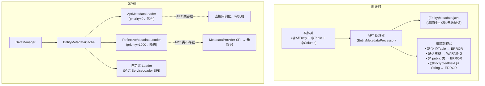
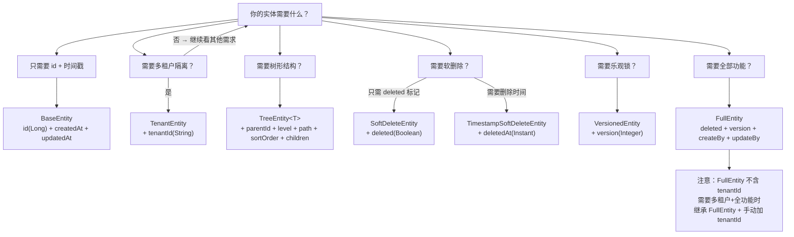
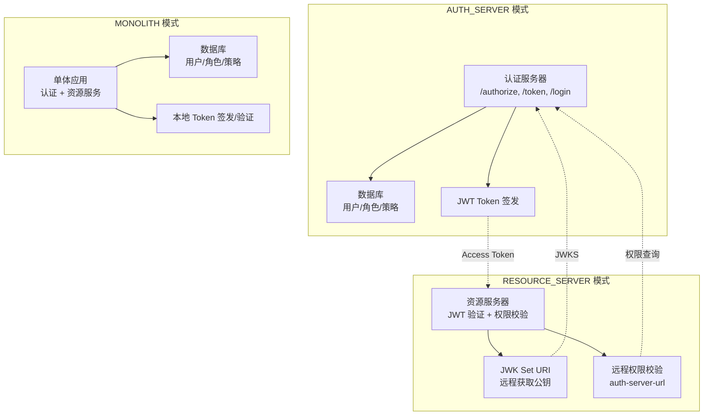
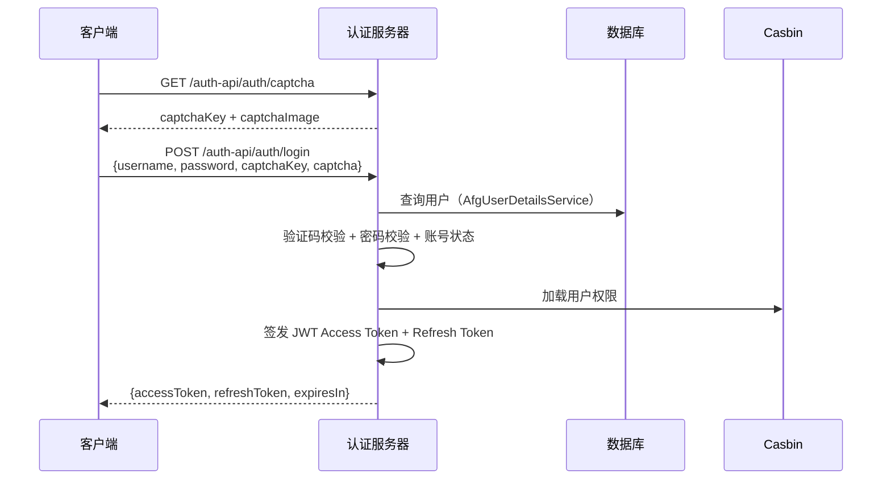
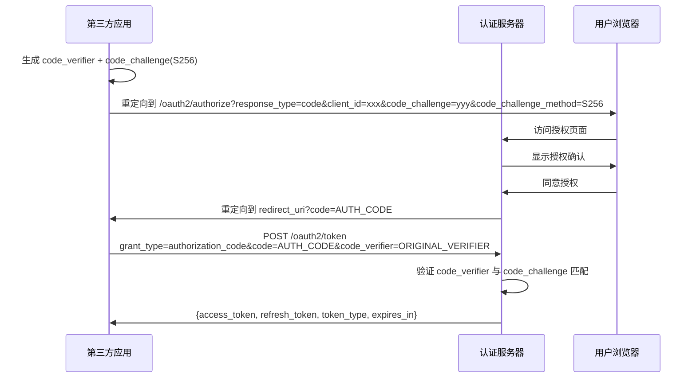

# AFG Framework — 产品需求文档 (PRD)

> **版本：** 1.0.0-SNAPSHOT
> **日期：** 2026-06-11
> **状态：** 产品需求蓝图
> **定位：** Spring Boot 的企业级增强框架

---

## 1. 产品概述

### 1.1 产品定位

AFG Framework 是一款面向企业级 Java 应用开发的**全栈增强框架**，基于 **Java 25 + Spring Boot 4 + Gradle** 构建。

**核心定位：Spring Boot 的企业级增强框架。**

不是替代 Spring Boot，而是在其之上补齐企业级开发缺失的能力——多租户、数据权限、统一审计、AI 全链路、声明式韧性安全——让开发者从"组装轮子"变为"聚焦业务"。

**一句话定义**：在 Spring Boot 之上，提供企业级应用开发所需的全部增强能力，引入即生效，不引入零侵入。

### 1.2 设计哲学

框架的每一条设计决策都遵循以下 5 条哲学：

#### 1. 约定优于配置

合理的默认值优于显式配置。框架的每个功能都有开箱即用的默认行为，配置只用于覆盖。

```
引入 afg-framework-auth-server → OAuth2 授权服务器自动可用
引入 afg-framework-afg-redis → 分布式缓存/锁/调度自动可用
无需任何配置，即可运行
```

#### 2. 增强而非替代

所有功能基于 Spring Boot 增强，不替换原生能力。开发者可以同时使用框架增强和 Spring Boot 原生 API。

```
框架提供 DataManager → 增强 Spring JDBC，不替代 JdbcTemplate
框架提供 @AiChat → 增强 Spring AI，不替代 ChatClient
框架提供 AfgCache → 增强 Spring Cache，不替代 @Cacheable
```

#### 3. 编译时安全

APT 编译时生成元数据，运行时零反射开销。类型安全优先，错误在编译期暴露而非运行时。

```
@AfEntity → 编译时生成 {Entity}Metadata.java → 运行时零反射
Conditions.builder(User.class).eq(User::getStatus, 1) → Lambda 类型安全
APT 编译期校验 → 缺少 @AfEntity、字段类型不支持等错误即时报告
```

#### 4. 开箱即用

每个功能都有本地降级实现，不引入外部依赖即可运行。引入外部依赖后自动升级为生产级实现。

```
无 Redis → Caffeine 本地缓存 + 内存锁 + 本地调度
有 Redis → Redisson 分布式缓存/锁/调度，自动升级
无 AI 引擎 → NoOp 默认实现，框架正常运行
有 Spring AI / LangChain4J → 自动发现并装配
```

#### 5. 模块化按需加载

引入即生效，不引入零侵入。每个模块通过 `@ConditionalOnBean` / `@ConditionalOnClass` 自动发现和装配。

```
引入 afg-framework-ai-core → AI 能力自动可用
不引入 → 零 AI 相关 Bean 注册，零性能开销
```

### 1.3 框架价值观

框架的文化决定了 API 的设计风格和开发者的使用体验：

#### 1. 简洁胜于复杂

一个 DataManager 替代 JPA Repository + Service + Query 三层。声明式优于编程式，链式优于嵌套，Lambda 优于字符串。

```java
// 期望的开发者体验：一行代码完成查询
dataManager.entity(User.class)
    .query()
    .where(builder(User.class).eq(User::getStatus, 1).build())
    .page(PageRequest.of(1, 20));
```

#### 2. 安全是基础设施

多租户、数据权限、审计不是可选插件，而是默认行为。框架自动为查询注入租户过滤和数据权限条件，开发者无需手动处理。

```java
// 框架自动注入租户和数据权限条件，开发者无感知
dataManager.findAll(User.class);  // 自动过滤当前租户 + 数据权限范围
```

#### 3. AI 是一等公民

AI 能力与数据访问、安全同等重要。Chat、Agent、Workflow、RAG、Tool 全链路 AI 能力，双引擎适配（Spring AI / LangChain4J），声明式注解驱动。

```java
@AiChat(client = "default", systemPrompt = "你是助手")
public String chat(String message) { ... }
```

#### 4. 企业级是底线

多租户、数据权限、审计、国际化、软删除、乐观锁——这些不是"高级功能"，是"基本要求"。框架默认提供，开发者无需手动拼装。

#### 5. 优雅降级

分布式不可用时本地兜底，外部依赖不可用时 NoOp 兜底。框架在任何环境下都能正常运行，不会因为缺少某个依赖而启动失败。

### 1.4 开发者体验理念

框架的 API 设计遵循以下优先级：

1. **声明式 > 编程式** — `@AiChat` 优于手动调用 ChatClient
2. **链式 > 嵌套** — `dataManager.entity(User.class).query().where(condition).list()` 优于 `query.setParameter(...)`
3. **Lambda > 字符串** — `User::getStatus` 优于 `"status"`
4. **注解 > 配置** — `@DistributedTask` 优于 `afg.scheduler.task.xxx.enabled=true`
5. **自动发现 > 手动注册** — `@ConditionalOnBean` 优于 `@Bean` 手动声明
6. **默认安全 > 默认开放** — 新增 API 默认需要认证，显式 `permitAll()` 才开放

### 1.5 质量底线

框架的每个功能必须满足以下底线：

1. **每个功能必须有 NoOp 降级实现** — 不引入外部依赖即可运行
2. **每个功能必须有开/关注解或条件** — `@ConditionalOnXxx` + `enabled` 开关
3. **每个功能必须有测试覆盖** — 集成测试 + Testcontainers，禁止 Mockito
4. **每个 AutoConfiguration 必须声明依赖排序** — `@AutoConfigureAfter` / `@AutoConfigureBefore`
5. **每个配置项必须有合理默认值** — 零配置即可运行
6. **每个 SPI 必须有本地默认实现** — 不依赖外部实现即可工作

### 1.6 核心价值（差异化优势）

AFG Framework 在以下 5 个领域是**全球唯一的开源框架**：

| 差异化能力 | 说明 | 竞品现状 |
|-----------|------|---------|
| **APT 零反射 DataManager** | 编译时生成实体元数据，运行时零反射，类型安全条件查询 | 所有竞品依赖运行时反射 |
| **三种多租户隔离模式** | 共享数据库 / 独立数据库 / 混合模式，开源提供 | 仅 BladeX 商业版有（付费） |
| **行级数据权限自动注入** | DataScopeType 自动为查询注入条件，开发者无感知 | 所有竞品需手动实现 |
| **AI 韧性 + 安全 + 审计** | @AiResilient / @ContentSafety / @AiAudited 声明式注解 | 所有竞品无此能力 |
| **AI 工作流 DAG 引擎** | 37 种内置节点，DAG 执行，Checkpoint，人机交互 | 所有竞品无内置 AI 工作流 |

### 1.7 目标用户

- 企业级 Java 后端开发团队（从 3 人初创到 300 人企业）
- 需要微服务/单体灵活切换的架构团队
- 需要集成 AI 能力的业务系统
- 国产化信创环境下的 Java 开发者
- 从 MyBatis/JPA 迁移的开发者

### 1.8 技术栈

| 类别 | 技术 | 版本 |
|------|------|------|
| 语言 | Java | 25 |
| 框架 | Spring Boot | 4.0.6 |
| 构建 | Gradle | Kotlin DSL |
| 安全 | Spring Security + jCasbin | 1.9.2 |
| AI - Spring AI | Spring AI | 2.0.0-M7 |
| AI - LangChain4J | LangChain4J | 1.15.1 |
| 数据库迁移 | Liquibase | BOM 管理 |
| 缓存 | Caffeine + Redis (Redisson 4.3.1) | — |
| 消息队列 | Spring AMQP (RabbitMQ) / Spring Kafka | BOM 管理 |
| 文件存储 | Local（框架内置） | — |
| gRPC | spring-grpc | 1.0.3 |
| Protobuf | protobuf-java | 3.25.8 |
| 代码质量 | PMD 7.23.0 + JaCoCo 0.8.14 | — |
| 安全扫描 | OWASP Dependency Check 12.2.2 | CVSS ≥ 7.0 阻断构建 |
| 序列化 | Jackson 2.x（Jackson 3 迁移待第三方库适配） | BOM 管理 |
| 校验 | Jakarta Validation + Hibernate Validator | BOM 管理 |
| API 文档 | SpringDoc OpenAPI | 3.0.3 |
| DTO 转换 | MapStruct | BOM 管理 |

---

## 2. 快速开始

> 本章节遵循 **Diataxis Tutorial** 模式——学习导向，目标是让一个 Java 开发者在 30 分钟内从零跑通第一个 CRUD 应用。
> 不假设任何 AFG Framework 先验知识，仅需 Java 和 Spring Boot 基础。

### 2.1 环境要求

| 依赖 | 最低版本 | 说明 |
|------|---------|------|
| JDK | 25+ | 框架基于 Java 25 构建 |
| Gradle | 8.x | 通过 Wrapper 管理，无需手动安装 |
| 数据库 | 见下表 | 至少一种，开发环境可用 H2 |
| IDE | IntelliJ IDEA / VS Code | 推荐启用 Annotation Processing |

**支持的数据库：**

| 数据库 | 最低版本 | 适用场景 |
|--------|---------|---------|
| MySQL | 8.0+ | 生产首选 |
| PostgreSQL | 15+ | 生产首选 |
| Oracle | 19c+ | 企业级 |
| SQL Server | 2019+ | 微软生态 |
| H2 | 2.x | 开发/测试 |
| 达梦 | DM8 | 国产合规 |
| 金仓 | KingbaseES V8 | 国产合规 |
| GaussDB | 最新 | 华为生态 |
| OceanBase | 4.x | 金融级 |
| openGauss | 5.x | 开源国产 |

### 2.2 创建项目

#### Gradle（推荐）

**build.gradle.kts：**

```kotlin
plugins {
    id("io.github.afg-projects.framework-plugin") version "1.0.0-SNAPSHOT"
}

afg {
    springBootVersion.set("4.0.6")       // Spring Boot 版本
    springAiVersion.set("2.0.0-M7")      // Spring AI 版本（可选）
    frameworkVersion.set("1.0.0-SNAPSHOT") // 框架版本
    standalone.set(true)                  // true=独立部署(Spring Boot jar), false=聚合模块(plain jar)
    useLombok.set(true)                  // 自动添加 Lombok 依赖
    enableCodegen.set(true)              // 启用 APT 代码生成
    basePackage.set("com.example.demo")   // 基础包路径
    securityMode.set("MONOLITH")         // AUTH_SERVER / RESOURCE_SERVER / MONOLITH / null
    databaseType.set("mysql")            // 数据库类型
}

dependencies {
    // 核心模块（自动引入 commons + apt-api + apt-impl + core + data-core + data-jdbc）
    // 已由 Gradle 插件自动添加，无需手动声明

    // 安全模块（MONOLITH 模式自动引入 auth-server + resource-server）
    // 已由 Gradle 插件根据 securityMode 自动添加

    // 可选：AI 能力
    implementation("io.github.afg-projects:afg-framework-ai-core")
    implementation("io.github.afg-projects:afg-framework-ai-langchain4j")

    // 可选：Redis 分布式能力（需先配置 RedissonClient Bean）
    implementation("io.github.afg-projects:afg-framework-afg-redis")
}
```

#### Maven（替代方案）

**pom.xml：**

```xml
<dependencyManagement>
    <dependencies>
        <dependency>
            <groupId>io.github.afg-projects</groupId>
            <artifactId>afg-framework-bom</artifactId>
            <version>1.0.0-SNAPSHOT</version>
            <type>pom</type>
            <scope>import</scope>
        </dependency>
    </dependencies>
</dependencyManagement>

<dependencies>
    <!-- 核心（必须） -->
    <dependency>
        <groupId>io.github.afg-projects</groupId>
        <artifactId>afg-framework-core</artifactId>
    </dependency>
    <dependency>
        <groupId>io.github.afg-projects</groupId>
        <artifactId>afg-framework-apt-api</artifactId>
    </dependency>
    <dependency>
        <groupId>io.github.afg-projects</groupId>
        <artifactId>afg-framework-apt-impl</artifactId>
        <scope>compile</scope>  <!-- APT 处理器编译期需要 -->
    </dependency>

    <!-- 安全（MONOLITH 模式） -->
    <dependency>
        <groupId>io.github.afg-projects</groupId>
        <artifactId>afg-framework-auth-server</artifactId>
    </dependency>
</dependencies>
```

> **注意**：Maven 项目不享受 Gradle 插件的自动依赖管理和代码生成功能，需手动声明所有核心依赖并配置 APT 处理器路径。推荐使用 Gradle 构建项目。

### 2.3 最小配置

**application.yml：**

```yaml
spring:
  datasource:
    url: jdbc:mysql://localhost:3306/demo
    username: root
    password: root

afg:
  security:
    auth-server:
      enabled: true
      token:
        issuer: https://auth.example.com  # JWT issuer URL
        key-store-path: file:${user.home}/.afg/keys  # RSA 密钥对路径（支持 file: 和 classpath: 协议）
```

> 仅需数据库连接和 Token 密钥配置。框架其余功能零配置即可运行。
>
> **密钥配置说明**：
> - `key-store-path`：RSA 密钥对文件路径，框架使用 RS256 签名 JWT Token。首次启动时自动在指定路径生成密钥对。
> - 支持 `file:`（文件系统路径）和 `classpath:`（打包在 jar 中）两种协议。
> - **生产环境必须**：使用独立的密钥文件，禁止使用默认路径，定期轮换密钥。

### 2.4 创建第一个实体

```java
import jakarta.persistence.Column;
import jakarta.persistence.Table;
import io.github.afgprojects.framework.apt.entity.AfEntity;
import io.github.afgprojects.framework.data.core.entity.SoftDeleteEntity;
import lombok.Getter;
import lombok.Setter;

@Getter @Setter
@AfEntity  // 触发 APT 编译时元数据生成
@Table(name = "sys_user")  // 来自 Jakarta Persistence
public class User extends SoftDeleteEntity {

    @Column(name = "username", nullable = false, length = 50)  // 来自 Jakarta Persistence
    private String username;

    @Column(name = "email", length = 100)
    private String email;

    @Column(name = "status")
    private Integer status = 1;
}
```

> **注解说明**：
> - `@AfEntity`（框架注解）— 触发 APT 编译时元数据生成，是框架的零反射基础
> - `@Table` / `@Column`（Jakarta Persistence 注解）— 定义数据库表/列映射，来自 `jakarta.persistence` 包
> - 三个注解必须同时使用：`@AfEntity` + `@Table` + `@Column`
> - 继承 `SoftDeleteEntity` 后，删除操作自动执行软删除而非物理删除

### 2.5 创建第一个 Controller

```java
import io.github.afgprojects.framework.commons.exception.CommonErrorCode;
import io.github.afgprojects.framework.commons.model.Result;
import io.github.afgprojects.framework.commons.model.PageData;
import io.github.afgprojects.framework.data.core.DataManager;
import io.github.afgprojects.framework.data.core.condition.Conditions;
import io.github.afgprojects.framework.data.core.condition.Condition;
import io.github.afgprojects.framework.data.core.query.PageRequest;
import org.springframework.web.bind.annotation.*;
import lombok.RequiredArgsConstructor;
import org.springframework.transaction.annotation.Transactional;

@RestController
@RequestMapping("/users")
@RequiredArgsConstructor
public class UserController {

    private final DataManager dataManager;

    @PostMapping
    @Transactional
    public Result<User> create(@RequestBody User user) {
        return Result.success(dataManager.save(User.class, user));
    }

    @GetMapping("/{id}")
    public Result<User> getById(@PathVariable Long id) {
        return dataManager.findById(User.class, id)
            .map(Result::success)
            .orElse(Result.fail(CommonErrorCode.NOT_FOUND));
    }

    @GetMapping
    public Result<PageData<User>> list(
            @RequestParam(required = false) String username,
            @RequestParam(defaultValue = "1") int page,
            @RequestParam(defaultValue = "20") int size) {

        Condition condition = Conditions.builder(User.class)
            .likeIfPresent(User::getUsername, username)  // null 时自动跳过
            .eq(User::getStatus, 1)
            .build();

        PageData<User> result = dataManager.entity(User.class)
            .query()
            .where(condition)
            .page(PageRequest.of(page, size));

        return Result.success(result);
    }

    @DeleteMapping("/{id}")
    @Transactional
    public Result<Void> delete(@PathVariable Long id) {
        dataManager.deleteById(User.class, id);  // 软删除自动执行
        return Result.success();
    }
}
```

> **API 说明**：
> - `Result.success(data)` — 统一成功响应（code=0）
> - `Result.fail(CommonErrorCode.XXX)` — 统一失败响应（code=错误码）
> - `Result` 是基础响应类（commons 模块），`Results` 是增强辅助类（core 模块，自动填充 traceId）。推荐使用 `Result` 保持简洁，生产环境可切换到 `Results`。
> - `dataManager.save(User.class, user)` — id 为 null 则 insert，否则 update
> - `Conditions.builder(User.class)` — Lambda 类型安全条件构建器，`likeIfPresent` 在参数为 null 时自动跳过
> - `page(PageRequest)` 直接返回 `PageData<User>`，无需额外 `.list()` 调用

### 2.6 启动并验证

```bash
# 构建项目
./gradlew build

# 启动应用
./gradlew bootRun

# 创建用户
curl -X POST http://localhost:8080/users \
  -H "Content-Type: application/json" \
  -d '{"username":"admin","email":"admin@example.com"}'

# 查询用户列表
curl http://localhost:8080/users

# 登录获取 Token（MONOLITH 模式下 auth-server 自动可用）
curl -X POST http://localhost:8080/auth-api/auth/login \
  -H "Content-Type: application/json" \
  -d '{"username":"admin","password":"123456"}'
```

> **验证清单**：
> - ✅ 应用正常启动，无报错
> - ✅ 创建用户返回 `{"code":0,"message":"success","data":{"id":1,"username":"admin",...}}`
> - ✅ 查询列表返回分页数据
> - ✅ 登录返回 JWT Access Token
> - ✅ 删除后用户标记为软删除（`deleted=true`），仍可通过 `includeDeleted()` 查询

### 2.7 添加 AI 对话

```java
import io.github.afgprojects.framework.ai.core.chat.annotation.AiChat;
import org.springframework.stereotype.Service;

@Service
public class ChatService {

    @AiChat(client = "default", systemPrompt = "你是一个智能助手")
    public String chat(String message) {
        return message;  // 由框架 AOP 切面自动调用 AI 模型
    }
}
```

```yaml
afg:
  ai:
    chat:
      enabled: true
    # LLM 配置由 Spring AI 或 LangChain4J 的原生配置管理
```

> **@AiChat 注解属性**：
> - `client` — ChatClient 注册名（默认 `"default"`）
> - `systemPrompt` — 系统提示词（默认 `""`）
> - `memoryKey` — 对话记忆键（默认 `""`，用于关联上下文）
> - `temperature` — 生成温度（默认 `-1`，由底层模型决定）
> - `maxTokens` — 最大 Token 数（默认 `-1`，由底层模型决定）

### 2.8 故障排查

| 问题 | 可能原因 | 解决方案 |
|------|---------|---------|
| 启动报 `NoSuchBeanDefinitionException: DataManager` | 未引入 data-jdbc 模块 | 确保 Gradle 插件已应用，或手动添加 `afg-framework-data-jdbc` 依赖 |
| 启动报 `Entity metadata not found: User` | 实体类缺少 `@AfEntity` 注解 | 在实体类上添加 `@AfEntity`（与 `@Table` + `@Column` 配合使用） |
| APT 不生成 Metadata 类 | IDE Annotation Processing 未启用 | IDEA: Settings → Build → Compiler → Annotation Processors → Enable |
| 登录报 404 | auth-server 模块未引入 | 检查 `securityMode` 配置，MONOLITH 模式会自动引入 |
| 模块 context-path 不生效 | Controller 被 `@IgnoreModuleContextPath` 排除 | 检查 Controller 上是否有排除注解 |
| 构建出现 `bin/` 重复编译输出 | IDEA 使用 JPS 编译器 | Settings → Build → Build Tools → Gradle → "Build and run using" 改为 Gradle |
| 引入 JPA 后框架冲突 | Hibernate EntityManagerFactory 自动配置 | 删除 `spring-boot-starter-data-jpa`，使用 `afg-framework-data-jdbc` |

### 2.9 下一步

完成快速开始后，建议阅读以下章节深入了解：

- **3. 核心概念** — 理解 DataManager vs JPA、APT 元数据、自动配置原理
- **5.4 DataManager** — 完整的数据操作 API、条件查询、关联关系、分页
- **5.5 Security** — 3 种部署模式、OAuth2 配置、权限模型
- **5.6 AI** — 双引擎选择（Spring AI vs LangChain4J）、Chat/RAG/Agent 使用

---

## 3. 核心概念

> 本章节遵循 **Diataxis Concept** 模式——理解导向，目标是帮助开发者建立对框架核心抽象的心智模型。

### 3.1 DataManager vs JPA Repository

| 维度 | JPA Repository | DataManager |
|------|---------------|-------------|
| **设计理念** | 每个实体一个 Repository | 一个 DataManager 操作所有实体 |
| **元数据加载** | 运行时反射 | APT 编译时生成优先（priority=0），反射降级（priority=1000） |
| **查询方式** | 方法名派生 / @Query / Specification | Lambda 条件构建器 + 链式查询 |
| **多租户** | Hibernate Filter（需手动配置） | 自动注入租户条件（零配置） |
| **数据权限** | 无 | 自动注入数据权限条件（零配置） |
| **软删除** | @Where 注解（需手动） | 自动过滤（零配置） |
| **聚合查询** | 无内置 | 内置 GROUP BY + HAVING + 聚合函数 |
| **关联加载** | N+1 问题 / FETCH JOIN | 预加载 / 批量加载 / 延迟加载 |
| **DTO 投影** | Interface Projection / Class Projection | ProjectedQuery + Lambda 字段选择 |
| **缓存** | 二级缓存（复杂） | AfgCache 统一抽象 + 本地/Redis 实现 |
| **依赖** | Hibernate EntityManager | 纯 JDBC |

> **元数据加载说明**：APT 是优先路径，反射是降级路径。当 APT 生成的元数据类存在时，`AptMetadataLoader`（priority=0）直接实例化，零反射；当 APT 产物不存在时（如未启用 APT），`ReflectiveMetadataLoader`（priority=1000）通过 `MetadataProvider` SPI 获取元数据。此外，`EntityMetadataCache` 通过 `ServiceLoader<EntityMetadataLoader>` SPI 发现机制支持自定义加载器插入。

**从 JPA 迁移**：

| JPA | AFG |
|-----|-----|
| `UserRepository extends JpaRepository` | `DataManager` |
| `repository.findById(id)` | `dataManager.findById(User.class, id)` |
| `repository.save(user)` | `dataManager.save(User.class, user)` |
| `@Query("WHERE status = ?1")` | `Conditions.builder(User.class).eq(User::getStatus, 1)` |

**从 MyBatis-Plus 迁移**：

| MyBatis-Plus | AFG |
|-------------|-----|
| `BaseMapper<User>` | `DataManager` |
| `mapper.selectById(id)` | `dataManager.findById(User.class, id)` |
| `LambdaQueryWrapper<User>` | `Conditions.builder(User.class)` |
| `Page<User>` | `PageData<User>` |
| `@TableLogic` | 继承 `SoftDeleteEntity` |
| `TenantLineInnerInterceptor` | 自动注入（零配置） |

### 3.2 APT 编译时元数据

**为什么用 APT？**

传统 ORM 框架在运行时通过反射读取实体类的注解（`@Table`、`@Column`），生成 SQL。这有两个问题：
1. **运行时性能损耗** — 每次启动都要反射扫描
2. **错误发现太晚** — 字段名拼错、类型不匹配等错误在运行时才暴露

APT（Annotation Processing Tool）在**编译时**处理注解，生成元数据类，运行时直接使用，避免反射开销。

**工作流程**：



**对开发者的影响**：

- 编译期即可发现：缺少 `@AfEntity`、字段类型不支持、表名冲突等错误
- IDE 中可直接跳转到 `UserMetadata.TABLE_NAME`、`UserMetadata.USERNAME` 等常量
  > **前提条件**：IDE 需启用 Annotation Processing（IntelliJ IDEA: Settings → Build → Compiler → Annotation Processors → Enable）
- Lambda 条件查询 `User::getUsername` 由 APT 生成的元数据提供类型安全保证

**SPI 扩展点**：

框架通过 `ServiceLoader<EntityMetadataLoader>` SPI 机制发现元数据加载器。当 SPI 发现自定义加载器时，这些加载器与默认的 APT + Reflective 组合共同参与优先级排序。这允许使用者插入自定义的元数据来源（如远程配置中心、代码生成器等）。

### 3.3 自动配置约定

框架基于 Spring Boot AutoConfiguration 机制，遵循以下约定：

**启用优先级**：

```
1. 自动装配（优先）— @ConditionalOnClass / @ConditionalOnBean 自动检测
2. 注解增强（次选）— @AiChat / @DistributedTask 等注解，依赖对应的 AutoConfiguration 先注册切面 Bean
3. 配置属性（最后）— 仅覆盖默认值时需要配置
```

> **注意**：`@AiChat`、`@DistributedTask` 等注解并非独立的启用机制。它们的"触发"依赖于对应 AutoConfiguration 先注册了切面 Bean。例如 `@AiChat` 需要 `AiChatAutoConfiguration` 注册 `AiChatAspect`，`@DistributedTask` 需要 `SchedulerAutoConfiguration` 注册 `ScheduledTaskAspect`。如果未引入对应模块，注解将不会生效。

**引入即生效**：

| 操作 | 框架行为 | 前提条件 |
|------|---------|---------|
| 引入 `afg-framework-data-jdbc` | DataManager 自动注册，JDBC 增强可用 | DataSource Bean 已存在 |
| 引入 `afg-framework-afg-redis` | 分布式缓存/锁/调度自动升级，替换本地实现 | **RedissonClient Bean 已配置** |
| 引入 `afg-framework-ai-core` | AI SPI 接口 + NoOp 默认实现自动注册 | 无 |
| 引入 `afg-framework-ai-langchain4j` | LangChain4J 实现自动装配，替换 NoOp | LLM 客户端配置已完成 |
| 引入 `afg-framework-auth-server` | OAuth2 授权服务器自动可用 | Token 密钥已配置 |

> **afg-redis 特别说明**：仅引入 JAR 不会自动生效。`RedisAutoConfiguration` 使用 `@ConditionalOnBean(RedissonClient.class)`，需要使用者先配置 `RedissonClient` Bean（通常通过 `redisson-spring-boot-starter` 自动配置）。这一点与 Spring Boot 原生模块的行为一致——引入 starter 不代表功能启用，还需要提供基础设施连接。

**框架自定义条件注解**：

在 Spring Boot 内置条件注解之上，框架提供了三个增强条件注解：

| 注解 | 语义 | 使用场景 |
|------|------|---------|
| `@ConditionalOnFeature` | 当指定功能开关启用时生效 | 需要显式启用的可选功能 |
| `@ConditionalOnPropertyNotEmpty` | 当配置属性非空时生效 | 外部 API Key 等必须配置的项 |
| `@ConditionalOnTenant` | 当多租户上下文存在时生效 | 租户感知的 Bean 注册 |

### 3.4 实体基类选择决策树



**基类组合规则**（基于 `data-core` 模块）：

| 需求 | 基类 | 特征接口 | 额外字段 |
|------|------|---------|---------|
| 基础 | `BaseEntity` | — | id(Long), createdAt(Instant), updatedAt(Instant) |
| 多租户 | `TenantEntity` | — | + tenantId(String) |
| 树形结构 | `TreeEntity<T>` | `Treeable<T>` | + parentId(Long), level(Integer), path(String), sortOrder(Integer), children(List) |
| 软删除 | `SoftDeleteEntity` | `SoftDeletable` | + deleted(Boolean=false) |
| 软删除+时间戳 | `TimestampSoftDeleteEntity` | `TimestampSoftDeletable` | + deletedAt(Instant) |
| 乐观锁 | `VersionedEntity` | `Versioned` | + version(Integer=0) |
| 全功能 | `FullEntity` | `SoftDeletable` + `Versioned` + `Auditable` | + deleted, version, createBy(Long), updateBy(Long) |

> **注意**：
> - `FullEntity` 不继承 `TenantEntity`。需要多租户 + 全功能时，继承 `FullEntity` 并手动添加 `tenantId` 字段。
> - 推荐使用 `data-core` 模块的实体体系（Long id + Instant 时间戳）。`core` 模块存在另一套实体体系（String id + LocalDateTime），仅用于框架内部，不建议业务应用使用。

### 3.5 模块化架构理念

框架通过 `@AfgModuleAnnotation` 实现模块注册和自动发现：

```java
@AfgModuleAnnotation(
    id = "auth",
    name = "认证授权模块",
    contextPath = "/auth-api",      // 自动为模块 Controller 添加路径前缀
    basePackage = "io.github.afgprojects.framework.security",  // 自动组件扫描
    dependencies = {"core", "data-jdbc"}
)
public class AuthModuleConfig {}
```

**设计思想**：

- `@AfgModuleAnnotation` 是 `@Configuration + @ComponentScan` 的组合注解
  - `basePackage` 通过 `@AliasFor(annotation = ComponentScan.class, attribute = "basePackages")` 实现自动组件扫描，这是"引入即生效"的技术基础
- 每个模块声明自己的 Context-Path，框架通过 `PathMatchConfigurer` 自动为该模块的 Controller 添加路径前缀
- 模块声明依赖关系（`dependencies`），APT 处理器生成 `META-INF/afg-modules.index` 索引文件

> **注意**：`@AfgModuleAnnotation.dependencies` 和 `@AutoConfigureAfter` 是两套独立的依赖体系：
> - `dependencies` 声明模块间的逻辑依赖，用于 APT 生成模块索引和框架运行时检查
> - `@AutoConfigureAfter` 声明 AutoConfiguration 的加载顺序，由 Spring Boot 原生机制保证
> - 两者需要保持一致，但分属不同的声明位置

### 3.6 增强而非替代原则

框架的核心边界原则：

| 原则 | 说明 |
|------|------|
| **框架不重新实现 Spring Boot 已有的能力** | 数据库连接池用 HikariCP、Web 容器用 Tomcat/Undertow、JSON 用 Jackson |
| **框架在 Spring Boot 之上做增强** | DataManager 增强 JdbcTemplate、AfgCache 增强 Spring Cache、@AiChat 增强 Spring AI |
| **开发者可以同时使用框架和 Spring Boot 原生** | 可以用 DataManager，也可以直接注入 JdbcTemplate；可以用 @AiChat，也可以直接用 ChatClient |
| **框架独创的能力无 Spring Boot 对应物** | APT 元数据、数据权限自动注入、AI 韧性注解、DAG 工作流 |

**框架增强层（在 Spring Boot 之上的增量）**：

| 领域 | Spring Boot 原生 | AFG 增强 | 增强内容 |
|------|-----------------|---------|---------|
| JSON | Jackson | JacksonUtils / JacksonMapper | 通用序列化/反序列化工具、泛型类型安全 |
| 条件装配 | @ConditionalOnXxx | @ConditionalOnFeature / @ConditionalOnPropertyNotEmpty / @ConditionalOnTenant | 功能开关、属性非空、租户感知 |
| 缓存 | Spring Cache 抽象 | AfgCache\<V\> + CacheManager | 统一缓存抽象、多级缓存、实体缓存 |
| 调度 | @Scheduled | @DistributedTask + SchedulerAutoConfiguration | 分布式调度、延迟队列、单例执行 |
| HTTP | RestClient | —（不增强，直接使用） | — |

---

## 4. 模块架构

### 4.1 模块清单

框架由 **20 个 Gradle 子模块** 组成，按职责分为 7 大类：

```
afg-framework/
├── 通用层
│   ├── commons/                    # 通用工具（最底层，零框架依赖）
│   ├── apt-api/                    # APT 注解定义
│   └── apt-impl/                   # APT 处理器实现
│
├── 核心层
│   └── core/                       # 框架核心（31+ AutoConfiguration）
│
├── 数据层
│   ├── data-core/                  # 数据访问抽象（DataManager 接口、实体基类、条件构建器）
│   └── data-impl/
│       ├── data-sql/               # SQL 解析与构建器
│       ├── data-jdbc/              # JDBC 增强实现（JdbcDataManager + 审计日志存储）
│       └── data-liquibase/         # Liquibase 数据库迁移基础设施
│
├── 安全层
│   ├── security-core/              # 安全 SPI 接口
│   └── security-impl/
│       ├── auth-server/            # 认证服务器（9 AutoConfiguration）
│       └── resource-server/        # 资源服务器（2 AutoConfiguration）
│
├── AI 层
│   ├── ai-core/                    # AI 核心（16 AutoConfiguration）
│   └── ai-impl/
│       ├── ai-spring-ai/           # Spring AI 适配
│       └── ai-langchain4j/         # LangChain4J 适配
│
├── 集成层
│   └── afg-redis/                  # Redis/Redisson（缓存、锁、限流、调度、审计存储）
│
├── 治理层
│   └── governance/
│       ├── proto/                  # gRPC Proto 定义
│       ├── client/                 # 客户端 SDK
│       └── server/                 # 服务端模块
│
└── 工具层
    └── gradle-plugin/              # 自定义 Gradle 插件
```

### 4.2 依赖关系

```
commons（零依赖）
  └→ data-core
  │    └→ data-sql（SQL 构建器实现）
  │    └→ data-jdbc ←── core（JdbcDataManager + 审计日志存储）
  │         └→ data-liquibase（数据库迁移）
  └→ core
  │    └→ ai-core → ai-spring-ai / ai-langchain4j（AI 适配）
  └→ security-core
       └→ auth-server ←── data-jdbc + core
       └→ resource-server ←── data-jdbc + core
governance/proto（零框架依赖）
  └→ governance/client ←── proto + core
       └→ governance/server ←── client + core + data-jdbc + auth-server + data-liquibase
afg-redis ←── core（Redis/Redisson 实现 core 定义的分布式 SPI）
```

**依赖规则**：
- 依赖方向：从底层到上层，禁止反向依赖和循环依赖
- `commons` 和 `governance/proto` 是零依赖模块
- 集成模块（afg-redis）依赖 core 定义的 SPI 接口，不依赖其他集成模块

### 4.3 Maven 坐标

- **Group ID：** `io.github.afg-projects`
- **Artifact ID：** `afg-framework-{module-name}`
- **版本：** `1.0.0-SNAPSHOT`
- **发布目标：** Maven Central（通过 vanniktech.maven.publish 插件自动签名 + 发布）

| 模块 | Artifact ID |
|------|------------|
| 通用工具 | `afg-framework-commons` |
| APT 注解 | `afg-framework-apt-api` |
| APT 实现 | `afg-framework-apt-impl` |
| 核心 | `afg-framework-core` |
| 数据抽象 | `afg-framework-data-core` |
| SQL 构建 | `afg-framework-data-sql` |
| JDBC 实现 | `afg-framework-data-jdbc` |
| 数据库迁移 | `afg-framework-data-liquibase` |
| 安全 SPI | `afg-framework-security-core` |
| 认证服务器 | `afg-framework-auth-server` |
| 资源服务器 | `afg-framework-resource-server` |
| AI 核心 | `afg-framework-ai-core` |
| Spring AI 适配 | `afg-framework-ai-spring-ai` |
| LangChain4J 适配 | `afg-framework-ai-langchain4j` |
| Redis 集成 | `afg-framework-afg-redis` |
| 治理 Proto | `afg-framework-governance-proto` |
| 治理客户端 | `afg-framework-governance-client` |
| 治理服务端 | `afg-framework-governance-server` |
| Gradle 插件 | `afg-framework-gradle-plugin` |

### 4.4 模块选择指南

| 场景 | 需要的模块 | 最小依赖 |
|------|-----------|---------|
| 基础 CRUD 应用 | core + data-jdbc | `afg-framework-core` + `afg-framework-data-jdbc` |
| 需要多租户 | 上述 + auth-server | + `afg-framework-auth-server` |
| 需要资源服务器 | core + resource-server | `afg-framework-core` + `afg-framework-resource-server` |
| 需要 AI 对话 | 上述 + ai-core + ai-langchain4j | + `afg-framework-ai-core` + `afg-framework-ai-langchain4j` |
| 需要 RAG 知识库 | 上述 + 向量数据库 | + AI 模块 + 向量数据库驱动 |
| 需要分布式缓存/锁 | 上述 + afg-redis | + `afg-framework-afg-redis` |
| 需要配置中心 | 上述 + governance-client | + `afg-framework-governance-client` |
| 完整单体应用 | 全部 | 所有模块 |

> Gradle 插件根据 `securityMode` 和 `basePackage` 自动添加核心依赖，开发者只需添加可选模块。

### 4.5 模块与 Spring Boot 原生功能对比

| 功能 | Spring Boot 原生 | AFG 框架增强 |
|------|-----------------|-------------|
| 数据访问 | JPA / JdbcTemplate | DataManager（APT 零反射 + 类型安全 + 多租户/数据权限自动注入） |
| 安全 | Spring Security | OAuth2 授权服务器 + Casbin RBAC + 多租户 + 数据权限 + 登录策略 |
| 缓存 | @Cacheable + CacheManager | AfgCache + 三级缓存（本地/分布式/多级）+ 实体缓存 |
| 事件 | ApplicationEventPublisher | EventPublisher + 分布式事件 + 重试 + 死信 |
| 调度 | @Scheduled | @ScheduledTask + @DistributedTask + 动态任务 + 延迟队列 |
| 校验 | Bean Validation | 统一校验异常处理 → Result.fail |
| AI | 无 | Chat/Agent/Workflow/RAG/Tool 全链路 |
| 多租户 | 无 | 三种隔离模式 + 自动注入 |
| 数据权限 | 无 | 行级自动注入 + 5 种 DataScopeType |
| 审计 | Actuator Events | 统一审计框架（数据/登录/AI/工作流） |
| 导入/导出 | 无 | 注解驱动 + Excel/CSV + 流式处理 |
| 状态机 | 无 | 轻量级 @StateMachine |

---

## 5. 逐模块功能需求

> 每个模块按 6 段式模板描述：一句话定位 → 使用场景 → 期望 API 体验 → 完整功能清单 → 配置属性 → 注意事项/限制
> 每个模块包含"与 Spring Boot 原生对比"说明框

### 5.1 Commons 通用模块

**一句话定位**：框架最底层的通用工具集，零框架依赖，提供统一响应、异常体系、命名工具和通用工具类。

**使用场景**：
- 所有 API 响应统一包装为 `Result<T>`
- 业务异常抛出 `BusinessException`，框架自动转换为错误响应
- 字段命名转换（Java camelCase ↔ 数据库 snake_case）
- 日期、集合、字符串等日常工具操作

#### 期望 API 体验

```java
// 统一响应
Result.success(user)                          // → {"code":0,"message":"success","data":{...}}
Result.fail(CommonErrorCode.NOT_FOUND)         // → {"code":10100,"message":"资源不存在"}
Result.fail(10001, "用户名已存在")               // → {"code":10001,"message":"用户名已存在"}

// 分页
PageData.of(records, 100, 1, 20)              // → PageData(records, total=100, page=1, size=20, pages=5)
page.hasNext()                                 // → true
page.records()                                 // → List<T>

// 异常
throw BusinessException.of(CommonErrorCode.PARAM_ERROR, "参数不能为空");
throw BusinessException.of(CommonErrorCode.ENTITY_NOT_FOUND, "用户 %s 不存在", username);
exception.getMessage(Locale.CHINA)              // → i18n 消息

// 命名
NamingUtils.toSnakeCase("userName")            // → "user_name"
NamingUtils.toCamelCase("user_name")           // → "userName"
```

#### 完整功能清单

| 类 | 功能 |
|----|------|
| `Result<T>` | 统一 API 响应封装。成功 `code=0`，失败携带错误码和消息。支持 `success(data)` / `fail(code, message)` / `fail(ErrorCode)` |
| `PageData<T>` | 分页数据封装。`records` / `total` / `page` / `size` / `pages` / `hasNext` / `hasPrevious`。工厂方法 `of(records, total, page, size)` |
| `AfgException` | 抽象基类，继承 `RuntimeException` |
| `BusinessException` | 业务异常，携带 `ErrorCode` + `businessMessage` + `arg[]`（消息模板参数）+ `getMessage(Locale)`（i18n） |
| `ErrorCode` | 错误码接口（`getCode()` / `getMessage()` / `getCategory()`） |
| `ErrorCategory` | 错误分类枚举：`BUSINESS("B")` / `SYSTEM("S")` / `NETWORK("N")` / `SECURITY("A")` |
| `CommonErrorCode` | 94 个标准错误码枚举（范围 10000-19999） |
| `NamingUtils` | 命名转换：`toSnakeCase()` / `toCamelCase()` / `capitalize()` / `uncapitalize()` |
| `ArgumentAssert` | 参数断言工具：`notNull()` / `notEmpty()` / `isTrue()` / `state()` — 断言失败抛 `BusinessException` |
| `DateUtils` | 日期工具：`format()` / `parse()` / `between()` / `isExpired()` |
| `CollectionUtils` | 集合工具：`isEmpty()` / `isNotEmpty()` / `first()` / `last()` / `partition()` |
| `StringUtils` | 字符串工具：`isBlank()` / `truncate()` / `join()` / `splitAndTrim()` |
| `IoUtils` | IO 工具：`readAsString()` / `copy()` / `closeQuietly()` |

#### 配置属性

commons 模块无配置属性，纯工具类。

#### 注意事项/限制

- `CommonErrorCode` 的错误码区间分配：通用(10001)、资源(10100)、请求(10200)、限流(10300)、认证(10400)、数据(11000)、存储(12000)、任务(13000)、HTTP(14000)、模块(15000)、配置(16000)、功能开关(17000)、系统(19000)
- 业务应用的自定义错误码应从 20000 开始，避免与框架错误码冲突
- `BusinessException.getMessage(Locale)` 需要 `messages.properties` 资源文件配合，key 为错误码数字

> **与 Spring Boot 原生对比**：
> - Boot 原生无统一响应格式 — 框架提供 `Result<T>` + `PageData<T>`
> - Boot 原生异常处理需手动 `@ControllerAdvice` — 框架提供 `GlobalExceptionHandler` + `CommonErrorCode`
> - Boot 原生无参数断言工具 — 框架提供 `ArgumentAssert`

---

### 5.2 APT 注解处理模块（apt-api + apt-impl）

**一句话定位**：编译时注解处理器，生成实体元数据和服务元数据，实现零反射运行时和编译期类型安全。

**使用场景**：
- 实体类标注 `@AfEntity`，APT 自动生成 `{Entity}Metadata.java`
- 服务类标注 `@AfService`，APT 自动生成 `{Service}Metadata.java`
- 模块类标注 `@AfgModuleAnnotation`，APT 自动生成模块索引文件

#### 期望 API 体验

```java
// 定义实体 — APT 编译时自动生成 UserMetadata.java
@Getter @Setter
@AfEntity
@Table(name = "sys_user")
public class User extends SoftDeleteEntity {
    @Column(name = "username", nullable = false, length = 50)
    private String username;
}

// APT 生成的元数据（编译时可用，运行时零反射）
public class UserMetadata {
    public static final String TABLE_NAME = "sys_user";
    public static final SFunction<User, ?> USERNAME = User::getUsername;
    public static final FieldMetadata USERNAME_FIELD = FieldMetadata.builder()
        .name("username").columnName("username").type(String.class)
        .nullable(false).length(50).build();
    // ... 其他字段
}

// 编译期错误提示
// 如果实体类缺少 @AfEntity，编译时报告：
// "类 User 使用了 @Table 注解但缺少 @AfEntity，DataManager 将无法识别此实体"
```

#### 完整功能清单

**注解定义（apt-api）**：

| 注解 | 目标 | 功能 | 关键属性 |
|------|------|------|---------|
| `@AfEntity` | TYPE | 触发 APT 元数据生成 | `tableName` / `generateRelations` |
| `@CommonFieldDefinition` | FIELD, TYPE | 可复用字段元数据 | `name` / `propertyName` / `columnName` / `fieldType` / `isId` / `isGenerated` |
| `@CommonFieldDefinitions` | TYPE | `@CommonFieldDefinition` 容器 | — |
| `@AfService` | TYPE | 标记为动态可调用服务 | `name` / `description` / `category` / `tags` / `deprecated` |
| `@AfOperation` | METHOD | 标记可调用操作 | `name` / `description` / `async` / `permission` / `requiredRoles` / `audit` / `tenantScope` / `dataScope` |
| `@AfParam` | PARAMETER | 参数元数据 | `name` / `description` / `required` / `defaultValue` / `enumValues` |
| `@AfResult` | METHOD | 返回值元数据 | `description` / `paged` / `streaming` |
| `@AfgModuleAnnotation` | TYPE | 模块注册 | `id` / `name` / `basePackage` / `contextPath` / `dependencies` / `version` / `description` / `configFile` |
| `@AfgEnum` | TYPE | 枚举元数据 | `valueField` / `labelField` / `i18nPrefix` |
| `@EncryptedField` | FIELD | 字段级加密标记 | `algorithm` / `keyRef` |

**处理器实现（apt-impl）**：

| 处理器 | 输出 | 功能 |
|--------|------|------|
| `EntityMetadataProcessor` | `{Entity}Metadata.java` | 实体字段元数据、表名映射、关联关系、特征检测 |
| `ServiceMetadataProcessor` | `{Service}Metadata.java` | 服务操作元数据、参数描述、返回值信息 |
| `AfgModuleAnnotationProcessor` | `META-INF/afg/modules/{module}` | 模块索引文件，自动收集 `@AfgModuleAnnotation` |
| `EnumMetadataProcessor` | `{Enum}Metadata.java` | 枚举值映射、i18n 标签、数据库值转换 |

**编译期校验（新增）**：

| 校验规则 | 错误级别 | 说明 |
|---------|---------|------|
| `@Table` 存在但缺少 `@AfEntity` | ERROR | DataManager 无法识别此实体 |
| `@AfEntity` 实体字段类型不支持 | ERROR | 列出支持的类型清单 |
| 表名冲突（多个实体映射同一表） | ERROR | 编译期检测，避免运行时混淆 |
| `@Column(name)` 重复 | WARNING | 同一实体内列名重复 |
| `@ManyToOne`/`@OneToMany` 目标实体未标注 `@AfEntity` | ERROR | 关联目标必须也是 APT 实体 |

#### 配置属性

APT 模块无运行时配置属性。编译行为通过 Gradle 插件的 `afg { enableCodegen.set(true) }` 控制。

#### 注意事项/限制

- APT 生成的类在 `build/generated/sources/annotationProcessor` 目录下，IDE 需要标记为源码目录
- 增量编译支持：APT 处理器需声明 `@SupportedAnnotationTypes` 和增量编译能力
- 元数据缓存：编译时生成的类会被 JVM 缓存，全量编译时自动刷新

> **与 Spring Boot 原生对比**：
> - Boot 原生 JPA 使用运行时反射读取实体注解 — AFG 使用 APT 编译时生成元数据
> - Boot 原生无编译期实体校验 — AFG 在编译期检测缺少注解、类型不支持等错误
> - Boot 原生无枚举元数据生成 — AFG 生成枚举映射和 i18n 标签

---

### 5.3 Core 核心模块

**一句话定位**：框架的"大管家"，提供缓存、锁、事件、调度、审计、国际化、功能开关、校验、异常处理等横切面能力。

**使用场景**：
- 方法级缓存 `@Cacheable`、声明式锁 `@Lock`
- 业务事件发布/订阅、分布式事件
- 定时任务 `@ScheduledTask`、分布式调度 `@DistributedTask`
- 操作审计 `@Audited`、访问日志
- Bean Validation 校验异常统一处理
- 功能开关 `@FeatureToggle`、重复提交防护 `@DuplicateSubmit`
- 国际化 `LocaleFilter` + 错误码 i18n

#### 期望 API 体验

```java
// ===== 缓存 =====
@Cacheable(cacheName = "users", key = "#id")
public User getUser(Long id) { ... }

AfgCache<User> cache = cacheManager.getCache("users");
cache.put("key", user, Duration.ofMinutes(30));

// ===== 分布式锁 =====
@Lock(key = "'order:' + #orderId", lockType = LockType.REENTRANT, waitTime = 5000)
public Order processOrder(Long orderId) { ... }

DistributedLock lock = applicationContext.getBean(DistributedLock.class);
lock.lock("order:123", () -> doSomething());

// ===== 事件 =====
domainEventPublisher.publish(new UserCreatedEvent(user));

@DomainEventListener
public void onUserCreated(UserCreatedEvent event) { ... }

// ===== 调度 =====
@ScheduledTask(cron = "0 0 2 * * ?")
public void cleanupExpiredSessions() { ... }

@DistributedTask(cron = "0 */5 * * * ?", sharded = true)
public void syncData() { ... }

// ===== 审计 =====
@Audited(action = "DELETE_USER", recordArgs = true, sensitiveFields = {"password"})
public void deleteUser(Long id) { ... }

// ===== 访问日志 =====
// 自动记录每个请求：method, path, status, duration, userId, tenantId, clientIp
// 无需注解，自动生效，可配置排除路径

// ===== 重复提交防护 =====
@DuplicateSubmit(interval = 3000)
@PostMapping("/orders")
public Result<Order> createOrder(@RequestBody OrderRequest request) { ... }

// ===== 功能开关 =====
@FeatureToggle("new-search-algorithm")
@GetMapping("/search")
public Result<List<Item>> search(String keyword) { ... }

// ===== 校验 =====
// Bean Validation 校验失败自动转为 Result.fail(CommonErrorCode.PARAM_ERROR, details)
// 无需手动捕获 MethodArgumentNotValidException

// ===== 导入/导出 =====
@ExcelSheet(name = "用户列表")
public class UserExportVO {
    @ExcelColumn(name = "用户名", order = 1)
    private String username;

    @ExcelColumn(name = "状态", order = 2, enumConverter = UserStatus.class)
    private Integer status;
}

// 导出
ExcelExporter.export(users, UserExportVO.class, response.getOutputStream());

// 导入
ImportResult<UserImportVO> result = ExcelImporter.importAs(file.getInputStream(), UserImportVO.class);

// ===== 状态机 =====
@StateMachine(entity = Order.class)
public enum OrderStatus {
    PENDING, CONFIRMED, SHIPPED, DELIVERED, CANCELLED;

    @Transition(from = PENDING, to = CONFIRMED)
    public void confirm(Order order) { ... }

    @Transition(from = CONFIRMED, to = CANCELLED)
    public void cancel(Order order) { ... }
}

// ===== 枚举管理 =====
@AfgEnum(valueField = "code", labelField = "label", i18nPrefix = "enum.user-status")
public enum UserStatus {
    ACTIVE(1, "激活"),
    DISABLED(0, "禁用");

    private final int code;
    private final String label;
}

// ===== 通知 =====
notificationService.send(Notification.builder()
    .to(userId)
    .channel(NotificationChannel.EMAIL)
    .template("welcome")
    .variable("username", user.getUsername())
    .build());

// ===== Webhook =====
webhookService.dispatch("order.created", OrderCreatedPayload.from(order));

// ===== SSE =====
@GetMapping(value = "/events", produces = MediaType.TEXT_EVENT_STREAM_VALUE)
public SseEmitter events() {
    return sseService.createConnection(userId);
}
```

#### 完整功能清单

#### 功能使用说明

以下 12 项功能的使用说明遵循 7 步文档模式：concept → min example → common usage → advanced usage → configuration → degradation → limitations。

##### 5.3.1 校验/Validation

**Concept**：框架在 Bean Validation（Jakarta Validation + Hibernate Validator）之上提供统一校验异常处理。`GlobalExceptionHandler` 自动捕获 `MethodArgumentNotValidException` 和 `ConstraintViolationException`，转为 `Result.fail(CommonErrorCode.PARAM_ERROR, details)` 响应。开发者无需手动编写 `@ControllerAdvice`。

**Min Example** — 在 Controller 参数上加 `@Valid`：

```java
@PostMapping
public Result<User> create(@Valid @RequestBody CreateUserRequest request) {
    return Result.success(userService.create(request));
}
```

**Common Usage** — 定义校验规则 + 自定义错误消息：

```java
public record CreateUserRequest(
    @NotBlank(message = "用户名不能为空")
    @Size(max = 50, message = "用户名长度不能超过50")
    String username,

    @NotBlank(message = "密码不能为空")
    @Size(min = 8, message = "密码长度不能少于8")
    String password,

    @Email(message = "邮箱格式不正确")
    String email,

    @Pattern(regexp = "^1[3-9]\\d{9}$", message = "手机号格式不正确")
    String phone
) {}
```

校验失败响应：

```json
{"code": 10002, "message": "参数错误", "data": "username: 不能为空; email: 格式不正确"}
```

**Advanced Usage** — 自定义校验注解 + 分组校验：

```java
// 自定义手机号校验注解（框架已内置 @Phone）
@Constraint(validatedBy = PhoneValidator.class)
@Target({FIELD, PARAMETER})
@Retention(RUNTIME)
public @interface Phone {
    String message() default "手机号格式不正确";
    Class<?>[] groups() default {};
    Class<? extends Payload>[] payload() default {};
}

// 分组校验——创建和更新使用不同的校验规则
public interface Create {}
public interface Update {}

public record UserRequest(
    @Null(groups = Create.class, message = "创建时ID必须为空")
    @NotNull(groups = Update.class, message = "更新时ID不能为空")
    Long id,

    @NotBlank(groups = {Create.class, Update.class})
    String username
) {}

// Controller 指定校验分组
@PostMapping
public Result<User> create(@Validated(Create.class) @RequestBody UserRequest request) { ... }

@PutMapping
public Result<User> update(@Validated(Update.class) @RequestBody UserRequest request) { ... }
```

**Configuration**：

```yaml
afg:
  core:
    validation:
      enabled: true                  # 是否启用统一校验异常处理（默认 true）
```

**Degradation**：禁用 `afg.core.validation.enabled` 后，校验异常将按 Spring Boot 默认行为返回 400 错误页面，不再转换为 `Result<T>` JSON。

**Limitations**：
- 框架内置的 `@Phone` 注解仅验证中国大陆手机号格式，国际号码需自定义
- 校验异常的 `data` 字段格式为 `"field1: msg1; field2: msg2"` 字符串，非结构化 JSON。如需结构化错误详情，需自定义 `GlobalExceptionHandler`

---

##### 5.3.2 异常全局处理

**Concept**：框架 `GlobalExceptionHandler`（`@RestControllerAdvice`）统一捕获所有异常，转换为 `Result<T>` 统一响应。`BusinessException` 返回 HTTP 200 + 业务码非零；校验异常返回 HTTP 400；认证/权限异常返回 HTTP 401/403；未知异常返回 HTTP 500。支持 i18n（通过 `Accept-Language` 请求头）和 traceId 自动注入。

**Min Example** — Service 抛异常，Controller 无需 try-catch：

```java
@Service
@RequiredArgsConstructor
public class UserService {
    private final DataManager dataManager;

    public User getUserById(Long id) {
        return dataManager.findById(User.class, id)
            .orElseThrow(() -> new BusinessException(CommonErrorCode.ENTITY_NOT_FOUND));
    }
}

@RestController
@RequiredArgsConstructor
public class UserController {
    private final UserService userService;

    @GetMapping("/{id}")
    public Result<User> getById(@PathVariable Long id) {
        return Result.success(userService.getUserById(id));  // 异常自动处理
    }
}
```

**Common Usage** — 自定义错误码 + i18n：

```java
// 业务模块自定义 ErrorCode
@Getter
@RequiredArgsConstructor
public enum OrderErrorCode implements ErrorCode {
    ORDER_NOT_FOUND(20001, "订单不存在", ErrorCategory.BUSINESS),
    ORDER_STATUS_INVALID(20002, "订单状态不允许此操作", ErrorCategory.BUSINESS),
    ORDER_AMOUNT_EXCEEDED(20003, "订单金额超限", ErrorCategory.BUSINESS);

    private final int code;
    private final String message;
    private final ErrorCategory category;
}

// messages.properties — i18n 模板
// 20005=订单 {0} 不存在

// 使用 i18n 模板参数
throw new BusinessException(OrderErrorCode.ORDER_NOT_FOUND, new Object[]{"订单", orderId});
```

**Advanced Usage** — 自定义异常处理器 + ArgumentAssert 流式校验：

```java
// ArgumentAssert 流式参数校验（断言失败直接抛 BusinessException）
public void createOrder(OrderRequest request) {
    ArgumentAssert.notNull(request.getCustomerId(), "客户ID不能为空");
    ArgumentAssert.notEmpty(request.getItems(), "订单项不能为空");
    ArgumentAssert.isTrue(request.getTotalAmount().compareTo(BigDecimal.ZERO) > 0, "订单金额必须大于0");
    ArgumentAssert.state(order.getStatus() == OrderStatus.PENDING, "订单状态不允许此操作");
}

// 自定义异常处理器（扩展 GlobalExceptionHandler）
@RestControllerAdvice
public class CustomExceptionHandler {
    @ExceptionHandler(InsufficientStockException.class)
    @ResponseStatus(HttpStatus.CONFLICT)
    public Result<Void> handleInsufficientStock(InsufficientStockException e) {
        return Result.fail(20010, "库存不足: " + e.getSku());
    }
}
```

**Configuration**：

```yaml
afg:
  core:
    web:
      exception:
        enabled: true                # 是否启用 GlobalExceptionHandler（默认 true）
        log-business-exceptions: true # 是否记录业务异常日志（默认 true，warn 级别）
```

**Degradation**：禁用 `afg.core.web.exception.enabled` 后，所有异常将按 Spring Boot 默认行为返回错误页面。

**Limitations**：
- 同一应用中多个 `@RestControllerAdvice` 可能产生优先级冲突，需通过 `@Order` 明确顺序
- `BusinessException` 固定返回 HTTP 200，若需非 200 状态码需使用 `@ResponseStatus` 或自定义 `@ExceptionHandler`
- 参数类型不匹配（`MethodArgumentTypeMismatchException`）时，框架自动脱敏敏感数据

---

##### 5.3.3 缓存

**Concept**：框架提供 `AfgCache<V>` 统一缓存抽象，支持三种缓存层级：本地缓存（Caffeine）、分布式缓存（Redis）、多级缓存（本地 + 分布式）。通过 `CacheManager` 统一管理，声明式 `@Cached` / `@CacheEvict` / `@CachePut` 注解自动拦截。引入 afg-redis 后自动从本地缓存升级为分布式缓存。

**Min Example** — 声明式缓存注解：

```java
@Cached(cacheName = "users", key = "#id")
public User getUserById(Long id) {
    return dataManager.findById(User.class, id).orElse(null);
}

@CacheEvict(cacheName = "users", key = "#id")
public void evictUser(Long id) { }
```

**Common Usage** — 编程式缓存 + TTL 配置：

```java
@Service
@RequiredArgsConstructor
public class UserService {
    private final CacheManager cacheManager;

    public User getUserWithCache(Long id) {
        AfgCache<User> cache = cacheManager.getCache("users");
        User user = cache.get(String.valueOf(id));
        if (user != null) {
            return user;
        }
        user = dataManager.findById(User.class, id).orElse(null);
        if (user != null) {
            cache.put(String.valueOf(id), user, 30 * 60 * 1000);  // 30 分钟 TTL
        }
        return user;
    }

    public void refreshUser(Long id) {
        cacheManager.getCache("users").evict(String.valueOf(id));
    }
}
```

**Advanced Usage** — 多级缓存 + 自定义 CacheConfig：

```java
// 多级缓存配置（L1 本地 + L2 Redis）
AfgCache<User> multiLevelCache = cacheManager.getCache("users");  // 自动根据配置选择

// 自定义缓存配置
CacheConfig config = CacheConfig.builder()
    .cacheName("users")
    .localMaxSize(500)           // 本地缓存最大条目数
    .localTtlMillis(5 * 60 * 1000)   // 本地缓存 TTL 5 分钟
    .distributedTtlMillis(30 * 60 * 1000)  // 分布式缓存 TTL 30 分钟
    .build();
```

**Configuration**：

```yaml
afg:
  core:
    cache:
      type: LOCAL                   # LOCAL / DISTRIBUTED / MULTI_LEVEL
      local:
        max-size: 1000              # 本地缓存最大条目数
        ttl-seconds: 300            # 本地缓存默认 TTL（秒）
```

引入 afg-redis 后，`type` 自动升级为 `DISTRIBUTED`，无需手动修改。

**Degradation**：无 Redis 时使用 Caffeine 本地缓存，功能完全可用但仅限单实例。多实例部署时各实例缓存独立，存在短暂不一致。

**Limitations**：
- `@Cached` 的 `key` 支持 SpEL 表达式，但不支持复杂对象的方法调用（如 `#user.getId()` 中 `user` 为 null 时会报错）
- 多级缓存的本地缓存不监听 Redis 过期事件，本地缓存可能比分布式缓存多存活一个 TTL 周期
- `AfgCache.keys()` 和 `AfgCache.values()` 在分布式缓存实现中可能性能较差，建议仅在调试时使用

---

##### 5.3.4 分布式锁

**Concept**：框架提供声明式 `@Lock` 注解和编程式 `DistributedLock` 接口。默认使用内存锁（仅单实例有效），引入 afg-redis 后自动升级为 Redisson 分布式锁，支持可重入锁、公平锁、读写锁，Watchdog 自动续期。

**Min Example** — 声明式锁注解：

```java
@Lock(key = "'order:' + #orderId")
public Order processOrder(Long orderId) {
    return dataManager.findById(Order.class, orderId).orElse(null);
}
```

**Common Usage** — 指定锁类型和超时时间：

```java
@Lock(
    key = "'order:' + #orderId",
    lockType = LockType.REENTRANT,
    waitTime = 5000,           // 等待获取锁最多 5 秒
    leaseTime = 30000,         // 锁最长持有 30 秒
    timeUnit = Lock.TimeUnit.MILLISECONDS
)
@Transactional
public Order processOrder(Long orderId) { ... }

// 编程式锁
@Service
@RequiredArgsConstructor
public class OrderService {
    private final DistributedLock distributedLock;

    public void processOrder(Long orderId) {
        distributedLock.lock("order:" + orderId, () -> {
            // 锁内业务逻辑
            doProcess(orderId);
        });
    }
}
```

**Advanced Usage** — 公平锁 + 获取锁失败不抛异常：

```java
@Lock(
    key = "'payment:' + #paymentId",
    lockType = LockType.FAIR,          // 公平锁，按请求顺序获取
    waitTime = 3000,
    throwOnFailure = false,            // 获取锁失败不抛异常，方法正常执行
    message = "支付处理中，请稍后重试"
)
public PaymentResult processPayment(Long paymentId) {
    // 获取锁失败时方法仍会执行，需自行判断是否持有锁
}
```

**Configuration**：

```yaml
afg:
  core:
    lock:
      enabled: true                  # 是否启用锁支持
      annotations:
        enabled: true                # 是否启用 @Lock 注解拦截
      default-wait-time: 5000        # 默认等待时间（毫秒）
      default-lease-time: -1         # 默认持有时间（-1=Watchdog 自动续期）
```

**Degradation**：无 Redis 时降级为内存锁（`ReentrantLock`），功能完全可用但仅限单实例。多实例部署时锁不互斥，同一方法可能被多个实例同时执行。

**Limitations**：
- `@Lock` 的 `key` 使用 SpEL 表达式，参数名需与方法的实际参数名一致
- `leaseTime = -1`（Watchdog 模式）要求方法正常返回才能释放锁，如果方法死锁则依赖 Redisson 的 watchdog 超时机制
- `LockType.READ_WRITE` 需配合读写锁场景使用，注解方式无法指定读锁/写锁，需编程式调用
- 内存锁不支持 `LockType.FAIR`，降级为普通可重入锁

---

##### 5.3.5 事件发布/订阅

**Concept**：框架提供 `DomainEventPublisher` 发布事件 + `@EventHandler` 注解订阅事件。默认使用本地事件（Spring `ApplicationEventPublisher`），引入 RabbitMQ/Kafka 依赖后自动升级为分布式事件。支持重试、死信队列、消费者分组和并发消费。

**Min Example** — 发布和订阅事件：

```java
// 定义事件
public record UserCreatedEvent(Long userId, String username) implements DomainEvent {}

// 发布事件
@Service
@RequiredArgsConstructor
public class UserService {
    private final DomainEventPublisher eventPublisher;

    @Transactional
    public User create(User user) {
        User saved = dataManager.save(User.class, user);
        eventPublisher.publish(new UserCreatedEvent(saved.getId(), saved.getUsername()));
        return saved;
    }
}

// 订阅事件
@Component
@Slf4j
public class UserEventHandler {
    @EventHandler(topic = "user.created")
    public void handleUserCreated(UserCreatedEvent event) {
        log.info("User created: userId={}, username={}", event.userId(), event.username());
    }
}
```

**Common Usage** — 重试 + 死信队列 + 消费者分组：

```java
@Component
public class OrderEventHandler {
    @EventHandler(
        topic = "order.completed",
        groupId = "inventory-service",    // 消费者组，同组内负载均衡
        concurrency = 3,                  // 并发消费线程数
        retryCount = 3,                   // 失败重试次数
        retryInterval = 1000,             // 重试间隔（毫秒）
        exponentialBackoff = true,        // 指数退避
        deadLetterTopic = "order.completed.dlq"  // 死信队列
    )
    public void handleOrderCompleted(OrderCompletedEvent event) {
        inventoryService.deductStock(event.getOrderId());
    }
}
```

**Advanced Usage** — 通配符订阅 + 事件类型过滤：

```java
@Component
public class AuditEventHandler {
    // 通配符订阅所有用户相关事件
    @EventHandler(topic = "user.*")
    public void handleAnyUserEvent(DomainEvent event) {
        auditService.log(event);
    }

    // 事件类型过滤
    @EventHandler(topic = "order.*", eventTypes = {"order.completed", "order.cancelled"})
    public void handleOrderStatusChange(DomainEvent event) {
        notificationService.notify(event);
    }
}
```

**Configuration**：

```yaml
afg:
  core:
    event:
      type: LOCAL                    # LOCAL / RABBITMQ / KAFKA
      local:
        async-pool-size: 4           # 本地异步事件线程池大小
      retry:
        max-retries: 3               # 默认重试次数
        interval-ms: 1000            # 默认重试间隔
```

**Degradation**：无 RabbitMQ/Kafka 时使用本地事件，事件仅在同一 JVM 内传播。多实例部署时其他实例不会收到事件。

**Limitations**：
- 本地事件在事务提交后才发布，事务回滚时事件不发布
- 分布式事件的消费顺序不保证（多消费者并发消费），需要顺序消费时 `concurrency` 设为 1
- 死信队列需业务方自行消费处理，框架不自动重试死信消息
- 通配符模式 `user.*` 在 RabbitMQ 中使用 topic exchange，在 Kafka 中不支持通配符

---

##### 5.3.6 定时任务/调度

**Concept**：框架提供 `@ScheduledTask`（本地调度）和 `@DistributedTask`（分布式调度）两种注解。本地调度替代 Spring `@Scheduled`，增加错误处理策略和超时控制；分布式调度基于分布式锁确保集群中只有一个实例执行，支持分片执行。

**Min Example** — 声明式定时任务：

```java
@ScheduledTask(id = "cleanup-sessions", cron = "0 0 2 * * ?")
public void cleanupExpiredSessions() {
    sessionService.cleanExpired();
}
```

**Common Usage** — 分布式调度 + 锁超时：

```java
@DistributedTask(
    id = "sync-data",
    cron = "0 */5 * * * ?",
    description = "每5分钟同步数据",
    lockWaitTime = 0,              // 不等待锁，获取不到直接跳过
    lockLeaseTime = -1             // Watchdog 自动续期
)
public void syncData() {
    dataSyncService.syncFromExternal();
}

// 动态任务管理（运行时增删改任务）
@Autowired
private DynamicTaskManager dynamicTaskManager;

dynamicTaskManager.schedule("report-gen", "0 0 8 * * ?", () -> reportService.generateDaily());
dynamicTaskManager.cancel("report-gen");
```

**Advanced Usage** — 分片调度 + 错误处理策略：

```java
// 分片调度：多实例各处理一部分数据
@DistributedTask(
    id = "process-orders",
    cron = "0 0 3 * * ?",
    shardCount = 4,                // 4 个分片，集群中最多 4 个实例并行处理
    enabled = true
)
public void processOrders() {
    int shardIndex = getShardIndex();  // 获取当前实例的分片索引
    List<Order> orders = orderService.findByShard(shardIndex, 4);
    orders.forEach(orderService::process);
}

// 错误处理策略
@ScheduledTask(
    id = "send-notifications",
    cron = "0 */10 * * * ?",
    errorHandling = ScheduledTask.ErrorHandling.RETRY,  // 失败重试
    timeout = 300000              // 超时 5 分钟
)
public void sendNotifications() { ... }
```

**Configuration**：

```yaml
afg:
  core:
    scheduler:
      dynamic-task:
        enabled: false             # 是否启用动态任务管理（默认 false）
      annotation:
        enabled: true              # 是否启用 @ScheduledTask/@DistributedTask 注解
    redis:
      scheduler:
        redisson:
          enabled: true            # 是否启用 Redisson 分布式调度
          delay-queue:
            enabled: true          # 是否启用延迟队列
```

**Degradation**：无 Redis 时 `@DistributedTask` 降级为本地调度（每个实例独立执行），失去集群唯一执行保证。需评估业务是否能容忍多实例重复执行。

**Limitations**：
- `@DistributedTask` 的分片调度基于锁竞争，非一致性哈希，实例数变化时分片可能不均匀
- 动态任务（`DynamicTaskManager`）的调度状态仅在内存中维护，应用重启后丢失
- `errorHandling = RETRY` 的重试次数和间隔使用框架默认值，不可按方法配置
- `lockLeaseTime = -1`（Watchdog 模式）依赖 Redisson 的后台线程续期，如果应用非正常关闭（kill -9），锁会在 30 秒后自动释放

---

##### 5.3.7 多数据源

**Concept**：框架提供 `MultiDataSourceAutoConfiguration`，基于 Spring Boot 的抽象数据源路由实现多数据源和读写分离。通过 `@DataSource` 注解或编程式 `DataSourceContextHolder` 切换数据源。

**Min Example** — 配置多数据源：

```yaml
afg:
  core:
    multi-datasource:
      enabled: true
```

```java
// 通过 DataManager 切换数据源
dataManager.entity(Order.class)
    .withDataSource("slave")         // 切换到从库
    .query()
    .list();
```

**Common Usage** — 读写分离：

```yaml
spring:
  datasource:
    master:
      url: jdbc:mysql://master-host:3306/app
      username: root
      password: root
    slave:
      url: jdbc:mysql://slave-host:3306/app
      username: reader
      password: reader
```

```java
// 写操作自动路由到主库
dataManager.save(Order.class, order);  // → master

// 读操作显式指定从库
dataManager.entity(Order.class)
    .withDataSource("slave")
    .query()
    .where(condition)
    .list();
```

**Advanced Usage** — 动态数据源 + 租户隔离：

```java
// 编程式切换数据源
@Autowired
private DataSourceContextHolder contextHolder;

public void processWithDataSource(String dsName, Runnable action) {
    try {
        contextHolder.setDataSource(dsName);
        action.run();
    } finally {
        contextHolder.clearDataSource();
    }
}

// 租户级独立数据库——每个租户使用独立数据源
// 框架通过 TenantDataSourceResolver 自动路由
```

**Configuration**：

```yaml
afg:
  core:
    multi-datasource:
      enabled: false                 # 启用多数据源（默认 false）
      primary: master                # 主数据源名称
      load-balance:
        enabled: false               # 从库负载均衡
        strategy: ROUND_ROBIN        # ROUND_ROBIN / RANDOM / WEIGHTED
```

**Degradation**：`enabled: false` 时使用 Spring Boot 默认单数据源，所有读写操作路由到同一数据源。

**Limitations**：
- 多数据源下的事务管理需特别注意：跨数据源操作不支持分布式事务，需使用编程式事务分别管理
- `@Transactional` 仅对当前数据源生效，切换数据源后事务不传播
- 多租户独立数据库模式需配合 `TenantAutoConfiguration`，数据源配置需在运行时动态注册

---

##### 5.3.8 国际化/i18n

**Concept**：框架通过 `LocaleFilter` + `LocaleAutoConfiguration` 提供 i18n 支持。`LocaleFilter` 从请求 `Accept-Language` 头解析 Locale 并设置到 `LocaleContextHolder`。`BusinessException.getMessage(Locale)` 和 `ErrorCode.getMessage(Locale)` 自动使用当前请求的 Locale 进行消息解析。消息资源通过 `messages.properties` / `messages_zh_CN.properties` / `messages_en.properties` 管理。

**Min Example** — 使用 i18n 错误码：

```java
// messages.properties（默认）
// 11000=Entity not found

// messages_zh_CN.properties
// 11000=实体不存在

// messages_en.properties
// 11000=Entity not found

// 代码中使用——自动根据请求 Accept-Language 选择消息
throw new BusinessException(CommonErrorCode.ENTITY_NOT_FOUND);
```

**Common Usage** — 带参数的 i18n 模板：

```properties
# messages_zh_CN.properties
11008={0}不存在: {1}
20005=订单 {0} 不存在

# messages_en.properties
11008={0} not found: {1}
20005=Order {0} not found
```

```java
// 使用 i18n 模板参数（customMessage=false，走 i18n 解析）
throw new BusinessException(CommonErrorCode.ENTITY_NOT_FOUND, new Object[]{"用户", userId});
```

**Advanced Usage** — 自定义 LocaleResolver + 枚举 i18n：

```java
// 自定义 Locale 解析逻辑（如从用户设置中读取）
@Component
public class UserLocaleResolver implements LocaleResolver {
    @Override
    public Locale resolveLocale(HttpServletRequest request) {
        String userLang = request.getHeader("X-Locale");
        if (userLang != null) {
            return Locale.forLanguageTag(userLang);
        }
        return request.getLocale();
    }
}

// 枚举 i18n——通过 @AfgEnum 注解自动生成 i18n 标签
@AfgEnum(valueField = "code", labelField = "label", i18nPrefix = "enum.user-status")
public enum UserStatus {
    ACTIVE(1, "激活"),
    DISABLED(0, "禁用");
    // i18n key: enum.user-status.ACTIVE / enum.user-status.DISABLED
}
```

**Configuration**：

```yaml
spring:
  messages:
    basename: messages               # 消息资源文件基名
    encoding: UTF-8
    cache-duration: 3600             # 缓存时间（秒）

afg:
  core:
    locale:
      enabled: true                  # 是否启用 LocaleFilter
      default-locale: zh_CN          # 默认 Locale
```

**Degradation**：未配置 `messages.properties` 时，所有消息使用 `ErrorCode.getMessage()` 的默认值（英文或硬编码消息）。

**Limitations**：
- `BusinessException(ErrorCode, String message)` 构造方式中 `customMessage=true`，直接返回 `message`，不走 i18n
- i18n 模板参数仅支持 `Object[]`，不支持命名参数
- 枚举 i18n 的标签在运行时通过 `EnumMetadata` 查询，非静态编译

---

##### 5.3.9 功能开关

**Concept**：框架提供 `@FeatureToggle` 注解 + `FeatureFlagManager` 接口，实现运行时功能开关。支持基于配置的开关（`afg.core.feature.{name}.enabled`）和分布式存储（Redis）的开关。关闭功能时执行回退方法或抛出 `FeatureDisabledException`。

**Min Example** — 声明式功能开关：

```java
@FeatureToggle(feature = "new-search-algorithm")
@GetMapping("/search")
public Result<List<Item>> search(String keyword) {
    return Result.success(searchService.newSearch(keyword));
}
```

**Common Usage** — 回退方法 + 默认值：

```java
@FeatureToggle(
    feature = "new-search-algorithm",
    enabledByDefault = true,           // 配置中心不可用时默认启用
    fallbackMethod = "legacySearch"    // 关闭时执行回退方法
)
@GetMapping("/search")
public Result<List<Item>> search(String keyword) {
    return Result.success(searchService.newSearch(keyword));
}

// 回退方法——必须与原方法签名一致
public Result<List<Item>> legacySearch(String keyword) {
    return Result.success(searchService.legacySearch(keyword));
}
```

**Advanced Usage** — 编程式开关 + 灰度策略：

```java
@Service
@RequiredArgsConstructor
public class SearchService {
    private final FeatureFlagManager featureFlagManager;

    public List<Item> search(String keyword) {
        if (featureFlagManager.isEnabled("new-search-algorithm")) {
            return newSearch(keyword);
        }
        return legacySearch(keyword);
    }
}

// 灰度策略——按用户比例或用户标签启用
@FeatureToggle(
    feature = "new-search-algorithm",
    fallbackMethod = "legacySearch"
)
public Result<List<Item>> search(String keyword) {
    // 框架根据灰度规则判断当前用户是否启用
}
```

**Configuration**：

```yaml
afg:
  core:
    feature:
      enabled: true                  # 是否启用功能开关
      features:
        new-search-algorithm:
          enabled: true              # 默认启用
          grayscale:
            enabled: false           # 是否启用灰度
            percentage: 10           # 灰度比例（10% 用户启用）
```

**Degradation**：配置中心不可用时使用 `enabledByDefault` 值。无 Redis 时功能开关仅内存存储，应用重启后丢失运行时修改。

**Limitations**：
- `@FeatureToggle` 的 `fallbackMethod` 必须与原方法在同一类中且签名一致
- 灰度策略基于 Redis 存储，无 Redis 时灰度不生效
- 功能开关的运行时修改（通过 `FeatureFlagManager` API）不会持久化到配置文件

---

##### 5.3.10 API 文档/Swagger

**Concept**：框架通过 `AfgOpenApiAutoConfiguration` 自动集成 SpringDoc OpenAPI，生成 API 文档。自动处理模块 Context-Path 前缀、安全端点文档化、统一响应 `Result<T>` 的 Schema 展开。

**Min Example** — 自动生效，无需配置：

```java
// 引入 SpringDoc 依赖后自动生效
// 访问 http://localhost:8080/swagger-ui.html 查看 API 文档
// 访问 http://localhost:8080/v3/api-docs 获取 OpenAPI JSON
```

**Common Usage** — 注解增强 API 文档：

```java
@RestController
@RequestMapping("/users")
@Tag(name = "用户管理", description = "用户 CRUD 操作")
public class UserController {

    @Operation(summary = "创建用户", description = "创建新用户并返回用户信息")
    @ApiResponses({
        @ApiResponse(responseCode = "200", description = "创建成功"),
        @ApiResponse(responseCode = "400", description = "参数校验失败")
    })
    @PostMapping
    @Transactional
    public Result<User> create(
            @Parameter(description = "用户创建请求") @Valid @RequestBody CreateUserRequest request) {
        return Result.success(dataManager.save(User.class, request.toEntity()));
    }
}
```

**Advanced Usage** — 安全端点文档化 + 模块 Context-Path 处理：

```java
// 模块 Context-Path 自动包含在 API 文档中
// 实际路径 /auth-api/auth/login 在 Swagger UI 中正确显示

// 安全端点——添加安全要求
@SecurityRequirement(name = "bearerAuth")
@GetMapping("/me")
public Result<User> getCurrentUser() { ... }

// 自定义 OpenAPI 配置
@Bean
public OpenApiCustomizer openApiCustomizer() {
    return openApi -> openApi.info(new Info()
        .title("AFG Demo API")
        .version("1.0.0"));
}
```

**Configuration**：

```yaml
springdoc:
  api-docs:
    enabled: true
    path: /v3/api-docs
  swagger-ui:
    enabled: true
    path: /swagger-ui.html

afg:
  core:
    openapi:
      enabled: true                 # 是否启用 SpringDoc 自动配置
```

**Degradation**：未引入 SpringDoc 依赖时 `AfgOpenApiAutoConfiguration` 不生效（`@ConditionalOnClass`），API 文档功能不可用。

**Limitations**：
- `Result<T>` 的泛型展开需要 SpringDoc 正确识别，嵌套泛型（如 `Result<PageData<User>>`）可能需要手动 `@Schema` 注解
- 模块 Context-Path 前缀在 Swagger UI 中可能显示为重复路径，需确认 `PathMatchConfigurer` 与 SpringDoc 的兼容性
- 安全端点的 OAuth2 授权码流程需在 OpenAPI 配置中明确定义

---

##### 5.3.11 日志

**Concept**：框架通过 `LoggingAutoConfiguration` 提供 MDC 增强和结构化日志。MDC 自动注入 `traceId`、`userId`、`tenantId`、`requestId`、`clientIp` 等上下文字段。`SensitiveFieldProcessor` 自动脱敏日志中的敏感数据（密码、Token、身份证号等）。

**Min Example** — 使用 @Slf4j + MDC 自动注入：

```java
@Slf4j
@Service
public class UserService {
    public User createUser(User user) {
        // MDC 中自动包含 traceId、userId、tenantId
        log.info("Creating user: {}", user.getUsername());
        // 输出：2026-06-13 10:30:00 [traceId:abc-123] [userId:1] Creating user: admin
        return dataManager.save(User.class, user);
    }
}
```

**Common Usage** — 结构化日志 + 脱敏：

```yaml
# Logback 配置——结构化 JSON 日志（生产环境推荐）
# logback-spring.xml
<pattern>
{
  "timestamp": "%d{yyyy-MM-dd'T'HH:mm:ss.SSS}",
  "level": "%level",
  "logger": "%logger{36}",
  "message": "%msg",
  "traceId": "%X{traceId:-}",
  "userId": "%X{userId:-}",
  "tenantId": "%X{tenantId:-}",
  "requestId": "%X{requestId:-}"
}
</pattern>
```

```java
// 敏感信息自动脱敏
log.info("User login: password={}", "mySecret123");
// 输出：User login: password=***

// @Audited 注解的 sensitiveFields 自动脱敏
@Audited(action = "CHANGE_PASSWORD", sensitiveFields = {"password"})
public void changePassword(Long userId, String password) { ... }
```

**Advanced Usage** — 自定义 MDC 字段 + 访问日志：

```java
// 自定义 MDC 字段
MDC.put("correlationId", customCorrelationId);

// 访问日志——自动记录每个请求
// 无需注解，AccessLogFilter 自动生效
// 日志格式：method=POST path=/users status=201 duration=125ms userId=1 tenantId=tenant-1 clientIp=192.168.1.1
```

**Configuration**：

```yaml
afg:
  core:
    access-log:
      enabled: true                  # 是否启用访问日志
      exclude-paths: /health,/actuator/**  # 排除路径
    logging:
      structured:
        enabled: false               # 是否启用结构化 JSON 日志（默认 false）
      sensitive:
        enabled: true                # 是否启用敏感信息脱敏
        fields: password,token,secret,idCard,phone  # 脱敏字段名
```

**Degradation**：禁用 MDC 增强后，日志中不包含 traceId 等上下文字段，但不影响正常日志输出。

**Limitations**：
- MDC 字段基于 ThreadLocal，异步线程（`@Async`、CompletableFuture）中 MDC 不自动传递，需手动传播或使用框架提供的 `MdcTaskDecorator`
- 结构化 JSON 日志需要 Logback 配置配合，框架仅提供 MDC 字段注入
- 敏感信息脱敏基于字段名匹配，自定义字段名需添加到 `sensitive.fields` 配置

---

##### 5.3.12 Bean 动态调用

**Concept**：框架通过 `@AfService` / `@AfOperation` 注解标记可动态调用的服务，APT 编译时生成服务元数据，`BeanInvocationEngine` 运行时通过服务名 + 操作名动态调用 Spring Bean 方法。支持 AI Agent 工具调用、低代码平台方法绑定、跨模块服务编排等场景。

**Min Example** — 定义动态服务：

```java
@AfService(name = "userService", description = "用户管理服务")
@Service
@RequiredArgsConstructor
public class UserService {
    private final DataManager dataManager;

    @AfOperation(name = "findById", description = "根据ID查找用户")
    public User findById(@AfParam(name = "id", description = "用户ID") Long id) {
        return dataManager.findById(User.class, id).orElse(null);
    }

    @AfOperation(name = "create", description = "创建用户")
    public User create(@AfParam(name = "username") String username,
                       @AfParam(name = "email") String email) {
        User user = new User();
        user.setUsername(username);
        user.setEmail(email);
        return dataManager.save(User.class, user);
    }
}
```

**Common Usage** — 通过 BeanInvocationEngine 动态调用：

```java
@Service
@RequiredArgsConstructor
public class DynamicCallService {
    private final BeanInvocationEngine invocationEngine;

    // 通过服务名 + 操作名 + 命名参数调用
    public User findUser(Long id) {
        return invocationEngine.invoke("userService", "findById",
            Map.of("id", id), User.class);
    }

    // 通过服务名 + 操作名 + 位置参数调用
    public User createUser(String username, String email) {
        return invocationEngine.invoke("userService", "create",
            new Object[]{username, email}, User.class);
    }
}
```

**Advanced Usage** — 异步调用 + 调用计划 + AI 工具集成：

```java
// 异步调用
CompletableFuture<User> future = invocationEngine.invokeAsync(
    "userService", "findById", Map.of("id", 1L), User.class);

// 调用计划——预编译调用，减少运行时解析开销
InvocationPlan plan = invocationEngine.plan("userService", "findById", Map.of("id", 1L));
// plan 包含目标 Bean、Method、参数映射等信息

// AI Agent 工具调用——@AfService 的元数据自动注册为 AI Tool
// 当使用 @AiAgent 时，Agent 可自动发现并调用 @AfService 的操作
```

**Configuration**：

```yaml
afg:
  core:
    bean-invocation:
      enabled: true                 # 是否启用 Bean 动态调用
      scan-packages:                # 扫描 @AfService 的包路径
        - com.example.service
```

**Degradation**：禁用 `bean-invocation.enabled` 后，`@AfService` 注解不再被处理，`BeanInvocationEngine` 不可注入。

**Limitations**：
- 动态调用基于反射，性能低于直接方法调用。高频调用场景建议使用 `InvocationPlan` 预编译
- 方法参数类型必须可序列化/反序列化，复杂泛型类型可能导致参数转换失败
- 异步调用的线程池由框架管理，不支持自定义线程池配置
- `@AfService` 标注的类必须是 Spring Bean，非 Spring 管理的对象无法动态调用

---

**31+ AutoConfiguration**：

| AutoConfiguration | 功能 | 启用方式 |
|-------------------|------|---------|
| `AfgCoreAutoConfiguration` | 框架核心 Bean 初始化 | 自动 |
| `AfgAutoConfiguration` | 框架自动配置入口 | 自动 |
| `ModuleAutoConfiguration` | 模块注册与发现 | 自动 |
| `ModuleWebAutoConfiguration` | 模块 Controller 路径前缀 | 自动 |
| `WebAutoConfiguration` | Web 层通用配置 | 自动 |
| `HttpClientAutoConfiguration` | HTTP 客户端（重试+熔断+追踪） | 自动 |
| `LoggingAutoConfiguration` | 结构化日志 + MDC 增强 | 自动 |
| `MetricsAutoConfiguration` | Micrometer 指标采集 | 自动 |
| `HealthAutoConfiguration` | 健康检查端点 | 自动 |
| `ShutdownAutoConfiguration` | 优雅停机 | 自动 |
| `EncryptionAutoConfiguration` | 配置加密（ENC() 前缀） | 自动 |
| `RemoteConfigAutoConfiguration` | 远程配置拉取 | Governance 可用时自动 |
| `CacheAutoConfiguration` | 缓存管理（本地/分布式/多级） | 自动 |
| `LockAutoConfiguration` | 分布式锁 | 自动（有 DistributedLock Bean 时升级） |
| `MultiDataSourceAutoConfiguration` | 多数据源 + 读写分离 | `afg.core.multi-datasource.enabled=true` |
| `VirtualThreadAutoConfiguration` | 虚拟线程 | Java 21+ 自动 |
| `AfgSecurityAutoConfiguration` | 安全基础设施 | 自动 |
| `SignatureAutoConfiguration` | API 签名验证 | `@SignatureRequired` 注解触发 |
| `RateLimitAutoConfiguration` | 接口限流 | `@RateLimited` 注解触发 |
| `DataScopeAutoConfiguration` | 数据权限基础设施 | 自动 |
| `AuditLogAutoConfiguration` | 审计日志 | `@Audited` 注解触发 |
| `EventAutoConfiguration` | 事件发布/订阅 | 自动 |
| `FeatureFlagAutoConfiguration` | 功能开关 | `@FeatureToggle` 注解触发 |
| `FeatureFlagWebAutoConfiguration` | 功能开关 Web 端点 | 自动 |
| `CloudNativeAutoConfiguration` | 云原生支持 | K8s 环境自动 |
| `KubernetesProbeAutoConfiguration` | K8s 探针 | K8s 环境自动 |
| `LocaleAutoConfiguration` | 国际化 | 自动 |
| `BeanInvocationAutoConfiguration` | Bean 动态调用（@AfService） | `@AfService` 注解触发 |
| `ContextAutoConfiguration` | 请求上下文管理 | 自动 |
| `AfgOpenApiAutoConfiguration` | OpenAPI/Swagger | SpringDoc 可用时自动 |
| `SchedulerAutoConfiguration` | 定时任务 + 分布式调度 | `@ScheduledTask` / `@DistributedTask` 注解触发 |
| `AccessLogAutoConfiguration` | 访问日志过滤器 | 自动（可配置排除路径） |
| `ValidationAutoConfiguration` | Bean Validation + 统一异常处理 | 自动 |
| `SseAutoConfiguration` | SSE 基础设施 | 自动 |
| `StateMachineAutoConfiguration` | 轻量级状态机 | `@StateMachine` 注解触发 |
| `EnumManagementAutoConfiguration` | 枚举元数据管理 | `@AfgEnum` 注解触发 |
| `ImportExportAutoConfiguration` | 导入/导出（Excel/CSV） | `@ExcelSheet` / `@CsvSheet` 注解触发 |
| `NotificationAutoConfiguration` | 通知服务 SPI | 自动 |
| `WebhookAutoConfiguration` | Webhook 分发 | 自动 |
| `DuplicateSubmitAutoConfiguration` | 重复提交防护 | `@DuplicateSubmit` 注解触发 |
| `ApiVersionAutoConfiguration` | API 版本路由 | `@ApiVersion` 注解触发 |
| `IdGeneratorAutoConfiguration` | 分布式 ID 生成 | 自动（替代数据库自增） |

**核心 SPI 接口**：

| 子包 | 核心接口 | 默认实现 |
|------|---------|---------|
| `api.cache` | `AfgCache<V>` / `CacheManager` | Caffeine 本地缓存 |
| `api.lock` | `DistributedLock` | 内存锁（Redis 升级） |
| `api.event` | `EventPublisher<T>` / `EventSubscriber<T>` | `LocalEventPublisher`（RabbitMQ/Kafka 升级） |
| `api.scheduler` | `DistributedTaskScheduler` / `DelayQueue` | `LocalTaskScheduler`（Redis 升级） |
| `api.ratelimit` | `RateLimitStorage` | 内存存储（Redis 升级） |
| `api.audit` | `AuditLogStorage` | 日志输出（JDBC/Redis 升级） |
| `api.feature` | `FeatureFlagManager` | 内存存储（Redis 升级） |
| `api.notification` | `NotificationService` / `NotificationChannel` | LogNotificationService（邮件/短信 SPI） |
| `api.webhook` | `WebhookService` / `WebhookRepository` | 内存注册 + HTTP 分发 |
| `api.statemachine` | `StateMachine<T, S>` / `StateMachineFactory` | 内存状态机 |
| `api.id` | `IdGenerator` | SnowflakeIdGenerator |
| `api.sse` | `SseConnectionManager` | 内存连接管理 |
| `api.importexport` | `DataExporter` / `DataImporter` / `FormatHandler` | Excel (EasyExcel) + CSV |
| `api.encryption` | `FieldEncryptor` | AES 字段加密 |

#### 配置属性

core 模块遵循"引入即生效"原则，大部分功能无需配置。仅以下场景需要覆盖默认值：

```yaml
afg:
  core:
    # 缓存（通常无需配置，默认 Caffeine 本地缓存）
    cache:
      type: LOCAL                          # LOCAL / DISTRIBUTED / MULTI_LEVEL
      local:
        max-size: 1000
        ttl-seconds: 300

    # 事件
    event:
      type: LOCAL                          # LOCAL / RABBITMQ / KAFKA

    # 调度
    scheduler:
      dynamic-task:
        enabled: false                     # 动态任务管理

    # 审计
    audit:
      storage-type: log                    # log / database / redis / none

    # 访问日志
    access-log:
      enabled: true
      exclude-paths: /health,/actuator/**  # 排除路径

    # 多数据源
    multi-datasource:
      enabled: false

    # 分布式 ID
    id-generator:
      type: SNOWFLAKE                      # SNOWFLAKE / SEGMENT / UUID
      snowflake:
        worker-id: 1
        datacenter-id: 1
```

> 基础设施配置（数据库/Redis/MQ 地址）由 Spring Boot 原生管理（`spring.datasource.*` / `spring.data.redis.*`），框架不重复定义。

#### 注意事项/限制

- `CacheAutoConfiguration` 创建 `DefaultCacheManager`（Caffeine），引入 afg-redis 后自动升级为 `RedisCacheManager`
- `LockAutoConfiguration` 创建内存锁，引入 afg-redis 后自动升级为 `RedisDistributedLock`
- `EventAutoConfiguration` 默认使用本地事件，引入 RabbitMQ/Kafka 依赖后自动升级为分布式事件
- 审计日志的存储实现：`log`（默认）/ `database`（data-jdbc 提供）/ `redis`（afg-redis 提供）
- `@DuplicateSubmit` 基于 Redis 实现分布式去重，无 Redis 时降级为内存去重（仅单实例有效）
- 访问日志默认记录所有请求，生产环境建议排除健康检查等高频低价值路径

> **与 Spring Boot 原生对比**：
> - Boot 原生 `@Cacheable` + `ConcurrentMapCacheManager` — AFG 增强：AfgCache 统一接口 + Caffeine 默认 + Redis 自动升级 + 实体缓存
> - Boot 原生无分布式锁 — AFG 提供 `@Lock` 注解式 + 编程式，Redis 自动升级
> - Boot 原生 `ApplicationEventPublisher` — AFG 增强：分布式事件 + 重试 + 死信 + 领域事件
> - Boot 原生 `@Scheduled` — AFG 增强：`@DistributedTask` + 动态任务 + 延迟队列 + 分片
> - Boot 原生 Bean Validation 异常需手动 `@ControllerAdvice` — AFG 自动处理为 `Result.fail`
> - Boot 原生无访问日志 — AFG 提供 `AccessLogFilter`，结构化记录每个请求
> - Boot 原生无重复提交防护 — AFG 提供 `@DuplicateSubmit`
> - Boot 原生无状态机 — AFG 提供轻量级 `@StateMachine`
> - Boot 原生无导入导出 — AFG 提供注解驱动 Excel/CSV
> - Boot 原生无通知服务 — AFG 提供 `NotificationService` SPI


---

### 5.4 DataManager 数据访问模块（data-core + data-sql + data-jdbc + data-liquibase）

**一句话定位**：框架的核心差异化能力——统一数据操作门面，APT 零反射，类型安全条件查询，自动注入多租户/数据权限/软删除过滤。

**使用场景**：
- 所有数据 CRUD 操作通过 DataManager 完成，无需定义 Repository
- 条件查询使用 Lambda 类型安全构建器
- 分页、聚合、关联加载、DTO 投影
- 软删除/乐观锁/多租户/数据权限自动处理
- 数据库迁移通过 Liquibase + Gradle 任务

#### 期望 API 体验

```java
@RestController
@RequiredArgsConstructor
public class OrderController {

    private final DataManager dataManager;

    // ===== 基础 CRUD =====
    @PostMapping
    @Transactional
    public Result<Order> create(@RequestBody Order order) {
        return Result.success(dataManager.save(Order.class, order));
    }

    @GetMapping("/{id}")
    public Result<Order> getById(@PathVariable Long id) {
        return dataManager.findById(Order.class, id)
            .map(Result::success)
            .orElse(Result.fail(CommonErrorCode.ENTITY_NOT_FOUND));
    }

    // ===== 条件查询（Lambda 类型安全） =====
    @GetMapping("/search")
    public Result<List<Order>> search(
            @RequestParam(required = false) String customerName,
            @RequestParam(required = false) OrderStatus status,
            @RequestParam(required = false) Instant startTime) {

        // 动态条件：null 值自动跳过
        Condition condition = builder(Order.class)
            .likeIfPresent(Order::getCustomerName, customerName)  // null → 跳过
            .eqIfPresent(Order::getStatus, status)                 // null → 跳过
            .geIfPresent(Order::getCreatedAt, startTime)           // null → 跳过
            .eq(Order::getDeleted, false)                          // 软删除自动过滤，也可显式
            .build();

        return Result.success(dataManager.findList(Order.class, condition));
    }

    // ===== 链式查询 + 分页 =====
    @GetMapping
    public Result<PageData<Order>> list(
            @RequestParam(defaultValue = "1") int page,
            @RequestParam(defaultValue = "20") int size) {

        PageData<Order> result = dataManager.entity(Order.class)
            .query()
            .where(builder(Order.class).eq(Order::getStatus, OrderStatus.ACTIVE).build())
            .orderByDesc(Order::getCreatedAt)
            .page(PageRequest.of(page, size));

        return Result.success(result);
    }

    // ===== DTO 投影查询 =====
    @GetMapping("/summary")
    public Result<List<OrderSummaryDTO>> summary() {
        return Result.success(
            dataManager.entity(Order.class)
                .project()
                .select(Order::getId, Order::getOrderNo, Order::getTotalAmount)
                .where(builder(Order.class).eq(Order::getStatus, OrderStatus.ACTIVE).build())
                .list()
        );
    }

    // ===== 聚合查询 =====
    @GetMapping("/stats")
    public Result<List<AggregateResult>> stats() {
        return Result.success(
            dataManager.entity(Order.class)
                .query()
                .aggregate()
                .groupBy(Order::getStatus)
                .count("id", "orderCount")
                .sum("totalAmount", "totalRevenue")
                .avg("totalAmount", "avgAmount")
                .list()
        );
    }

    // ===== 关联加载 =====
    @GetMapping("/{id}/with-items")
    public Result<Order> getWithItems(@PathVariable Long id) {
        return dataManager.entity(Order.class)
            .query()
            .withAssociation("items")      // 预加载关联
            .where(builder(Order.class).eq(Order::getId, id).build())
            .one()
            .map(Result::success)
            .orElse(Result.fail(CommonErrorCode.ENTITY_NOT_FOUND));
    }

    // ===== 数据权限 =====
    @GetMapping("/my-dept")
    public Result<List<Order>> myDeptOrders() {
        // 自动注入当前用户的数据权限范围
        return Result.success(
            dataManager.entity(Order.class)
                .query()
                .withDataScope()            // 自动注入 DEPT_AND_CHILD 条件
                .list()
        );
    }

    // ===== 多租户 =====
    @GetMapping("/tenant/{tenantId}")
    public Result<List<Order>> tenantOrders(@PathVariable String tenantId) {
        // 显式指定租户（通常由框架自动处理）
        try (var scope = dataManager.tenantScope(tenantId)) {
            return Result.success(dataManager.findAll(Order.class));
        }
    }

    // ===== 软删除 + 恢复 =====
    @DeleteMapping("/{id}")
    @Transactional
    public Result<Void> delete(@PathVariable Long id) {
        dataManager.deleteById(Order.class, id);  // 软删除实体自动执行软删除
        return Result.success();
    }

    @PostMapping("/{id}/restore")
    @Transactional
    public Result<Void> restore(@PathVariable Long id) {
        dataManager.restoreById(Order.class, id);  // 恢复软删除记录
        return Result.success();
    }

    // ===== 乐观锁 =====
    @PutMapping("/{id}")
    @Transactional
    public Result<Order> update(@PathVariable Long id, @RequestBody Order order) {
        order.setId(id);
        try {
            return Result.success(dataManager.save(Order.class, order));  // version 自动 +1
        } catch (OptimisticLockException e) {
            return Result.fail(CommonErrorCode.OPTIMISTIC_LOCK_ERROR, "数据已被修改，请刷新后重试");
        }
    }

    // ===== 批量操作 =====
    @PostMapping("/batch")
    @Transactional
    public Result<List<Order>> batchCreate(@RequestBody List<Order> orders) {
        return Result.success(dataManager.saveAll(Order.class, orders));
    }

    // ===== 条件更新 =====
    @PatchMapping("/cancel-expired")
    @Transactional
    public Result<Integer> cancelExpired() {
        int affected = dataManager.entity(Order.class)
            .updateAll(
                builder(Order.class)
                    .eq(Order::getStatus, OrderStatus.PENDING)
                    .lt(Order::getCreatedAt, Instant.now().minus(7, ChronoUnit.DAYS))
                    .build(),
                Map.of(Order::getStatus, OrderStatus.CANCELLED)  // Lambda → 字段映射
            );
        return Result.success(affected);
    }

    // ===== 实体变更事件 =====
    // 保存/更新/删除后自动发布 EntityChangedEvent，包含 old/new value diff
    // 无需手动发布，框架自动处理
}
```

#### 完整功能清单

**DataManager — 统一数据操作门面**：

| 操作类别 | 方法 | 说明 |
|----------|------|------|
| **实体代理** | `entity(Class)` | 获取 `EntityProxy<T>` 进行实体操作 |
| **元数据** | `getEntityMetadata(Class)` | 获取实体元数据 |
| **SQL 构建** | `query()` / `update()` / `insert()` / `delete()` | SQL 构建器 |
| **事务** | `executeInTransaction(Supplier)` / `executeInReadOnly(Supplier)` | 编程式事务 |
| **租户** | `tenantScope(tenantId)` | 创建租户作用域（try-with-resources） |
| **原始 SQL** | `executeUpdate()` / `queryForList()` / `queryForObject()` / `queryForCount()` | 原生 SQL 操作 |
| **快捷查询** | `findById()` / `findAll()` / `findOne()` / `findList()` / `existsById()` / `count()` | 实体快捷方法 |
| **快捷写入** | `save()` / `saveAll()` / `insertAll()` | 保存快捷方法 |
| **快捷删除** | `deleteById()` / `deleteAllById()` / `deleteByCondition()` | 删除快捷方法 |
| **快捷恢复** | `restoreById()` | 软删除恢复 |
| **数据权限** | `findListWithDataScope()` | 带数据权限的查询 |
| **字段查询** | `findOneByField()` / `findAllByField()` / `existsByField()` / `countByField()` | Lambda 字段查询 |

**EntityProxy — 实体操作代理**：

| 操作 | 方法 | 说明 |
|------|------|------|
| 查询 | `query()` → `EntityQuery<T>` | 链式查询 |
| 投影 | `project()` → `ProjectedQuery<T, R>` | DTO 投影查询 |
| 保存 | `save(entity)` | 新增或更新（id 为 null 则 insert） |
| 强制插入 | `insert(entity)` | 强制 INSERT |
| 强制更新 | `update(entity)` | 强制 UPDATE |
| 删除 | `deleteById(id)` | 删除（软删除实体执行软删除） |
| 恢复 | `restoreById(id)` | 恢复软删除记录 |
| 条件更新 | `updateAll(condition, updates)` | 批量更新 → 影响行数 |
| 条件删除 | `deleteByCondition(condition)` | 批量删除 → 影响行数 |
| 关联加载 | `fetch(entity, name)` / `fetchAll(entities, name)` | 关联关系加载 |
| 数据权限 | `withDataScope()` / `withDataScopes(...)` | 启用数据权限 |
| 多租户 | `withTenant(tenantId)` | 指定租户 |
| 软删除 | `includeDeleted()` | 包含已软删除记录 |
| 关联预加载 | `withAssociation(name)` / `withAssociations(...)` | 预加载关联 |
| 数据源 | `withDataSource(name)` | 切换数据源 |
| 只读 | `withReadOnly()` | 只读事务 |

**条件查询构建器**：

```java
import static io.github.afgprojects.framework.data.core.condition.Conditions.*;

// Lambda 方式（类型安全，推荐）
Condition condition = builder(User.class)
    .eq(User::getStatus, 1)
    .ne(User::getDeleted, true)
    .like(User::getUsername, "张")
    .likeStartsWith(User::getEmail, "admin")     // email LIKE 'admin%'
    .likeEndsWith(User::getEmail, "@example.com") // email LIKE '%@example.com'
    .notLike(User::getUsername, "test")
    .gt(User::getAge, 18)
    .ge(User::getCreatedAt, startTime)
    .lt(User::getAge, 60)
    .le(User::getCreatedAt, endTime)
    .between(User::getAge, 18, 60)
    .notBetween(User::getSalary, 10000, 20000)
    .in(User::getDeptId, deptIds)
    .notIn(User::getStatus, List.of(0, -1))
    .isNull(User::getDeletedAt)
    .isNotNull(User::getEmail)
    .jsonContains(User::getTags, "vip")
    .jsonPath(User::getMetadata, "$.level", 3)
    .build();

// 动态条件（null 值自动跳过）
Condition condition = builder(User.class)
    .eqIfPresent(User::getStatus, status)         // status != null 时添加
    .likeIfPresent(User::getUsername, name)        // name != null 时添加
    .geIfPresent(User::getCreatedAt, startTime)    // startTime != null 时添加
    .inIfPresent(User::getDeptId, deptIds)         // deptIds 非空时添加
    .betweenIfPresent(User::getAge, minAge, maxAge) // 两者都非 null 时添加
    .build();

// 组合条件
Condition condition = allOf(cond1, cond2);  // AND
Condition condition = anyOf(cond1, cond2);   // OR

// 嵌套条件
Condition condition = builder(User.class)
    .eq(User::getTenantId, tenantId)
    .and(builder(User.class)
        .like(User::getUsername, keyword)
        .or(builder(User.class)
            .like(User::getEmail, keyword)
            .like(User::getPhone, keyword)
            .build())
        .build())
    .build();
```

**完整操作符**：`eq`, `ne`, `like`, `likeStartsWith`, `likeEndsWith`, `notLike`, `in`, `notIn`, `isNull`, `isNotNull`, `gt`, `ge`, `lt`, `le`, `between`, `notBetween`, `jsonContains`, `jsonContained`, `jsonPath`

**空值语义**：
- `eq(field, null)` → `IS NULL`
- `ne(field, null)` → `IS NOT NULL`
- `in(field, emptyList)` → `1=0`（不匹配任何记录）
- `eqIfPresent(field, null)` → **跳过该条件**（不参与查询）

**实体基类**：

| 类 | 字段 | 特征接口 |
|----|------|---------|
| `BaseEntity` (abstract) | `id`(Long), `createdAt`(Instant), `updatedAt`(Instant) | — |
| `TenantEntity` | + `tenantId`(String) | — |
| `SoftDeleteEntity` | + `deleted`(Boolean=false) | `SoftDeletable` |
| `TimestampSoftDeleteEntity` | + `deletedAt`(Instant) | `TimestampSoftDeletable` |
| `VersionedEntity` | + `version`(Integer=0) | `Versioned` |
| `FullEntity` | + `deleted` + `version` + `createBy` + `updateBy` | `SoftDeletable` + `Versioned` + `Auditable` |
| `TreeEntity<T>` | + `parentId`(Long) + `level`(Integer) + `path`(String) + `sortOrder`(Integer) + `children`(List) | `Treeable<T>` |

**关联关系注解**：

| 注解 | 默认 Fetch | 特有属性 |
|------|-----------|---------|
| `@ManyToOne` | EAGER | `foreignKey` / `optional` |
| `@OneToMany` | LAZY | `mappedBy` / `foreignKey` / `orphanRemoval` |
| `@OneToOne` | LAZY | `mappedBy` / `foreignKey` |
| `@ManyToMany` | LAZY | `mappedBy` / `joinTable` / `joinColumn` / `inverseJoinColumn` |

所有注解共有：`targetEntity` / `cascade`（PERSIST/MERGE/REMOVE/REFRESH/DETACH/ALL） / `fetch`

**数据库方言（10 种）**：

| 数据库 | 方言类 | 系列 |
|--------|--------|------|
| MySQL | `MySQLDialect` | MySQL 家族 |
| PostgreSQL | `PostgreSQLDialect` | PostgreSQL 家族 |
| Oracle | `OracleDialect` | — |
| SQL Server | `SQLServerDialect` | — |
| H2 | `H2Dialect` | — |
| OceanBase | `OceanBaseDialect` | MySQL 家族 |
| openGauss | `OpenGaussDialect` | PostgreSQL 家族 |
| GaussDB | `GaussDBDialect` | PostgreSQL 家族 |
| 达梦 | `DmDialect` | 国产数据库 |
| 金仓 | `KingbaseDialect` | 国产数据库 |

**类型处理器（16+ 内置）**：

`BigDecimalTypeHandler`, `BlobTypeHandler`, `BooleanNumberTypeHandler`, `DateTimeTypeHandler`, `EnumTypeHandler`, `InstantTypeHandler`, `JsonTypeHandler`, `LocalDateTypeHandler`, `LocalTimeTypeHandler`, `NumberTypeHandler`, `OffsetDateTimeTypeHandler`, `StringTypeHandler`, `UUIDTypeHandler`, `YearMonthTypeHandler`, `YearTypeHandler`, `ZonedDateTimeTypeHandler`, `EncryptedTypeHandler`（字段级加密）

**SQL 构建器（data-sql）**：

| 构建器 | 说明 |
|--------|------|
| `SqlQueryBuilder` | SELECT 查询构建（CTE / JOIN / 子查询 / 窗口函数） |
| `SqlInsertBuilder` | INSERT 构建（批量 / ON DUPLICATE KEY UPDATE） |
| `SqlUpdateBuilder` | UPDATE 构建 |
| `SqlDeleteBuilder` | DELETE 构建 |
| `WindowFunctionBuilder` | 窗口函数构建（ROW_NUMBER / RANK / SUM OVER 等） |
| `SqlRewriteContext` | SQL 重写上下文（租户隔离 / 数据权限注入） |

**数据库迁移（data-liquibase）**：

| 功能 | 说明 |
|------|------|
| Liquibase 集成 | 框架提供 `LiquibaseAutoConfiguration`，自动执行迁移 |
| 内置迁移 | auth-server（22 个 changeSet）、ai-core（18 个 changeSet） |
| Gradle 任务 | `generateMigration` / `dbMigrate` / `generateEntity` / `generateEntityFromDb` |
| Schema 对比 | `SchemaComparator`（实体 vs 数据库 vs 基线三方差异） |

**新增功能**：

| 功能 | 说明 |
|------|------|
| 分布式 ID 生成 | `IdGenerator` SPI — Snowflake / Segment / UUID 三种策略，`@GeneratedValue(generator=SNOWFLAKE)` |
| 实体变更事件 | 保存/更新/删除后自动发布 `EntityChangedEvent<T>`（含 old/new value diff） |
| 字段级加密 | `@EncryptedField(algorithm=AES, keyRef="user-key")` — PII 数据加密存储 |
| 悲观锁 | `dataManager.entity(Order.class).withPessimisticLock().findById(id)` — `SELECT ... FOR UPDATE` |
| 树形结构 | `TreeEntity<T>` 基类 + `TreeQuery`（递归查询、路径查询、子树查询、闭包表支持） |
| ProjectedQuery | `dataManager.entity(User.class).project().select(User::getId, User::getUsername).list()` |
| 动态条件 | `eqIfPresent` / `likeIfPresent` / `inIfPresent` / `betweenIfPresent` 等 — null 值自动跳过 |

#### DataManager 深度使用指南

以下 11 项使用说明每项遵循 4 级代码示例深度：最小可用(3-10行) → 常见用法(20-50行) → 高级用法(50-150行) → 完整配置。

##### 5.4.1 DataManager 完整使用指南

**Min Example** — 最简 CRUD：

```java
@RestController
@RequiredArgsConstructor
public class UserController {
    private final DataManager dataManager;

    @PostMapping
    @Transactional
    public Result<User> create(@RequestBody User user) {
        return Result.success(dataManager.save(User.class, user));
    }

    @GetMapping("/{id}")
    public Result<User> getById(@PathVariable Long id) {
        return dataManager.findById(User.class, id)
            .map(Result::success)
            .orElse(Result.fail(CommonErrorCode.ENTITY_NOT_FOUND));
    }
}
```

**Common Usage** — 条件查询 + 分页 + 聚合 + 关联：

```java
// 条件查询 + 分页
PageData<User> page = dataManager.entity(User.class)
    .query()
    .where(builder(User.class).likeIfPresent(User::getUsername, keyword).build())
    .orderByDesc(User::getCreatedAt)
    .page(PageRequest.of(1, 20));

// 聚合查询
List<AggregateResult> stats = dataManager.entity(User.class)
    .query().aggregate()
    .groupBy(User::getDeptId)
    .count("id", "userCount")
    .avg("age", "avgAge")
    .list();

// 关联预加载
User user = dataManager.entity(User.class)
    .query()
    .withAssociation("orders")
    .where(builder(User.class).eq(User::getId, id).build())
    .one()
    .orElse(null);
```

**Advanced Usage** — DTO 投影 + 批量操作 + 原始 SQL：

```java
// DTO 投影
List<UserSummary> summaries = dataManager.entity(User.class)
    .project(UserSummary.class)
    .select(User::getId, User::getUsername, User::getStatus)
    .where(builder(User.class).eq(User::getStatus, 1).build())
    .list();

// 条件更新
long affected = dataManager.entity(User.class)
    .updateAll(
        builder(User.class).eq(User::getStatus, 0).build(),
        Map.of("status", 1)
    );

// 原始 SQL 查询
List<User> users = dataManager.queryForList(
    "SELECT * FROM sys_user WHERE status = ?",
    List.of(1),
    (rs, rowNum) -> new User(rs.getLong("id"), rs.getString("username"))
);
```

**Complete Configuration**：

```yaml
afg:
  data:
    entity-cache:
      enabled: true
      max-size: 1000
      ttl-seconds: 300
    sql-metrics:
      enabled: true
      slow-query-threshold-ms: 500
```

---

##### 5.4.2 条件查询动态条件

**Min Example** — null 值自动跳过：

```java
Condition condition = builder(User.class)
    .eqIfPresent(User::getStatus, status)    // status=null → 跳过
    .likeIfPresent(User::getUsername, name)  // name=null → 跳过
    .build();
```

**Common Usage** — 搜索接口动态条件：

```java
@GetMapping("/search")
public Result<PageData<User>> search(
        @RequestParam(required = false) String username,
        @RequestParam(required = false) Integer status,
        @RequestParam(required = false) Instant startTime,
        @RequestParam(required = false) Instant endTime) {

    Condition condition = builder(User.class)
        .likeIfPresent(User::getUsername, username)
        .eqIfPresent(User::getStatus, status)
        .geIfPresent(User::getCreatedAt, startTime)
        .leIfPresent(User::getCreatedAt, endTime)
        .inIfPresent(User::getDeptId, deptIds)
        .betweenIfPresent(User::getAge, minAge, maxAge)
        .build();

    return Result.success(dataManager.entity(User.class)
        .query().where(condition).page(PageRequest.of(1, 20)));
}
```

**Advanced Usage** — 嵌套动态条件 + 组合条件：

```java
// 嵌套条件——关键词搜索 username OR email OR phone
Condition keywordCondition = builder(User.class)
    .likeIfPresent(User::getUsername, keyword)
    .or(builder(User.class)
        .likeIfPresent(User::getEmail, keyword)
        .likeIfPresent(User::getPhone, keyword)
        .build())
    .build();

// 组合条件——基础条件 + 关键词条件
Condition finalCondition = allOf(baseCondition, keywordCondition);

// 空值语义对比
// eq(User::getStatus, null) → WHERE status IS NULL（语义化）
// eqIfPresent(User::getStatus, null) → 跳过（不参与查询）
// in(User::getDeptId, emptyList()) → WHERE 1=0（空集合不匹配）
// inIfPresent(User::getDeptId, emptyList()) → 跳过（不参与查询）
```

---

##### 5.4.3 关联关系完整示例

**Min Example** — @ManyToOne EAGER（自动加载）：

```java
@Getter @Setter
@AfEntity
@Table(name = "sys_order")
public class Order extends BaseEntity {
    @ManyToOne
    @Column(name = "user_id")
    private User user;    // 默认 EAGER，查询 Order 时自动加载 User
}
```

**Common Usage** — @OneToMany LAZY + 预加载：

```java
@Getter @Setter
@AfEntity
@Table(name = "sys_user")
public class User extends BaseEntity {
    @OneToMany(mappedBy = "user", fetch = FetchType.LAZY)
    private List<Order> orders;  // LAZY，需要显式加载
}

// 预加载——查询时指定关联
List<User> users = dataManager.entity(User.class)
    .query()
    .withAssociation("orders")
    .list();  // 每个 User 的 orders 已加载

// 显式加载——查到后再加载
User user = dataManager.findById(User.class, 1L).orElse(null);
dataManager.entity(User.class).fetch(user, "orders");  // 此时 orders 加载
```

**Advanced Usage** — @ManyToMany 中间实体：

```java
// 推荐：用中间实体替代 @ManyToMany
@Getter @Setter
@AfEntity
@Table(name = "sys_user_role")
public class UserRole extends BaseEntity {
    @ManyToOne
    @Column(name = "user_id")
    private User user;

    @ManyToOne
    @Column(name = "role_id")
    private Role role;
}

// 避免直接使用 @ManyToMany（查询和删除复杂度高）
// 如需使用 @ManyToMany：
@ManyToMany(mappedBy = "users", joinTable = "sys_user_role",
    joinColumn = "role_id", inverseJoinColumn = "user_id")
private List<User> users;
```

---

##### 5.4.4 软删除完整生命周期

**Min Example** — 自动软删除：

```java
@Getter @Setter
@AfEntity
@Table(name = "sys_user")
public class User extends SoftDeleteEntity {
    @Column(name = "username")
    private String username;
}

// 删除操作自动软删除（设置 deleted=true）
dataManager.deleteById(User.class, userId);

// 查询自动过滤（WHERE deleted = false）
List<User> activeUsers = dataManager.findAll(User.class);
```

**Common Usage** — 恢复 + 查看已删除记录：

```java
// 恢复软删除记录
dataManager.restoreById(User.class, userId);

// 查看已删除记录（包含 deleted=true）
List<User> allUsers = dataManager.entity(User.class)
    .includeDeleted()
    .query()
    .list();

// 物理删除——先恢复再物理删除（不推荐，仅特殊场景使用）
dataManager.restoreById(User.class, userId);
// 然后使用原始 SQL 物理删除
```

**Advanced Usage** — 唯一约束处理 + TIMESTAMP 策略：

```xml
<!-- 软删除实体的唯一约束必须包含 deleted 字段 -->
<constraints nullable="false" uniqueConstraintName="uk_user_username_deleted"/>
<!-- 对应的列组合：(username, deleted) -->

<!-- TIMESTAMP 策略的唯一约束包含 deleted_at -->
<!-- deleted_at IS NULL 表示未删除，允许多条 deleted_at 有值的同名记录 -->
```

```java
// TimestampSoftDeleteEntity——用时间戳替代布尔标记
@Getter @Setter
@AfEntity
@Table(name = "sys_document")
public class Document extends TimestampSoftDeleteEntity {
    @Column(name = "title")
    private String title;
}
// 删除时设置 deletedAt = Instant.now()
// 查询时自动过滤 WHERE deleted_at IS NULL
```

---

##### 5.4.5 乐观锁使用说明

**Min Example** — 自动乐观锁：

```java
@Getter @Setter
@AfEntity
@Table(name = "sys_account")
public class Account extends VersionedEntity {
    @Column(name = "balance")
    private BigDecimal balance;
}

// 更新时自动 WHERE id=? AND version=?
// 成功后 version 自动 +1
Account updated = dataManager.save(Account.class, account);
```

**Common Usage** — 冲突检测与处理：

```java
@PutMapping("/{id}")
@Transactional
public Result<Account> update(@PathVariable Long id, @RequestBody Account account) {
    account.setId(id);
    try {
        return Result.success(dataManager.save(Account.class, account));
    } catch (OptimisticLockException e) {
        return Result.fail(CommonErrorCode.OPTIMISTIC_LOCK_ERROR, "数据已被修改，请刷新后重试");
    }
}
```

**Advanced Usage** — 重试策略：

```java
// 手动重试——乐观锁冲突后自动重试
public Account updateWithRetry(Long id, BigDecimal newBalance, int maxRetries) {
    for (int i = 0; i < maxRetries; i++) {
        Account account = dataManager.findById(Account.class, id).orElseThrow();
        account.setBalance(newBalance);
        try {
            return dataManager.save(Account.class, account);
        } catch (OptimisticLockException e) {
            if (i == maxRetries - 1) throw e;
            log.info("Optimistic lock conflict, retrying... (attempt {})", i + 1);
        }
    }
    throw new BusinessException(CommonErrorCode.OPTIMISTIC_LOCK_ERROR);
}
```

---

##### 5.4.6 审计字段自动填充

**Min Example** — 自动填充 createBy/updateBy：

```java
@Getter @Setter
@AfEntity
@Table(name = "sys_order")
public class Order extends FullEntity {
    @Column(name = "order_no")
    private String orderNo;
}

// 创建时自动填充 createBy（从 Security 上下文获取当前用户 ID）
// 更新时自动填充 updateBy
Order saved = dataManager.save(Order.class, order);
// saved.getCreateBy() = 当前用户 ID
// saved.getUpdateBy() = 当前用户 ID
```

**Common Usage** — 继承 FullEntity 获取全部审计功能：

```java
// FullEntity 提供：deleted + version + createBy + updateBy
// 实现特征接口：SoftDeletable + Versioned + Auditable

// 注意：FullEntity 不含 tenantId，需要多租户时手动添加
@Getter @Setter
@AfEntity
@Table(name = "sys_order")
public class Order extends FullEntity {
    @Column(name = "tenant_id")
    private String tenantId;  // 手动添加多租户字段

    @Column(name = "order_no")
    private String orderNo;
}
```

**Advanced Usage** — 手动覆盖审计值：

```java
// 正常情况下框架自动填充，但特殊场景可以手动覆盖
Order order = new Order();
order.setOrderNo("ORD-001");
order.setCreateBy(0L);      // 手动设置系统用户 ID
order.setUpdateBy(0L);
dataManager.save(Order.class, order);

// LifecycleCallbacks——自定义填充逻辑
@AfEntity
@Table(name = "sys_order")
public class Order extends FullEntity implements LifecycleCallbacks {
    @Override
    public void beforeCreate() {
        if (getCreateBy() == null) {
            setCreateBy(getSystemUserId());  // 自定义填充逻辑
        }
    }
}
```

---

##### 5.4.7 多租户完整配置步骤

**Min Example** — 最简多租户配置：

```yaml
afg:
  security:
    auth-server:
      tenant:
        enabled: true
        strategies: TOKEN,HEADER
        header-name: X-Tenant-Id
```

```java
@Getter @Setter
@AfEntity
@Table(name = "sys_order")
public class Order extends TenantEntity {
    @Column(name = "order_no")
    private String orderNo;
}

// 查询自动注入 tenantId 条件
dataManager.findAll(Order.class);  // → WHERE tenant_id = 'current-tenant'
```

**Common Usage** — 三种解析策略：

```java
// TOKEN 策略——从 JWT Token 解析租户 ID
// 适用于：前端应用，Token 中包含租户信息

// HEADER 策略——从 HTTP Header 解析
// 适用于：API 网关，网关注入 X-Tenant-Id Header
// curl -H "X-Tenant-Id: tenant-1" http://localhost:8080/orders

// DOMAIN 策略——从请求域名解析
// 适用于：SaaS 多域名，如 tenant1.example.com
// 需配置域名映射规则

// 组合策略——按优先级依次尝试
afg.security.auth-server.tenant.strategies: TOKEN,HEADER,DOMAIN
// 先从 Token 解析，Token 中无租户信息则从 Header 解析
```

**Advanced Usage** — 租户作用域 + 独立数据库：

```java
// 显式指定租户（跨租户操作，管理员场景）
try (var scope = dataManager.tenantScope("tenant-2")) {
    List<Order> tenant2Orders = dataManager.findAll(Order.class);
}  // try-with-resources，自动恢复原租户

// 独立数据库模式——每个租户独立 DataSource
// 需配置 MultiDataSourceAutoConfiguration + TenantDataSourceResolver
afg:
  core:
    multi-datasource:
      enabled: true
  security:
    auth-server:
      tenant:
        isolation-mode: DATABASE  # 共享数据库 / 独立数据库 / 混合模式
```

---

##### 5.4.8 数据权限完整使用说明

**Min Example** — 自动注入数据权限：

```java
// 查询时启用数据权限
List<Order> myOrders = dataManager.entity(Order.class)
    .query()
    .withDataScope()  // 自动根据当前用户的数据权限范围注入条件
    .list();
```

**Common Usage** — 五种 DataScopeType：

```java
// ALL → 无额外条件（管理员看所有数据）
// SELF → WHERE create_by = currentUserId（仅看自己创建的）
// DEPT → WHERE dept_id = currentDeptId（仅看本部门）
// DEPT_AND_CHILD → WHERE dept_id IN (currentDept + childDepts)
// CUSTOM → 自定义策略（业务定义条件）

// 便捷方法
dataManager.findListWithDataScope(Order.class, condition);

// 指定部门字段
dataManager.entity(User.class)
    .query()
    .withDataScope("deptId")  // 使用 deptId 字段而非默认字段
    .list();
```

**Advanced Usage** — 自定义数据权限策略：

```java
// 实现 DataScopeService 的 CUSTOM 策略
@Component
public class CustomDataScopeService implements DataScopeService {
    @Override
    public Condition buildCustomCondition(Class<?> entityClass, String fieldName, Object userId) {
        // 自定义数据权限条件
        return builder(entityClass)
            .in(fieldName, getUserAccessibleDepts(userId))
            .build();
    }
}
```

---

##### 5.4.9 SQL 构建器使用示例

**Min Example** — Lambda 条件构建：

```java
Condition condition = builder(User.class)
    .eq(User::getStatus, 1)
    .like(User::getUsername, "张")
    .build();
```

**Common Usage** — 动态条件 + 排序 + 分页：

```java
Condition condition = builder(User.class)
    .eqIfPresent(User::getStatus, status)
    .likeIfPresent(User::getUsername, name)
    .geIfPresent(User::getCreatedAt, startTime)
    .build();

PageData<User> page = dataManager.entity(User.class)
    .query()
    .where(condition)
    .orderByDesc(User::getCreatedAt)
    .page(PageRequest.of(1, 20));
```

**Advanced Usage** — 组合条件 + 嵌套条件 + JSON 操作：

```java
// AND 组合
Condition combined = allOf(statusCondition, nameCondition);

// OR 组合
Condition orCondition = anyOf(cond1, cond2);

// 嵌套条件
Condition nested = builder(User.class)
    .eq(User::getTenantId, tenantId)
    .and(builder(User.class)
        .like(User::getUsername, keyword)
        .or(builder(User.class)
            .like(User::getEmail, keyword)
            .build())
        .build())
    .build();

// JSON 操作
Condition jsonCondition = builder(User.class)
    .jsonContains(User::getTags, "vip")
    .jsonPath(User::getMetadata, "$.level", 3)
    .build();
```

---

##### 5.4.10 类型处理器自定义

**Min Example** — 使用内置 JsonTypeHandler：

```java
@Getter @Setter
@AfEntity
@Table(name = "sys_config")
public class Config extends BaseEntity {
    @Column(name = "metadata", columnDefinition = "TEXT")
    private Map<String, Object> metadata;  // 自动 JSON 序列化/反序列化
}
```

**Common Usage** — EnumTypeHandler + InstantTypeHandler：

```java
// 枚举——数据库存储 String，Java 使用 enum
@Column(name = "status")
private UserStatus status;  // 自动通过 EnumTypeHandler 转换

// Instant——数据库存储 TIMESTAMP，Java 使用 Instant
@Column(name = "created_at")
private Instant createdAt;  // 自动通过 InstantTypeHandler 转换
```

**Advanced Usage** — 自定义 TypeHandler：

```java
// 实现 TypeHandler 接口
public class MoneyTypeHandler implements TypeHandler<Money> {
    @Override
    public void setParameter(PreparedStatement ps, int i, Money parameter) throws SQLException {
        ps.setBigDecimal(i, parameter.getAmount());
    }

    @Override
    public Money getResult(ResultSet rs, String columnName) throws SQLException {
        return Money.of(rs.getBigDecimal(columnName), "CNY");
    }
}

// 注册方式——在实体字段上使用 @Column 指定 typeHandler
@Column(name = "amount", typeHandler = MoneyTypeHandler.class)
private Money amount;
```

---

##### 5.4.11 文件存储使用说明

**Min Example** — 最简文件上传：

```java
@Autowired
private StorageService storageService;

@PostMapping("/upload")
public Result<String> upload(@RequestParam MultipartFile file) {
    String fileUrl = storageService.upload(file.getOriginalFilename(), file.getInputStream());
    return Result.success(fileUrl);
}
```

**Common Usage** — 配置切换存储方式：

```yaml
afg:
  storage:
    type: LOCAL                    # LOCAL / MINIO / S3 / OSS
    local:
      base-path: /data/uploads     # 本地存储路径
    minio:
      endpoint: http://minio:9000
      access-key: minioadmin
      secret-key: minioadmin
      bucket: afg-uploads
```

**Advanced Usage** — 多存储后端 + 预签名 URL：

```java
// 按需切换存储后端
storageService.upload(bucket, key, inputStream);  // 自动路由到配置的后端

// 生成预签名 URL（临时访问链接）
String presignedUrl = storageService.generatePresignedUrl(bucket, key, Duration.ofHours(1));

// 文件元信息
StorageFileInfo info = storageService.getFileInfo(bucket, key);
// info.getSize(), info.getContentType(), info.getLastModified()
```

---

#### 配置属性

```yaml
afg:
  data:
    # 实体缓存
    entity-cache:
      enabled: true
      max-size: 1000
      ttl-seconds: 300

    # SQL 监控
    sql-metrics:
      enabled: true
      slow-query-threshold-ms: 500

    # 分布式 ID
    id-generator:
      type: SNOWFLAKE                    # SNOWFLAKE / SEGMENT / UUID
      snowflake:
        worker-id: 1
        datacenter-id: 1

    # 字段加密
    field-encryption:
      enabled: true
      default-algorithm: AES
```

#### 注意事项/限制

- `@Transactional` 与 `dataManager.executeInTransaction()` 可以共存，框架正确处理事务传播
- API 端到端测试中 `@Transactional` 无效（HTTP 不同线程），应使用 `RestClient` + 真实数据
- 软删除实体的唯一约束需注意：已删除记录的 username 可能与新建记录冲突。建议唯一约束包含 `deleted` 字段
- `FullEntity` 不继承 `TenantEntity`，需要多租户 + 全功能时需手动添加 `tenantId` 字段
- `TreeEntity` 的 `path` 字段使用 `/` 分隔的祖先 ID 路径（如 `/1/5/12/`），用于快速查询子树
- 关联关系 `@ManyToOne` 默认 EAGER 加载，`@OneToMany` 默认 LAZY，注意 N+1 问题
- `SchemaComparator` 需要数据库连接才能执行三方对比

> **与 Spring Boot 原生对比**：
> - Boot 原生 JPA Repository — AFG DataManager：统一门面、零反射、类型安全、自动注入多租户/数据权限/软删除
> - Boot 原生 JPA @Entity — AFG @AfEntity + @Table + @Column：APT 编译时元数据
> - Boot 原生 JPA Specification — AFG Conditions.builder()：Lambda 类型安全条件构建
> - Boot 原生 JPA 无内置软删除 — AFG SoftDeleteEntity：自动过滤 + 恢复
> - Boot 原生 JPA 无内置乐观锁 — AFG VersionedEntity：version 自动 +1 + 冲突检测
> - Boot 原生 JPA 无多租户 — AFG TenantEntity：自动注入租户条件
> - Boot 原生 JPA 无数据权限 — AFG DataScope：自动注入数据权限条件
> - Boot 原生 JPA 无聚合查询 — AFG 内置 GROUP BY + HAVING + 聚合函数
> - Boot 原生 JPA 无 DTO 投影 — AFG ProjectedQuery + Lambda 字段选择
> - Boot 原生 JPA 无树形结构 — AFG TreeEntity + TreeQuery
> - Boot 原生 JPA 无字段加密 — AFG @EncryptedField
> - Boot 原生 JPA 无分布式 ID — AFG IdGenerator SPI


---

### 5.5 Security 安全模块（security-core + auth-server + resource-server）

**一句话定位**：企业级安全基础设施——OAuth2 授权服务器 + Casbin RBAC + 多租户 + 数据权限 + 登录策略 + 审计，开箱即用。

**使用场景**：
- 用户登录（用户名密码/手机号/邮箱/社交登录）
- OAuth2 授权码流程（第三方应用接入）
- API 权限控制（@RequirePermission / @RequireRole / 动态 API 权限）
- 多租户隔离（TOKEN/HEADER/DOMAIN 三种解析策略）
- 数据权限（ALL/SELF/DEPT/DEPT_AND_CHILD/CUSTOM 五种范围）
- 登录安全（失败锁定 + 设备限制 + IP 限制 + 密码策略）

#### 期望 API 体验

```java
// ===== 实现 AfgUserDetailsService（接入框架安全的唯一必须实现） =====
@Service
@RequiredArgsConstructor
public class UserDetailsServiceImpl implements AfgUserDetailsService {

    private final DataManager dataManager;

    @Override
    public AfgUserDetails loadUserByUsername(String username) throws UsernameNotFoundException {
        User user = dataManager.findOne(User.class,
            builder(User.class).eq(User::getUsername, username).build())
            .orElseThrow(() -> new UsernameNotFoundException("用户不存在: " + username));

        return AfgUserDetails.builder()
            .userId(user.getId())
            .username(user.getUsername())
            .password(user.getPassword())
            .tenantId(user.getTenantId())
            .roles(user.getRoleCodes())           // 角色编码列表
            .permissions(user.getPermissionCodes()) // 权限编码列表
            .enabled(user.getStatus() == 1)
            .build();
    }
}

// ===== 权限控制 =====
@RequirePermission("order:delete")
@DeleteMapping("/{id}")
public Result<Void> delete(@PathVariable Long id) { ... }

@RequireRole(value = {"ADMIN", "MANAGER"}, logical = Logical.OR)
@GetMapping("/dashboard")
public Result<DashboardData> dashboard() { ... }

// ===== 动态 API 权限（通过治理中心配置，无需改代码） =====
// 在治理中心配置：POST /orders → requireAuth=true, requirePermission="order:create"

// ===== 多租户 =====
// 自动生效，无需代码。框架从 Token/Header/Domain 解析租户 ID
// 查询自动注入 tenant_id 条件
dataManager.findAll(Order.class);  // → WHERE tenant_id = 'current-tenant'

// ===== 数据权限 =====
// 自动生效，根据用户的数据权限范围注入条件
dataManager.entity(Order.class).query().withDataScope().list();
// ALL → 无额外条件
// SELF → WHERE create_by = 'current-user'
// DEPT → WHERE dept_id = 'current-dept'
// DEPT_AND_CHILD → WHERE dept_id IN (current-dept + child-depts)
// CUSTOM → WHERE custom_condition

// ===== OAuth2 授权码流程 =====
// 1. 客户端重定向到 /oauth2/authorize?response_type=code&client_id=xxx
// 2. 用户授权后重定向回 redirect_uri?code=xxx
// 3. 客户端用 code 换 token：POST /oauth2/token

// ===== 社交登录 =====
// 框架提供微信/钉钉/飞书/企微的 LoginStrategy 实现
// 配置 appId/appSecret 即可启用

// ===== 2FA =====
// 登录时如用户启用了 TOTP，需额外输入验证码
// 框架提供 QR 码生成 + TOTP 验证

// ===== 密码重置 =====
// POST /auth-api/auth/password/reset-request  → 发送重置令牌到邮箱/手机
// POST /auth-api/auth/password/reset           → 验证令牌 + 重置密码
```

#### 完整功能清单

**AutoConfiguration（9 + 2 = 11 个）**：

| AutoConfiguration | 功能 |
|-------------------|------|
| `AuthorizationServerAutoConfiguration` | OAuth2 授权服务器核心 |
| `LoginAutoConfiguration` | 登录流程（验证码、策略工厂、社交登录、2FA） |
| `OAuth2AutoConfiguration` | OAuth2 客户端、授权码存储 |
| `CasbinAutoConfiguration` | jCasbin RBAC 策略引擎 |
| `PermissionAutoConfiguration` | 权限管理（角色、资源、RBAC、@RequirePermission/@RequireRole） |
| `DataScopeAutoConfiguration` | 数据权限（5 种 DataScopeType + 自动条件注入） |
| `TenantAutoConfiguration` | 多租户（3 种隔离模式 + 解析器链 + 验证器 + 过滤器） |
| `SecurityStrategyAutoConfiguration` | 安全策略（登录锁定 + 设备限制 + 密码校验 + IP 限制） |
| `AuditAutoConfiguration` | 安全审计（登录日志 + 安全事件 + 告警） |
| `ResourceServerAutoConfiguration` | 资源服务器（JWT 验证 + 远程权限校验） |
| `DefaultSecurityAutoConfiguration` | 默认安全配置（开发阶段放行所有请求） |

**登录策略**：

| 策略 | 说明 |
|------|------|
| `UsernamePasswordLoginStrategy` | 用户名密码 + 验证码 |
| `MobileCaptchaLoginStrategy` | 手机号 + 短信验证码 |
| `EmailCaptchaLoginStrategy` | 邮箱 + 验证码 |
| `WechatLoginStrategy` | 微信 OAuth2 登录 |
| `DingTalkLoginStrategy` | 钉钉 OAuth2 登录 |
| `FeishuLoginStrategy` | 飞书 OAuth2 登录 |
| `WeComLoginStrategy` | 企业微信 OAuth2 登录 |

**多租户**：

| 隔离模式 | 说明 | 适用场景 |
|---------|------|---------|
| 共享数据库 | tenant_id 列过滤 | 大多数 SaaS，成本最低 |
| 独立数据库 | 每个租户独立数据源 | 强隔离需求，合规要求 |
| 混合模式 | 按租户等级路由（大客户独立库，小客户共享库） | 混合场景 |

**数据权限**：

| DataScopeType | 自动注入条件 | 说明 |
|--------------|-------------|------|
| `ALL` | 无额外条件 | 看到所有数据 |
| `SELF` | `create_by = currentUserId` | 仅看自己创建的 |
| `DEPT` | `dept_id = currentDeptId` | 仅看本部门 |
| `DEPT_AND_CHILD` | `dept_id IN (currentDept + children)` | 本部门及子部门 |
| `CUSTOM` | 自定义策略 | 业务自定义条件 |

**部署模式**：

| 模式 | 配置 | 说明 |
|------|------|------|
| AUTH_SERVER | `afg.security.auth-server.enabled: true` | 独立认证服务 |
| RESOURCE_SERVER | `afg.security.resource-server.enabled: true` | 只验证 Token |
| MONOLITH | 两者同时启用 | 聚合部署 |

#### 配置属性

```yaml
afg:
  security:
    auth-server:
      enabled: true
      token:
        issuer: https://auth.example.com
        signing-key: your-secret-key-at-least-256-bits  # HS256 对称密钥方案；RS256 密钥对方案请使用 key-store-path
        access-token-ttl: 2h
        refresh-token-ttl: 7d
      oauth2:
        enabled: true
        authorization-code-ttl: 5m
        clients:
          - client-id: my-client
            client-secret: my-secret
            redirect-uris: https://app.example.com/callback
            scopes: read,write
            grant-types: authorization_code,refresh_token
            require-pkce: true
      login:
        enabled: true
        captcha-ttl: 5m
      casbin:
        enabled: true
        model-type: rbac-domain
        policy-adapter-type: jdbc
      permission:
        enabled: true
        default-data-scope: ALL
      tenant:
        enabled: true
        strategies: TOKEN,HEADER,DOMAIN
        default-tenant: default
        header-name: X-Tenant-Id
      security:
        max-login-failures: 5
        lock-duration: 30m
        max-devices: 5
      audit:
        enabled: true
    resource-server:
      enabled: true
      jwt:
        jwk-set-uri: https://auth.example.com/.well-known/jwks.json
      permission:
        auth-server-url: http://auth-server:8080/auth-api/internal
```

#### 安全模块深度使用指南

##### 5.5.1 安全架构概览

三种部署模式的组件交互关系：



##### 5.5.2 认证机制完整说明

| 认证方式 | 入口端点 | 需要配置 | 适用场景 |
|---------|---------|---------|---------|
| 用户名密码 + 验证码 | `POST /auth-api/auth/login` | `afg.security.auth-server.login.enabled: true` | 传统 Web 应用 |
| 手机号 + 短信验证码 | `POST /auth-api/auth/login/mobile` | 短信网关配置 | 移动端应用 |
| 邮箱 + 验证码 | `POST /auth-api/auth/login/email` | 邮件服务配置 | 企业邮箱登录 |
| OAuth2 授权码 | `GET /oauth2/authorize` | `afg.security.auth-server.oauth2.enabled: true` + 客户端配置 | 第三方应用接入 |
| 社交登录（微信/钉钉/飞书/企微） | `GET /auth-api/auth/login/{provider}` | `appId` + `appSecret` | 企业内部应用 |
| 2FA（TOTP） | 登录后额外输入验证码 | 用户启用 TOTP | 高安全要求场景 |

**登录流程（用户名密码 + 验证码）**：



##### 5.5.3 AfgUserDetailsService 实现指南

`AfgUserDetailsService` 是接入框架安全的**唯一必须实现**。

**接口契约**：

```java
public interface AfgUserDetailsService {
    AfgUserDetails loadUserByUsername(String username) throws UsernameNotFoundException;
}
```

**完整实现示例**：

```java
@Service
@RequiredArgsConstructor
@Slf4j
public class UserDetailsServiceImpl implements AfgUserDetailsService {

    private final DataManager dataManager;

    @Override
    public AfgUserDetails loadUserByUsername(String username) throws UsernameNotFoundException {
        // 1. 查询用户——使用 DataManager
        User user = dataManager.findOne(User.class,
            builder(User.class).eq(User::getUsername, username).build())
            .orElseThrow(() -> new UsernameNotFoundException("用户不存在: " + username));

        // 2. 检查账号状态
        if (user.getStatus() != 1) {
            throw new BusinessException(CommonErrorCode.ACCOUNT_DISABLED, "账号已禁用");
        }

        // 3. 查询角色和权限（根据业务模型调整）
        List<String> roleCodes = dataManager.findList(UserRole.class,
            builder(UserRole.class).eq(UserRole::getUserId, user.getId()).build())
            .stream().map(UserRole::getRoleCode).toList();

        List<String> permissionCodes = dataManager.findList(RolePermission.class,
            builder(RolePermission.class).in(RolePermission::getRoleCode, roleCodes).build())
            .stream().map(RolePermission::getPermissionCode).distinct().toList();

        // 4. 构建 AfgUserDetails
        return AfgUserDetails.builder()
            .userId(user.getId())
            .username(user.getUsername())
            .password(user.getPassword())          // BCrypt 哈希密码
            .tenantId(user.getTenantId())
            .roles(roleCodes)                       // 角色编码列表
            .permissions(permissionCodes)           // 权限编码列表
            .enabled(user.getStatus() == 1)
            .build();
    }
}
```

**测试验证**：

```java
@SpringBootTest(webEnvironment = SpringBootTest.WebEnvironment.RANDOM_PORT)
class AfgUserDetailsServiceTest {

    @Autowired
    private AfgUserDetailsService userDetailsService;
    @Autowired
    private DataManager dataManager;

    @Test
    void shouldLoadUser_whenUserExists() {
        // 准备真实数据
        User user = dataManager.save(User.class, createUser("testuser"));

        AfgUserDetails details = userDetailsService.loadUserByUsername("testuser");

        assertThat(details.getUsername()).isEqualTo("testuser");
        assertThat(details.getUserId()).isEqualTo(user.getId());
    }

    @Test
    void shouldThrow_whenUserNotFound() {
        assertThatThrownBy(() -> userDetailsService.loadUserByUsername("nonexistent"))
            .isInstanceOf(UsernameNotFoundException.class);
    }
}
```

##### 5.5.4 OAuth2 授权码流程说明

**完整授权码流程（含 PKCE）**：



**客户端注册配置**：

```yaml
afg:
  security:
    auth-server:
      oauth2:
        enabled: true
        authorization-code-ttl: 5m       # 授权码有效期
        clients:
          - client-id: my-web-app
            client-secret: "{bcrypt}$2a$10$..."   # BCrypt 加密的密钥
            client-name: Web 应用
            redirect-uris: https://app.example.com/callback
            scopes: read,write
            grant-types: authorization_code,refresh_token
            require-pkce: true            # 生产环境必须启用 PKCE
```

**Token 管理**：

| 操作 | 端点 | 说明 |
|------|------|------|
| 获取 Token | `POST /oauth2/token` | grant_type=authorization_code / refresh_token / client_credentials |
| 刷新 Token | `POST /oauth2/token` | grant_type=refresh_token |
| 撤销 Token | `POST /oauth2/revoke` | 使 access_token 或 refresh_token 失效 |
| 内省 Token | `POST /oauth2/introspect` | 检查 Token 是否有效及关联信息 |

##### 5.5.5 权限模型说明

框架集成 jCasbin 提供 RBAC-Domain 权限模型，支持角色继承和域隔离。

**Casbin 模型类型**：

| 模型 | 说明 | 适用场景 |
|------|------|---------|
| `rbac` | 基础 RBAC | 简单角色权限 |
| `rbac-domain` | 域隔离 RBAC（推荐） | 多租户 + 多应用场景 |
| `abac` | 属性权限 | 细粒度策略 |

**策略配置示例**（RBAC-Domain）：

```ini
[request_definition]
r = sub, dom, obj, act

[policy_definition]
p = sub, dom, obj, act

[role_definition]
g = _, _, _

[policy_effect]
e = some(where (p.eft == allow))

[matchers]
m = g(r.sub, p.sub, r.dom) && r.dom == p.dom && r.obj == p.obj && r.act == p.act
```

**角色继承**：

```
# 策略：用户 admin 在 tenant-1 域拥有 admin 角色
g, admin, admin-role, tenant-1

# 策略：admin 角色在 tenant-1 域拥有所有权限
p, admin-role, tenant-1, *, *

# 策略：user 角色在 tenant-1 域只能读取
p, user-role, tenant-1, *, read
```

**注解式权限控制**：

```java
// 权限编码校验
@RequirePermission("order:delete")
@DeleteMapping("/{id}")
public Result<Void> delete(@PathVariable Long id) { ... }

// 角色编码校验
@RequireRole(value = {"ADMIN", "MANAGER"}, logical = Logical.OR)
@GetMapping("/dashboard")
public Result<DashboardData> dashboard() { ... }

// 动态 API 权限——通过治理中心配置，无需改代码
// POST /orders → requireAuth=true, requirePermission="order:create"
```

##### 5.5.6 密码策略说明

| 策略 | 配置 | 说明 |
|------|------|------|
| BCrypt 哈希 | 默认启用 | 密码存储必须 BCrypt 哈希，**禁止**明文 |
| 密码强度校验 | `afg.security.auth-server.security.password-validator.enabled` | 长度/复杂度/常见密码检测 |
| 密码过期 | `afg.security.auth-server.security.password-expiry-days` | 过期后强制修改密码 |
| 历史密码检查 | `afg.security.auth-server.security.password-history-count` | 禁止重复使用最近 N 次密码 |
| 登录锁定 | `afg.security.auth-server.security.max-login-failures` | 连续失败 N 次后锁定账号 |
| 锁定时长 | `afg.security.auth-server.security.lock-duration` | 锁定持续时间（如 30m） |

```yaml
afg:
  security:
    auth-server:
      security:
        enabled: true
        max-login-failures: 5          # 最大登录失败次数
        lock-duration: 30m             # 锁定时长
        max-devices: 5                 # 最大同时在线设备数
        password-validator:
          enabled: true
          min-length: 8
          require-uppercase: true
          require-lowercase: true
          require-digit: true
          require-special: true
```

##### 5.5.7 生产加固指南

> 以下清单是部署到生产环境的**最低安全要求**。

**1. HTTPS**：

```yaml
server:
  ssl:
    enabled: true
    key-store: classpath:keystore.p12
    key-store-password: ${KEYSTORE_PASSWORD}
    key-store-type: PKCS12
```

**2. CORS**：

```java
@Configuration
public class CorsConfiguration {
    @Bean
    public CorsFilter corsFilter() {
        CorsConfiguration config = new CorsConfiguration();
        config.setAllowedOrigins(List.of("https://app.example.com"));  // 禁止使用 *
        config.setAllowedMethods(List.of("GET", "POST", "PUT", "DELETE"));
        config.setAllowCredentials(true);
        config.setMaxAge(3600L);
        UrlBasedCorsConfigurationSource source = new UrlBasedCorsConfigurationSource();
        source.registerCorsConfiguration("/auth-api/**", config);
        return new CorsFilter(source);
    }
}
```

**3. 安全响应头**：

```yaml
afg:
  core:
    security-headers:
      enabled: true
      content-security-policy: "default-src 'self'"
      x-frame-options: DENY
      x-content-type-options: nosniff
      strict-transport-security: "max-age=31536000; includeSubDomains"
```

**4. 限流**：

```java
@RateLimited(permitsPerSecond = 10)
@PostMapping("/auth/login")
public Result<LoginResponse> login(@RequestBody LoginRequest request) { ... }
```

**5. IP 限制**：

```yaml
afg:
  security:
    auth-server:
      security:
        ip-restriction:
          enabled: true
          whitelist: 10.0.0.0/8,172.16.0.0/12  # 内网 IP 白名单
          blacklist: 1.2.3.4                     # 黑名单
```

**6. 密钥轮换**：

- JWT 签名密钥（RS256 密钥对）应定期轮换（建议 90 天）
- `key-store-path` 配置支持多密钥并存，轮换期间新旧密钥同时有效
- OAuth2 `client-secret` 应使用 BCrypt 加密存储，轮换时先添加新密钥再删除旧密钥
- `@SignatureRequired` 的 API 签名密钥应与 JWT 密钥分离

**7. 敏感配置外部化**：

```yaml
# 禁止在代码或配置文件中硬编码密钥
# 使用环境变量或配置中心
afg:
  security:
    auth-server:
      token:
        key-store-path: ${TOKEN_KEY_STORE_PATH}  # 从环境变量读取
    resource-server:
      jwt:
        jwk-set-uri: ${AUTH_SERVER_JWKS_URI}
```

##### 5.5.8 安全测试指南

**测试策略**：使用 Testcontainers + 真实数据库，禁止 Mockito mock。

**认证测试**：

```java
@SpringBootTest(webEnvironment = SpringBootTest.WebEnvironment.RANDOM_PORT)
class LoginControllerTest {

    @Autowired RestClient.Builder restClientBuilder;
    @LocalServerPort int port;
    @Autowired DataManager dataManager;

    protected RestClient restClient() {
        return restClientBuilder.baseUrl("http://localhost:" + port).build();
    }

    @Test
    void shouldReturnToken_whenLoginWithValidCredentials() {
        // 准备真实用户数据
        User user = dataManager.save(User.class, createUser("admin", passwordEncoder.encode("password123")));

        LoginResponse response = restClient().post()
            .uri("/auth-api/auth/login")
            .body(new LoginRequest("admin", "password123", captchaKey, captcha))
            .retrieve()
            .body(LoginResponse.class);

        assertThat(response.getAccessToken()).isNotBlank();
        assertThat(response.getRefreshToken()).isNotBlank();
    }

    @Test
    void shouldLockAccount_whenLoginFailExceedsMaxAttempts() {
        User user = dataManager.save(User.class, createUser("testuser", passwordEncoder.encode("password")));

        for (int i = 0; i < 5; i++) {
            restClient().post()
                .uri("/auth-api/auth/login")
                .body(new LoginRequest("testuser", "wrong-password", captchaKey, captcha))
                .retrieve();
        }

        // 第 6 次登录应返回账号锁定
        Result<?> result = restClient().post()
            .uri("/auth-api/auth/login")
            .body(new LoginRequest("testuser", "password", captchaKey, captcha))
            .retrieve()
            .body(Result.class);

        assertThat(result.getCode()).isEqualTo(CommonErrorCode.ACCOUNT_LOCKED.getCode());
    }
}
```

**权限测试**：

```java
@Test
void shouldDenyAccess_whenUserLacksPermission() {
    // 使用无权限用户的 Token
    String token = loginAs("regular-user");

    Result<?> result = restClient().delete()
        .uri("/auth-api/users/1")
        .header("Authorization", "Bearer " + token)
        .retrieve()
        .body(Result.class);

    assertThat(result.getCode()).isEqualTo(CommonErrorCode.FORBIDDEN.getCode());
}
```

**多租户隔离测试**：

```java
@Test
void shouldNotSeeOtherTenantData_whenQueryWithTenantFilter() {
    // 准备租户 A 的数据
    try (var scope = dataManager.tenantScope("tenant-a")) {
        dataManager.save(Order.class, createOrder("A-001"));
    }

    // 准备租户 B 的数据
    try (var scope = dataManager.tenantScope("tenant-b")) {
        dataManager.save(Order.class, createOrder("B-001"));
    }

    // 以租户 A 身份查询，只能看到租户 A 的数据
    String tokenA = loginAsTenant("user-a", "tenant-a");
    List<Order> orders = restClient().get()
        .uri("/auth-api/orders")
        .header("Authorization", "Bearer " + tokenA)
        .retrieve()
        .body(new ParameterizedTypeReference<Result<PageData<Order>>>() {})
        .getData().records();

    assertThat(orders).allSatisfy(o -> assertThat(o.getTenantId()).isEqualTo("tenant-a"));
}
```

---

#### 注意事项/限制

- 实现 `AfgUserDetailsService` 是接入框架安全的**唯一必须实现**
- Spring Security 需匹配带模块前缀路径：`.requestMatchers("/auth-api/auth/login").permitAll()`
- 多租户的独立数据库和混合模式需要 `MultiDataSourceAutoConfiguration` 配合
- Casbin 策略的 model 文件格式参考 [jCasbin 文档](https://github.com/casbin/jcasbin)
- `@RequirePermission` 和 `@RequireRole` 支持 `Logical.AND`（全部满足）和 `Logical.OR`（任一满足）

> **与 Spring Boot 原生对比**：
> - Boot 原生 Spring Security — AFG 增强：OAuth2 授权服务器 + Casbin RBAC + 多租户 + 数据权限 + 登录策略 + 审计
> - Boot 原生无 OAuth2 授权服务器 — AFG 完整实现（/authorize, /token, /introspect, /revoke）
> - Boot 原生无 RBAC 策略引擎 — AFG 集成 jCasbin
> - Boot 原生无多租户 — AFG 三种隔离模式
> - Boot 原生无数据权限 — AFG 行级自动注入
> - Boot 原生无社交登录 — AFG 微信/钉钉/飞书/企微
> - Boot 原生无 2FA — AFG TOTP

---

### 5.6 AI 核心模块（ai-core + ai-spring-ai + ai-langchain4j）

**一句话定位**：AI 是一等公民——Chat/Agent/Workflow/RAG/Tool 全链路 AI 能力，双引擎适配，声明式注解驱动，韧性+安全+审计内置。

**使用场景**：
- 给应用添加 AI 对话（@AiChat）
- 创建 AI Agent（@AiAgent + ReAct/PlanExecute/Reflection）
- 构建知识库问答（RAG + 向量存储 + ETL）
- 创建多步 AI 工作流（DAG 引擎 + 37 种节点 + Checkpoint）
- 多 Agent 协作（Coordinator + CommunicationBus）
- AI 调用韧性保护（@AiResilient 熔断/重试/降级）
- AI 内容安全（@ContentSafety 输入/输出检查 + PII 检测）

#### 期望 API 体验

```java
// ===== AI 对话 =====
@Service
public class ChatService {
    @AiChat(client = "default", systemPrompt = "你是客服助手", temperature = 0.7)
    public String chat(String message) { return message; }

    // 流式响应
    @AiChat(client = "default", streaming = true)
    public Flux<String> chatStream(String message) { return Flux.just(message); }
}

// ===== AI Agent =====
@AiAgent(value = "code-reviewer", maxIterations = 5, timeoutMs = 30000)
public AgentResponse reviewCode(String code) { ... }

// ===== RAG 知识库 =====
// 上传文档
knowledgeBaseService.upload(knowledgeBaseId, document);

// 查询
List<SearchResult> results = knowledgeBaseService.search(knowledgeBaseId, "如何退款", 5);

// ===== AI 工作流 =====
WorkflowDefinition workflow = WorkflowDefinition.builder()
    .name("customer-support")
    .node("input", InputNode.class)
    .node("classify", AiServiceNode.class, Map.of("prompt", "分类用户问题"))
    .node("search", ToolNode.class, Map.of("tool", "knowledgeSearch"))
    .node("answer", AiServiceNode.class, Map.of("prompt", "根据搜索结果回答"))
    .edge("input", "classify")
    .edge("classify", "search")
    .edge("search", "answer")
    .build();

DagResult result = dagEngine.execute(workflow, inputContext);

// ===== AI 韧性 =====
@AiResilient(retry = 3, retryIntervalMs = 1000, circuitBreaker = "ai-cb", fallbackMethod = "fallback")
@AiChat(client = "default")
public String chat(String message) { return message; }

public String fallback(String message) { return "AI 服务暂时不可用，请稍后重试"; }

// ===== AI 安全 =====
@ContentSafety(checkInput = true, checkOutput = true, block = true)
@AiChat(client = "default")
public String chat(String message) { return message; }

// ===== AI 审计 =====
@AiAudited
@AiChat(client = "default")
public String chat(String message) { return message; }

// ===== 工具注册 =====
@Tool(name = "weather", description = "查询天气")
public String getWeather(@ToolParam("城市") String city) { ... }

// ===== 技能路由 =====
@Skill(name = "refund", description = "退款处理", intentKeywords = {"退款", "退钱", "退费"})
public SkillResult handleRefund(SkillContext context) { ... }
```

#### AI 引擎选择指南

| 维度 | Spring AI | LangChain4J |
|------|-----------|-------------|
| **生态** | Spring 官方，与 Spring Boot 深度集成 | 独立生态，模型支持更广 |
| **模型支持** | OpenAI / Anthropic / Ollama / Vertex AI | 30+ 模型提供商（含国内通义/智谱/百川等） |
| **RAG** | VectorStore + Advisor | EmbeddingStore + ContentRetriever |
| **Agent** | ChatClient + Advisor 链 | AiServices + @Tool |
| **流式** | Flux<String> 原生支持 | Token 流支持 |
| **国内模型** | 有限 | 丰富（通义千问、智谱、百川、月之暗面等） |
| **推荐场景** | 已深度使用 Spring 生态 | 需要国内模型 / 更多模型选择 |

> 两个引擎可以同时使用，通过 `@AiChat(client = "spring-ai")` / `@AiChat(client = "langchain4j")` 指定。

#### 完整功能清单

**AutoConfiguration（16 + 7 + 7 = 30 个）**：

| 模块 | AutoConfiguration | 功能 |
|------|-------------------|------|
| ai-core | `AiCoreAutoConfiguration` | AI 核心初始化 |
| ai-core | `AiChatAutoConfiguration` | Chat 客户端注册 |
| ai-core | `AiAgentAutoConfiguration` | Agent 执行器 |
| ai-core | `AiModelAutoConfiguration` | 模型注册管理 |
| ai-core | `AiWorkflowAutoConfiguration` | 工作流 DAG 引擎 |
| ai-core | `AiPipelineAutoConfiguration` | 对话管线 |
| ai-core | `AiPersistenceAutoConfiguration` | 持久化（会话、消息历史） |
| ai-core | `AiResilienceAutoConfiguration` | 韧性（熔断、重试、降级） |
| ai-core | `AiPerformanceAutoConfiguration` | 性能（缓存、限流） |
| ai-core | `AiSecurityAutoConfiguration` | 安全（API Key、内容安全、PII） |
| ai-core | `AiObservabilityAutoConfiguration` | 可观测性（审计、指标、链路追踪） |
| ai-core | `AiRagAutoConfiguration` | RAG（向量存储、知识库、ETL） |
| ai-core | `AiEtlAutoConfiguration` | ETL 管线 |
| ai-core | `AiToolAutoConfiguration` | 工具注册与执行 |
| ai-core | `AiSkillAutoConfiguration` | 技能路由 |
| ai-core | `AiEntityAutoConfiguration` | AI 实体自动配置 |
| ai-langchain4j | `Lc4jChatAutoConfiguration` 等 7 个 | LangChain4J 适配 |
| ai-spring-ai | `SpringAiChatAutoConfiguration` 等 7 个 | Spring AI 适配 |

**AI 工作流 37 种节点**：

| 分类 | 节点类型 | 说明 |
|------|---------|------|
| **INPUT** | `InputNode` / `FileInputNode` / `HttpRequestNode` / `DatabaseQueryNode` | 数据输入 |
| **AI** | `AiServiceNode` / `AiAgentNode` / `AiChatNode` / `AiEmbeddingNode` | AI 调用 |
| **LOGIC** | `ConditionNode` / `LoopNode` / `ParallelNode` / `SwitchNode` / `MergeNode` / `DelayNode` / `SubWorkflowNode` | 流程控制 |
| **TOOL** | `ToolNode` / `HttpCallNode` / `DatabaseWriteNode` / `CodeExecuteNode` / `McpToolNode` | 工具调用 |
| **OUTPUT** | `OutputNode` / `FileOutputNode` / `NotificationNode` / `WebhookNode` / `LogOutputNode` | 数据输出 |
| **HUMAN** | `HumanApprovalNode` / `HumanInputNode` / `HumanChoiceNode` | 人机交互 |
| **TRANSFORM** | `JsonTransformNode` / `TextTransformNode` / `MappingNode` / `FilterNode` / `AggregateNode` | 数据转换 |
| **RAG** | `RetrievalNode` / `EmbeddingNode` / `ReRankNode` | 知识检索 |
| **CHECKPOINT** | `CheckpointNode` / `RecoveryNode` | 断点与恢复 |

**注解**：

| 注解 | 功能 |
|------|------|
| `@AiChat` | 声明式 AI 对话（client / systemPrompt / temperature / maxTokens / streaming） |
| `@AiAgent` | 声明式 Agent 执行（value / maxIterations / timeoutMs / chatClient） |
| `@ModelRoute` | 模型路由选择 |
| `@Workflow` | 声明式工作流执行（value / async） |
| `@AiResilient` | AI 调用韧性（retry / retryIntervalMs / circuitBreaker / fallbackMethod） |
| `@AiRateLimited` | AI 接口限流 |
| `@ContentSafety` | 内容安全检查（checkInput / checkOutput / block） |
| `@AiAudited` | AI 操作审计 |
| `@ToolExecution` | 工具执行审计 |

#### 配置属性

```yaml
afg:
  ai:
    enabled: true
    chat:
      enabled: true
      default-name: default
    agent:
      enabled: true
      max-iterations: 10
    workflow:
      enabled: true
    rag:
      enabled: true
      embedding-dimensions: 1536
      search-mode: BLEND
      similarity-threshold: 0.7
      top-n: 5
    resilience:
      enabled: true
      retry:
        max-retries: 3
      circuit-breaker:
        window-size: 100
        failure-rate-threshold: 0.5
    security:
      enabled: true
      content-safety:
        enabled: true
      pii:
        enabled: true
    observability:
      enabled: true
      audit:
        enabled: true
    # LLM 配置由 Spring AI 或 LangChain4J 的原生配置管理
```

#### AI 模块深度使用指南

##### 5.6.1 AI 使用场景说明

| 场景 | 推荐功能组合 | 说明 |
|------|------------|------|
| 智能客服 | @AiChat + Memory + RAG | 对话上下文保持 + 知识库检索增强 |
| 文档问答 | RAG + ETL + VectorStore | 文档解析 → 向量化 → 检索 + 生成 |
| 代码助手 | @AiAgent + Tool + @ContentSafety | Agent 自主编写代码，安全检查输出 |
| 数据分析 | @Workflow + DatabaseQueryNode + AiServiceNode | 数据查询 → AI 分析 → 报告生成 |
| Agent 自动化 | @AiAgent + @AiResilient + Tool | 自主任务执行，韧性保护 |
| 多步工作流 | @Workflow + DAG 引擎 + Checkpoint | 复杂业务流程编排，断点恢复 |

##### 5.6.2 AI 引擎选择指南

| 维度 | Spring AI | LangChain4J | 推荐 |
|------|-----------|-------------|------|
| 生态集成 | Spring 官方，深度集成 Spring Boot | 独立生态，需额外适配 | 已使用 Spring 全家桶 → Spring AI |
| 国内模型 | 有限（OpenAI/Anthropic/Ollama） | 丰富（通义千问/智谱/百川/月之暗面） | 国内模型 → LangChain4J |
| RAG | VectorStore + Advisor | EmbeddingStore + ContentRetriever | 两者均可 |
| Agent | ChatClient + Advisor 链 | AiServices + @Tool | 简单 Agent → Spring AI；复杂 Agent → LangChain4J |
| 流式 | Flux\<String\> 原生 | Token 流 | 实时流式 → Spring AI |
| 模型数量 | 10+ | 30+ | 更多模型选择 → LangChain4J |
| 迁移路径 | Spring AI → LangChain4J：更换 ChatClient 实现 | LangChain4J → Spring AI：更换 AiServices 实现 | 两者可共存 |

**迁移示例**：

```java
// Spring AI 引擎
@AiChat(client = "spring-ai", systemPrompt = "你是助手")
public String chatWithSpringAi(String message) { return message; }

// LangChain4J 引擎
@AiChat(client = "langchain4j", systemPrompt = "你是助手")
public String chatWithLangchain4j(String message) { return message; }

// 切换引擎只需修改 client 参数，业务代码不变
```

##### 5.6.3 各功能 4 级示例

**Chat — 声明式对话**：

```java
// Min Example
@AiChat(client = "default", systemPrompt = "你是助手")
public String chat(String message) { return message; }

// Common Usage — 流式 + 记忆
@AiChat(client = "default", systemPrompt = "你是客服", memoryKey = "#userId", streaming = true)
public Flux<String> chatStream(String message, String userId) { return Flux.just(message); }

// Advanced Usage — 韧性 + 安全 + 审计
@AiResilient(retry = 3, fallbackMethod = "chatFallback")
@ContentSafety(checkInput = true, checkOutput = true)
@AiAudited
@AiChat(client = "default", systemPrompt = "你是助手", temperature = 0.7, maxTokens = 2000)
public String chatWithProtection(String message) { return message; }

public String chatFallback(String message) { return "AI 服务暂时不可用"; }
```

**Embedding — 文本向量化**：

```java
// Min Example
@Autowired AfgEmbeddingClient embeddingClient;
float[] vector = embeddingClient.embed("Hello world");

// Common Usage — 批量嵌入
List<float[]> vectors = embeddingClient.embedAll(List.of("text1", "text2", "text3"));

// Advanced Usage — 自定义嵌入模型
@AiChat(client = "langchain4j")  // 指定使用 LangChain4J 的嵌入模型
```

**Agent — AI 智能体**：

```java
// Min Example
@AiAgent(value = "code-reviewer", maxIterations = 5)
public AgentResponse reviewCode(String code) { ... }

// Common Usage — 带超时和工具
@AiAgent(value = "data-analyst", maxIterations = 10, timeoutMs = 60000, chatClient = "langchain4j")
public AgentResponse analyzeData(String query) { ... }

// Advanced Usage — Agent 配合 Tool 和 Workflow
@AiAgent(value = "full-agent", maxIterations = 20, timeoutMs = 120000)
@AiResilient(retry = 2, circuitBreaker = "agent-cb", fallbackMethod = "agentFallback")
public AgentResponse fullAgent(String task) { ... }
```

**RAG — 检索增强生成**：

```java
// Min Example — 上传文档 + 查询
knowledgeBaseService.upload(kbId, document);
List<SearchResult> results = knowledgeBaseService.search(kbId, "如何退款", 5);

// Common Usage — 完整 RAG 流程
// 1. 创建知识库
KnowledgeBase kb = knowledgeBaseService.create("product-docs", "产品文档");

// 2. 上传文档（自动解析 + 分块 + 向量化）
knowledgeBaseService.upload(kb.getId(), pdfFile);
knowledgeBaseService.upload(kb.getId(), markdownFile);

// 3. 查询（向量检索 + 语义排序）
List<SearchResult> results = knowledgeBaseService.search(kb.getId(), query, 5);

// Advanced Usage — ETL 自定义管线
EtlPipeline pipeline = EtlPipeline.builder()
    .source(new PdfSource(pdfFile))
    .transformer(new MarkdownTransformer())
    .splitter(new TokenSplitter(500, 50))  // chunk_size=500, overlap=50
    .embedding(embeddingClient)
    .vectorStore(vectorStore)
    .build();
pipeline.execute();
```

**Tool — 工具注册**：

```java
// Min Example
@Tool(name = "weather", description = "查询天气")
public String getWeather(@ToolParam("城市") String city) {
    return weatherService.getWeather(city);
}

// Common Usage — 多参数工具
@Tool(name = "query-order", description = "查询订单信息")
public OrderInfo queryOrder(
    @ToolParam("订单ID") String orderId,
    @ToolParam("是否包含详情") boolean includeDetails) {
    return orderService.query(orderId, includeDetails);
}

// Advanced Usage — 工具执行审计
@ToolExecution(audited = true, timeoutMs = 10000)
@Tool(name = "database-query", description = "数据库查询")
public QueryResult databaseQuery(@ToolParam("SQL") String sql) { ... }
```

**Memory — 对话记忆**：

```java
// Min Example — 通过 @AiChat 的 memoryKey 自动管理
@AiChat(client = "default", memoryKey = "#userId")
public String chat(String message, String userId) { return message; }

// Common Usage — 编程式记忆管理
@Autowired ConversationMemory memory;
memory.save(sessionId, userMessage);
memory.save(sessionId, assistantMessage);
List<Message> history = memory.getHistory(sessionId);
memory.clear(sessionId);
```

**Streaming — 流式响应**：

```java
// Min Example
@AiChat(client = "default", streaming = true)
public Flux<String> chatStream(String message) { return Flux.just(message); }

// Common Usage — SSE 端点
@GetMapping(value = "/chat/stream", produces = MediaType.TEXT_EVENT_STREAM_VALUE)
public Flux<String> streamChat(@RequestParam String message) {
    return chatService.chatStream(message);
}
```

##### 5.6.4 工作流 37 种节点分类说明

| 分类 | 节点数 | 核心节点 | 典型场景 |
|------|--------|---------|---------|
| **INPUT** | 4 | `InputNode`, `FileInputNode`, `HttpRequestNode`, `DatabaseQueryNode` | 数据采集：用户输入、文件上传、API 调用、数据库查询 |
| **AI** | 4 | `AiServiceNode`, `AiAgentNode`, `AiChatNode`, `AiEmbeddingNode` | AI 操作：对话、Agent 执行、文本向量化 |
| **LOGIC** | 7 | `ConditionNode`, `LoopNode`, `ParallelNode`, `SwitchNode`, `MergeNode`, `DelayNode`, `SubWorkflowNode` | 流程控制：条件分支、循环、并行、子流程 |
| **TOOL** | 5 | `ToolNode`, `HttpCallNode`, `DatabaseWriteNode`, `CodeExecuteNode`, `McpToolNode` | 外部调用：工具执行、HTTP 请求、数据库写入、MCP 协议 |
| **OUTPUT** | 5 | `OutputNode`, `FileOutputNode`, `NotificationNode`, `WebhookNode`, `LogOutputNode` | 结果输出：标准输出、文件导出、通知、Webhook |
| **HUMAN** | 3 | `HumanApprovalNode`, `HumanInputNode`, `HumanChoiceNode` | 人机交互：审批、输入、选择 |
| **TRANSFORM** | 5 | `JsonTransformNode`, `TextTransformNode`, `MappingNode`, `FilterNode`, `AggregateNode` | 数据转换：JSON/文本转换、字段映射、过滤、聚合 |
| **RAG** | 3 | `RetrievalNode`, `EmbeddingNode`, `ReRankNode` | 知识检索：文档检索、文本嵌入、重排序 |
| **CHECKPOINT** | 2 | `CheckpointNode`, `RecoveryNode` | 断点管理：状态保存、断点恢复 |

**工作流示例——智能客服**：

```java
WorkflowDefinition workflow = WorkflowDefinition.builder()
    .name("customer-support")
    .node("input", InputNode.class)                              // 接收用户问题
    .node("classify", AiServiceNode.class, Map.of(
        "prompt", "分类用户问题：退款/技术支持/其他"))               // AI 分类
    .node("refund", HumanApprovalNode.class, Map.of(
        "message", "确认退款申请？"))                              // 人工审批退款
    .node("search", RetrievalNode.class, Map.of(
        "knowledgeBaseId", "kb-1"))                               // 知识检索
    .node("answer", AiServiceNode.class, Map.of(
        "prompt", "根据搜索结果回答用户问题"))                      // AI 生成回答
    .node("output", OutputNode.class)                             // 输出结果
    .edge("input", "classify")
    .edge("classify", "refund", Map.of("condition", "category == 'refund'"))
    .edge("classify", "search", Map.of("condition", "category != 'refund'"))
    .edge("refund", "search")
    .edge("search", "answer")
    .edge("answer", "output")
    .build();
```

##### 5.6.5 Skill 系统完整说明

**Concept**：Skill 是 AI 能力的声明式注册机制，通过 `@Skill` 注解标记业务方法，框架自动注册到 SkillRegistry。Agent 可根据意图关键词自动路由到对应的 Skill。

**Min Example**：

```java
@Skill(name = "refund", description = "退款处理", intentKeywords = {"退款", "退钱", "退费"})
public SkillResult handleRefund(SkillContext context) {
    String orderId = context.getParameter("orderId");
    refundService.process(orderId);
    return SkillResult.success("退款已处理");
}
```

**Common Usage** — 多 Skill 注册 + 意图路由：

```java
@Skill(name = "refund", description = "退款处理", intentKeywords = {"退款"})
public SkillResult handleRefund(SkillContext context) { ... }

@Skill(name = "shipping", description = "物流查询", intentKeywords = {"物流", "快递", "发货"})
public SkillResult handleShipping(SkillContext context) { ... }

@Skill(name = "complaint", description = "投诉处理", intentKeywords = {"投诉", "不满", "差评"})
public SkillResult handleComplaint(SkillContext context) { ... }

// Agent 根据用户输入自动选择 Skill
// 用户："我要退款" → 路由到 refund Skill
// 用户："我的快递到哪了" → 路由到 shipping Skill
```

##### 5.6.6 ETL 管线使用说明

**Concept**：ETL（Extract-Transform-Load）管线用于将原始文档转换为向量存储的知识库数据。支持自定义 Source、Transformer、Splitter 和 Embedding。

**Min Example**：

```java
// 使用 KnowledgeBaseService 一键上传（内置 ETL）
knowledgeBaseService.upload(kbId, document);
```

**Common Usage** — 自定义 ETL 管线：

```java
EtlPipeline pipeline = EtlPipeline.builder()
    .source(new PdfSource(pdfFile))                   // 数据源：PDF 文件
    .transformer(new MarkdownTransformer())            // 转换：PDF → Markdown
    .splitter(new TokenSplitter(500, 50))             // 分块：500 tokens/chunk, 50 overlap
    .embedding(embeddingClient)                        // 向量化
    .vectorStore(vectorStore)                          // 存储
    .build();

EtlResult result = pipeline.execute();
// result.getProcessedCount(), result.getFailedCount(), result.getDuration()
```

##### 5.6.7 ai-spring-ai 适配模块说明

**Concept**：`ai-spring-ai` 模块将 Spring AI 的 `ChatClient`、`EmbeddingModel` 等适配为框架的 `AfgChatClient`、`AfgEmbeddingClient` 接口。

| 框架 SPI | Spring AI 适配 | 说明 |
|---------|---------------|------|
| `AfgChatClient` | `SpringAiChatClient` | ChatClient 适配 |
| `AfgEmbeddingClient` | `SpringAiEmbeddingClient` | EmbeddingModel 适配 |
| `ChatClientRegistry` | `SpringAiChatClientRegistry` | ChatClient 注册 |
| `ConversationMemory` | `SpringAiChatMemory` | Spring AI ChatMemory 适配 |
| `Observation` | `SpringAiObservation` | Spring AI Observation 适配 |

**AutoConfiguration（7 个）**：`SpringAiChatAutoConfiguration`, `SpringAiEmbeddingAutoConfiguration`, `SpringAiModelAutoConfiguration`, `SpringAiMemoryAutoConfiguration`, `SpringAiToolAutoConfiguration`, `SpringAiObservationAutoConfiguration`, `SpringAiAdvisorAutoConfiguration`

##### 5.6.8 降级行为文档化

每个 AI SPI 都有三级降级路径：NoOp（无操作）→ Default（本地默认）→ Provider 实现（Spring AI / LangChain4J）。

| SPI 接口 | NoOp 行为 | Default 行为 | Provider 升级条件 |
|---------|----------|-------------|-----------------|
| `AfgChatClient` | 返回固定字符串 "AI not available" | 内存注册表 | 引入 ai-spring-ai 或 ai-langchain4j |
| `AfgEmbeddingClient` | 返回空向量 | — | 同上 |
| `VectorStore` | 所有操作返回空/0 | — | 配置向量数据库 |
| `ConversationMemory` | 不存储任何对话 | 内存 Map 存储 | 引入 Spring AI ChatMemory |
| `SessionStore` | 不存储会话 | 内存 ConcurrentHashMap | @ConditionalOnBean(DataManager) |
| `CircuitBreaker` | 所有请求直接通过（不熔断） | 内存计数熔断 | 引入 afg-redis |
| `Cache` | 不缓存 | Caffeine 本地缓存 | 引入 afg-redis |
| `ModelRegistry` | 空注册表 | 内存注册表 | 引入 AI 引擎 |
| `ContentSafetyChecker` | 所有内容通过（不检查） | — | 自定义实现 |
| `PiiDetector` | 不检测 PII | — | 自定义实现 |
| `AuditLogger` | 不记录审计 | 日志输出 | @ConditionalOnBean(DataManager) |
| `MetricsCollector` | 不收集指标 | Micrometer | Micrometer 在 classpath |

---

#### 注意事项/限制

- AI 模块的每个功能都有 NoOp 默认实现，不引入 AI 引擎依赖即可运行
- `@AiResilient` 的 `fallbackMethod` 必须与原方法同签名
- `@ContentSafety` 与 Security 模块是正交关系：ContentSafety 处理 AI 内容安全，Security 处理访问控制
- AI 审计（`@AiAudited`）应与 core 审计（`@Audited`）统一格式和存储
- 工作流节点的输入/输出 Schema 需要匹配，框架在执行前校验

> **与 Spring Boot 原生对比**：
> - Boot 原生无 AI 能力 — AFG 完整 AI 全链路（Chat/Agent/Workflow/RAG/Tool/Skill）
> - Boot 原生 + Spring AI — AFG 增强：韧性注解 + 安全注解 + 审计注解 + 工作流引擎
> - Boot 原生无 AI 工作流 — AFG DAG 引擎 + 37 种节点
> - Boot 原生无 AI 韧性 — AFG @AiResilient（熔断/重试/降级）
> - Boot 原生无 AI 安全 — AFG @ContentSafety + PiiDetector

---

### 5.7 Integration 集成模块 — afg-redis

**一句话定位**：框架分布式能力的唯一实现模块——为 core 层定义的 10 个分布式 SPI 提供 Redis/Redisson 实现。

**使用场景**：
- 分布式缓存（替代 Caffeine 本地缓存）
- 分布式锁（@Lock 注解式 + 编程式）
- 分布式调度（@DistributedTask + 动态任务）
- 延迟队列
- 审计日志存储（Redis）
- 限流存储（令牌桶 + 滑动窗口）
- 功能开关存储（Redisson）

#### 期望 API 体验

```java
// 引入 afg-redis 依赖后，所有 core SPI 自动升级为 Redis 实现
// 无需额外配置，spring.data.redis.* 由 Spring Boot 原生管理

// ===== 分布式缓存（自动升级） =====
@Cacheable(cacheName = "users", key = "#id")
public User getUser(Long id) { ... }
// 无 Redis → Caffeine 本地缓存
// 有 Redis → Redis RMapCache 分布式缓存

// ===== 分布式锁（自动升级） =====
@Lock(key = "'order:' + #orderId", lockType = LockType.REENTRANT, waitTime = 5000)
public Order processOrder(Long orderId) { ... }
// 无 Redis → 内存锁（仅单实例有效）
// 有 Redis → Redisson 分布式锁（Watchdog 自动续期）

// ===== 分布式调度（自动升级） =====
@DistributedTask(cron = "0 */5 * * * ?")
public void syncData() { ... }
// 无 Redis → 本地调度
// 有 Redis → Redisson 分布式调度（集群唯一执行）

// ===== 延迟队列 =====
@Autowired
DelayQueue delayQueue;

delayQueue.offer("task-id", Duration.ofMinutes(30));  // 30 分钟后执行
```

#### 完整功能清单

| 实现的 SPI | 实现类 | 说明 |
|-----------|--------|------|
| `CacheManager` | `RedisCacheManager` | Redis 分布式缓存 |
| `CacheStorageProvider` | `RedisCacheStorageProvider` | 多级缓存的 Redis 存储层 |
| `DistributedLock` | `RedisDistributedLock` | 4 种锁类型（Reentrant/Fair/ReadWrite/Spin） |
| `DistributedTaskScheduler` | `RedissonTaskScheduler` | Cron/固定速率/一次性/分片任务 |
| `DelayQueue` | `RedissonDelayQueue` | 分布式延迟队列 |
| `AuditLogStorage` | `RedisAuditLogStorage` | Redis 审计日志存储 |
| `RateLimitStorage` | `RedisRateLimitStorage` | 令牌桶 + 滑动窗口限流 |
| `FeatureFlagManager.DistributedStorageClient` | `RedissonStorageClient` | 功能开关 Redis 存储 |
| `HealthIndicator` | `RedisHealthIndicator` | Redis 健康检查 |
| `RedisHealthChecker` | `RedissonHealthChecker` | Redisson 连接检查 |

#### 配置属性

```yaml
spring:
  data:
    redis:
      host: localhost
      port: 6379
      # Spring Boot 原生配置，框架不重复定义

afg:
  redis:
    cache:
      enabled: true                    # 是否启用 Redis 缓存
    lock:
      enabled: true                    # 是否启用 Redis 锁
      annotations:
        enabled: true                   # 是否启用 @Lock 注解
    scheduler:
      redisson:
        enabled: true                   # 是否启用 Redisson 调度
        delay-queue:
          enabled: true                 # 是否启用延迟队列
```

#### 注意事项/限制

- `RedisAutoConfiguration` 应拆分为多个子 Configuration 类（Cache/Lock/Scheduler/Audit/RateLimit/Feature/Health），当前 12 个 @Bean 集中在一个类中
- `RedissonTaskScheduler.resume()` 仅更新状态，不恢复实际调度，需重新调用 `schedule`
- Redis 连接配置由 Spring Boot 原生 `spring.data.redis.*` 管理，框架不重复定义

> **与 Spring Boot 原生对比**：
> - Boot 原生 `RedisTemplate` — AFG 不封装 RedisTemplate，直接可用
> - Boot 原生 `RedisCacheManager` — AFG 增强：AfgCache 统一接口 + 按缓存名配置 TTL + 多级缓存
> - Boot 原生无分布式锁 — AFG 提供 @Lock + 4 种锁类型 + Watchdog
> - Boot 原生无分布式调度 — AFG 提供 @DistributedTask + 延迟队列
> - Boot 原生无限流存储 — AFG 提供令牌桶 + 滑动窗口

---

### 5.8 Governance 治理模块（proto + client + server）

**一句话定位**：基于 gRPC 的服务治理——配置中心 + 服务注册发现 + 灰度发布，框架自建轻量级方案。

**使用场景**：
- 配置中心：应用启动时从治理中心拉取配置，运行时实时推送变更
- 服务注册发现：微服务注册到治理中心，客户端发现服务实例
- 灰度发布：按规则路由流量到新版本

#### 完整功能清单

| 子模块 | 功能 |
|--------|------|
| proto | gRPC 服务定义（SubscribeConfig/ConfigAckStream/GetConfigs/PublishConfig/RegisterService/HeartbeatStream/DiscoverServices） |
| client | `GovernanceConfigClient` + `GovernanceRegistryClient` + `ConfigAutoRegistrar` + gRPC Channel 管理 + 签名拦截器 |
| server | gRPC 服务实现 + REST API（配置组/配置项/配置值/配置历史/配置快照/配置导入导出/服务注册/服务实例/环境管理）+ 实体层 + Liquibase 迁移 |

#### 配置属性

```yaml
afg:
  governance:
    client:
      server-address: localhost:9090
      enabled: true
    server:
      enabled: true
```

#### 注意事项/限制

- 服务注册发现（Phase 3）部分 RPC 已定义但实现可能不完整
- gRPC 传输层依赖 `grpc-netty`（非 shaded），引入 governance-client 的项目需显式添加 `implementation(libs.grpc.netty)`
- 禁止在框架模块中使用 `grpc-netty-shaded`

> **与 Spring Boot 原生对比**：
> - Boot 原生无配置中心 — AFG 自建 gRPC 配置中心（vs Nacos/Apollo/Consul，可扩展）
> - Boot 原生无服务注册 — AFG 自建 gRPC 注册中心
> - Boot 原生 + Spring Cloud Nacos — AFG 治理模块是轻量级替代，适合不想引入 Spring Cloud 全家桶的场景

---

### 5.9 Gradle 插件

**一句话定位**：项目脚手架和代码生成工具——afgInit 生成项目骨架，generateMigration 生成迁移脚本。

#### 期望 API 体验

```kotlin
// build.gradle.kts
plugins {
    id("io.github.afg-projects.afg-framework") version "1.0.0-SNAPSHOT"
}

afg {
    springBootVersion.set("4.0.6")
    frameworkVersion.set("1.0.0-SNAPSHOT")
    standalone.set(true)
    useLombok.set(true)
    enableCodegen.set(true)
    basePackage.set("com.example")
    securityMode.set("MONOLITH")
    databaseType.set("mysql")
}
```

```bash
./gradlew afgInfo              # 显示框架配置信息
./gradlew afgInit              # 生成项目脚手架代码
./gradlew generateMigration    # 从实体生成迁移脚本
./gradlew generateEntity       # 生成实体类
./gradlew generateEntityFromDb # 从数据库反向生成实体
./gradlew dbMigrate            # 执行数据库迁移
./gradlew generateDbDoc        # 生成数据库文档
```

#### 完整功能清单

| 任务 | 说明 |
|------|------|
| `afgInfo` | 显示框架配置信息 |
| `afgInit` | 生成项目骨架（Application.java + application.yml + AfgUserDetailsService + 目录结构 + Liquibase 迁移 + README.md + Dockerfile + .gitignore） |
| `generateMigration` | 从实体生成 Liquibase changeSet |
| `generateEntity` | 生成实体类 |
| `generateEntityFromDb` | 从数据库反向生成实体 |
| `dbMigrate` | 执行数据库迁移 |
| `generateDbDoc` | 从实体生成 Markdown/HTML 数据库文档 |

#### 配置属性

Gradle 插件通过 `afg {}` 扩展配置，无运行时配置属性。

#### 注意事项/限制

- `afgInit` 根据 `securityMode` 生成不同的安全配置代码
- `afgInit` 生成的 `AfgUserDetailsService` 包含 DataManager 使用示例
- 代码生成器支持 SPI 扩展，可注册自定义 Generator

> **与 Spring Boot 原生对比**：
> - Boot 原生 Spring Initializr — AFG afgInit：生成 AFG 框架项目骨架，包含安全配置 + DataManager 示例
> - Boot 原生无迁移生成 — AFG generateMigration：从实体自动生成 Liquibase changeSet
> - Boot 原生无数据库文档生成 — AFG generateDbDoc


---

## 6. 框架开发规范体系

### 6.1 编码规范

#### 命名约定

| 类型 | 规则 | 示例 |
|------|------|------|
| 类名 | UpperCamelCase | `UserService` / `OrderController` |
| 方法名 | lowerCamelCase，动词开头 | `findById` / `createOrder` / `isExpired` |
| 字段名 | lowerCamelCase | `userName` / `createdAt` |
| 常量名 | UPPER_SNAKE_CASE | `MAX_RETRY_COUNT` / `DEFAULT_PAGE_SIZE` |
| 包名 | 全小写，点分隔 | `io.github.afgprojects.framework.core.cache` |
| 数据库表名 | lower_snake_case | `sys_user` / `sec_role` |
| 数据库列名 | lower_snake_case | `user_name` / `created_at` |
| AutoConfiguration | `{Feature}AutoConfiguration` | `CacheAutoConfiguration` |
| SPI 接口 | 名词或动词 | `DistributedLock` / `EventPublisher` |
| 默认实现 | `Default{Spi}` 或 `{Technology}{Spi}` | `DefaultCacheManager` / `RedisDistributedLock` |
| NoOp 实现 | `NoOp{Spi}` | `NoOpVectorStore` |
| 实体类 | 名词，无后缀 | `User` / `Order` / `SecRole` |
| Controller | `{Entity}Controller` | `UserController` |
| Service | `{Entity}Service` | `UserService` |
| 异常类 | `{Name}Exception` | `BusinessException` / `OptimisticLockException` |
| 错误码枚举 | `{Domain}ErrorCode` | `CommonErrorCode` / `AiErrorCode` |

#### 注释规范

- **类级 Javadoc**：所有 public 类必须有 Javadoc，说明职责和使用方式
- **方法级 Javadoc**：public API 方法必须有 Javadoc，包含 `@param` / `@return` / `@throws`
- **行内注释**：仅注释"为什么"而非"是什么"，代码本身应自解释
- **禁止**：注释掉的代码、TODO 无 issue 编号、过度注释

#### 日志规范

- 统一使用 Lombok `@Slf4j`，**禁止**手动创建 Logger
- 日志级别：`ERROR`（异常） > `WARN`（潜在问题） > `INFO`（关键业务） > `DEBUG`（调试信息） > `TRACE`（详细追踪）
- MDC 字段：`traceId` / `userId` / `tenantId` / `requestId` / `clientIp`（框架自动注入）
- 敏感信息脱敏：密码、Token、身份证号等在日志中必须脱敏（`***`）
- 日志格式：结构化 JSON（生产环境）/ 纯文本（开发环境）

#### Lombok 使用规范

- `@Getter` / `@Setter`：实体类使用
- `@RequiredArgsConstructor`：依赖注入使用（替代 `@Autowired`）
- `@Builder`：Builder 模式使用
- `@Slf4j`：日志使用
- **禁止**：`@Data`（包含 `toString`/`equals`/`hashCode`，JPA 实体会出问题）、`@Value`（不可变实体不适用）

**规则：实体类禁止使用 @Data**

```java
// ❌ Bad — @Data 生成 toString/equals/hashCode，可能导致懒加载触发和循环引用
@Data
@AfEntity
@Table(name = "sys_user")
public class User extends SoftDeleteEntity {
    @OneToMany(mappedBy = "user")
    private List<Order> orders;  // toString 时触发懒加载，可能报 LazyInitializationException
}

// ✅ Good — @Getter + @Setter，避免自动生成有问题的方法
@Getter @Setter
@AfEntity
@Table(name = "sys_user")
public class User extends SoftDeleteEntity {
    @OneToMany(mappedBy = "user")
    private List<Order> orders;
}
```

**Rationale**：`@Data` 生成的 `toString()` 会遍历所有字段包括懒加载关联，触发 `LazyInitializationException`；`equals()`/`hashCode()` 基于 id 可能导致相同 id 的 detached 实体与 managed 实体不相等。

**规则：依赖注入使用 @RequiredArgsConstructor，禁止 @Autowired**

```java
// ❌ Bad — @Autowired 字段注入，不可变、无法在测试中替换
@Service
public class UserService {
    @Autowired
    private DataManager dataManager;
}

// ✅ Good — 构造器注入，不可变、测试友好
@Service
@RequiredArgsConstructor
public class UserService {
    private final DataManager dataManager;
}
```

**Rationale**：构造器注入保证依赖不可变（`final`），Spring 官方推荐，测试时可直接 `new UserService(dataManager)` 传入真实 Bean。

**Checklist**：
- [ ] 所有实体类使用 `@Getter @Setter`，无 `@Data`
- [ ] 所有 Service/Controller 使用 `@RequiredArgsConstructor` + `final` 字段
- [ ] 所有日志使用 `@Slf4j`，无手动 `LoggerFactory.getLogger()`

---

### 6.2 API 设计规范

**规则：所有 API 必须返回 Result\<T\> 统一响应**

```java
// ❌ Bad — 直接返回实体，无统一格式，异常时返回 HTML 错误页面
@GetMapping("/{id}")
public User getById(@PathVariable Long id) {
    return dataManager.findById(User.class, id).orElse(null);
}

// ✅ Good — 统一 Result<T> 包装
@GetMapping("/{id}")
public Result<User> getById(@PathVariable Long id) {
    return dataManager.findById(User.class, id)
        .map(Result::success)
        .orElse(Result.fail(CommonErrorCode.ENTITY_NOT_FOUND));
}
```

**Rationale**：统一响应格式让前端/调用方统一处理成功和失败，`GlobalExceptionHandler` 自动将异常转为 `Result.fail()`。

**规则：同一 Controller 内响应类型必须一致，禁止混用 Result\<T\> 和 ResponseEntity\<T\>**

```java
// ❌ Bad — 混用两种响应类型
@RestController
public class UserController {
    @GetMapping("/{id}")
    public Result<User> getById(@PathVariable Long id) { ... }

    @GetMapping("/{id}/raw")
    public ResponseEntity<User> getByIdRaw(@PathVariable Long id) { ... }
}

// ✅ Good — 统一使用 Result<T>
@RestController
public class UserController {
    @GetMapping("/{id}")
    public Result<User> getById(@PathVariable Long id) { ... }
}
```

**Rationale**：混用响应类型导致前端需要判断返回格式，增加复杂度。

**规则：RESTful URL 使用复数名词，禁止动词**

```java
// ❌ Bad — URL 中包含动词
@GetMapping("/getUser")
@PostMapping("/createUser")
@DeleteMapping("/deleteUser")

// ✅ Good — RESTful 风格
@GetMapping("/users/{id}")
@PostMapping("/users")
@DeleteMapping("/users/{id}")
```

**Checklist**：
- [ ] 所有 Controller 方法返回 `Result<T>` 或 `Result<PageData<T>>`
- [ ] 同一 Controller 内响应类型一致
- [ ] URL 遵循 RESTful 约定（复数名词 + HTTP 方法语义）

---

### 6.3 异常处理规范

**规则：业务异常必须使用 BusinessException，禁止 RuntimeException / IllegalArgumentException**

```java
// ❌ Bad — 使用 JDK 标准异常，无法统一处理和 i18n
throw new IllegalArgumentException("用户不存在");
throw new RuntimeException("订单状态不允许此操作");

// ✅ Good — 使用 BusinessException + CommonErrorCode
throw new BusinessException(CommonErrorCode.ENTITY_NOT_FOUND);
throw new BusinessException(CommonErrorCode.RESOURCE_LOCKED, "订单状态不允许此操作");
```

**Rationale**：`BusinessException` 携带 `ErrorCode` + `ErrorCategory`，支持 i18n 和统一错误码映射。`GlobalExceptionHandler` 自动捕获并转为 `Result.fail()`。

**规则：Controller 禁止 try-catch BusinessException**

```java
// ❌ Bad — 重复处理，GlobalExceptionHandler 已统一处理
@GetMapping("/{id}")
public Result<User> getById(@PathVariable Long id) {
    try {
        return Result.success(userService.getUserById(id));
    } catch (BusinessException e) {
        return Result.fail(e.getCode(), e.getMessage());
    }
}

// ✅ Good — 直接返回，让 GlobalExceptionHandler 处理
@GetMapping("/{id}")
public Result<User> getById(@PathVariable Long id) {
    return Result.success(userService.getUserById(id));
}
```

**Rationale**：`GlobalExceptionHandler` 已经统一处理 `BusinessException`，Controller 中重复 try-catch 增加代码量且丢失 traceId 等上下文信息。

**规则：异常消息禁止暴露内部实现细节**

```java
// ❌ Bad — 暴露 SQL 和表结构
throw new BusinessException(CommonErrorCode.QUERY_ERROR,
    "SELECT * FROM sys_user WHERE id = ? failed: Connection refused");

// ✅ Good — 使用用户可理解的消息
throw new BusinessException(CommonErrorCode.QUERY_ERROR, "查询用户信息失败");
```

**Checklist**：
- [ ] 所有业务异常使用 `BusinessException(CommonErrorCode.XXX)`
- [ ] Controller 无 try-catch `BusinessException`
- [ ] 异常消息不包含 SQL、表名、堆栈等内部信息
- [ ] 业务应用错误码从 20000 开始，不与框架冲突

#### RESTful 约定

| 操作 | HTTP 方法 | URL | 说明 |
|------|----------|-----|------|
| 查询列表 | GET | `/users` | 支持分页/排序/筛选参数 |
| 查询详情 | GET | `/users/{id}` | — |
| 创建 | POST | `/users` | 请求体为 JSON |
| 全量更新 | PUT | `/users/{id}` | 请求体为完整 JSON |
| 部分更新 | PATCH | `/users/{id}` | 请求体为部分 JSON |
| 删除 | DELETE | `/users/{id}` | 软删除优先 |
| 批量删除 | DELETE | `/users` | 请求体为 ID 列表 |

#### 统一响应格式

```json
// 成功
{"code": 0, "message": "success", "data": {...}}

// 失败
{"code": 10400, "message": "未认证", "data": null}

// 分页
{"code": 0, "message": "success", "data": {"records": [...], "total": 100, "page": 1, "size": 20, "pages": 5}}

// 校验失败
{"code": 10002, "message": "参数错误", "data": {"username": "不能为空", "email": "格式不正确"}}
```

#### 版本管理策略

- **URL 版本**（推荐）：`/v1/users` / `/v2/users`
- **Header 版本**：`Api-Version: 2`
- 框架通过 `@ApiVersion("v2")` 注解在 Controller 或方法上声明版本

#### 错误响应格式

```json
{
  "code": 11000,
  "message": "实体不存在",
  "data": null,
  "timestamp": "2026-06-11T10:30:00Z",
  "traceId": "abc-123-def"
}
```

### 6.3 异常处理规范

#### 异常分类

| 异常类型 | 基类 | 场景 | HTTP 状态码 |
|---------|------|------|------------|
| 业务异常 | `BusinessException` | 参数错误、业务规则违反 | 400 / 404 / 409 |
| 认证异常 | `AuthenticationException` | 未登录、Token 过期 | 401 |
| 权限异常 | `AccessDeniedException` | 无权限访问 | 403 |
| 系统异常 | `RuntimeException` | 框架内部错误 | 500 |

#### 全局异常处理行为

框架 `GlobalExceptionHandler` 统一处理：

| 异常类型 | 处理方式 | 响应 |
|---------|---------|------|
| `BusinessException` | 转为 `Result.fail(errorCode, message)` | 200 + code != 0 |
| `MethodArgumentNotValidException` | 收集所有字段错误 | 200 + code=10002 + details |
| `OptimisticLockException` | 乐观锁冲突 | 200 + code=11007 |
| `AuthenticationException` | 重定向到登录或返回 401 | 401 |
| `AccessDeniedException` | 返回 403 | 403 |
| 其他 `Exception` | 记录 ERROR 日志 + 返回 500 | 200 + code=19000 |

#### 错误码使用规则

- 框架错误码范围：10000-19999（`CommonErrorCode`）
- 业务应用错误码范围：20000+（自定义 `ErrorCode` 枚举）
- 新增错误码必须分配到正确的区间
- 错误码必须关联 `ErrorCategory`
- 错误消息支持 i18n（通过 `messages.properties`）

### 6.4 配置规范

**规则：每个功能最多 1 个 enabled 开关 + 必要的行为参数，禁止暴露内部实现配置**

```yaml
# ❌ Bad — 暴露框架内部实现细节
afg:
  core:
    cache:
      caffeine:
        initial-capacity: 100        # 内部实现细节
        weak-keys: true              # 内部实现细节
        scheduler-period: 60         # 内部实现细节

# ✅ Good — 只暴露行为参数
afg:
  core:
    cache:
      type: LOCAL                    # 策略选择
      local:
        max-size: 1000               # 行为参数：最大条目数
        ttl-seconds: 300             # 行为参数：过期时间
```

**Rationale**：内部实现细节（如 Caffeine 的 `weakKeys`）更换实现后配置失效，增加迁移成本。行为参数（如 `max-size`、`ttl`）与实现无关。

**规则：配置前缀遵循 afg.{module}.{feature}，层级不超过 4 层**

```yaml
# ❌ Bad — 层级过深（6 层）
afg:
  security:
    auth-server:
      oauth2:
        clients:
          default:
            credentials:
              client-secret: xxx     # 太深了

# ✅ Good — 层级合理（4 层），复杂配置用列表
afg:
  security:
    auth-server:
      oauth2:
        clients:
          - client-id: default
            client-secret: xxx
```

**Checklist**：
- [ ] 每个功能有且仅有 1 个 `enabled` 开关
- [ ] 配置层级不超过 4 层
- [ ] 基础设施配置（数据库/Redis/MQ）由 Spring Boot 原生管理
- [ ] 框架只配置行为参数，不配置连接参数

---

### 6.5 实体设计规范

**规则：时间戳字段必须使用 Instant，禁止 LocalDateTime**

```java
// ❌ Bad — LocalDateTime 缺少时区信息，跨时区部署时间不一致
@Column(name = "created_at")
private LocalDateTime createdAt;

// ✅ Good — Instant 是 UTC 时间戳，无时区歧义
@Column(name = "created_at")
private Instant createdAt;
```

**Rationale**：`LocalDateTime` 没有时区信息，不同时区的服务器存储/显示时间不一致。`Instant` 是绝对时间点（UTC），任何时区显示都正确。

**规则：软删除实体的唯一约束必须包含 deleted 字段**

```xml
<!-- ❌ Bad — 已删除记录的 username 与新建记录冲突 -->
<constraints nullable="false" unique="true" uniqueConstraintName="uk_user_username"/>

<!-- ✅ Good — 包含 deleted 字段，已删除记录不冲突 -->
<constraints nullable="false" uniqueConstraintName="uk_user_username_deleted"/>
<!-- 对应的列组合：(username, deleted) -->
```

**Rationale**：软删除的记录 `deleted=true` 仍存在于数据库中。如果唯一约束不包含 `deleted`，删除用户 "admin" 后无法重新创建 "admin"。

**规则：避免 @ManyToMany，优先使用中间实体**

```java
// ❌ Bad — @ManyToMany 隐藏中间表，查询和删除复杂
@ManyToMany
@JoinTable(name = "sys_user_role")
private List<Role> roles;

// ✅ Good — 显式中间实体，可添加额外字段
@Getter @Setter
@AfEntity
@Table(name = "sys_user_role")
public class UserRole extends BaseEntity {
    @ManyToOne
    private User user;

    @ManyToOne
    private Role role;

    @Column(name = "assigned_at")
    private Instant assignedAt;  // 中间实体可添加额外字段
}
```

**Checklist**：
- [ ] 所有时间戳字段使用 `Instant`（非 `LocalDateTime`）
- [ ] 金额字段使用 `BigDecimal`（非 `Double`/`Float`）
- [ ] 软删除实体的唯一约束包含 `deleted`/`deleted_at` 字段
- [ ] 关联关系优先使用中间实体，避免 `@ManyToMany`

---

### 6.6 模块开发规范

**规则：AutoConfiguration 必须使用 @AutoConfiguration，禁止 @Configuration**

```java
// ❌ Bad — @Configuration 不会注册到 AutoConfiguration.imports
@Configuration
public class DataManagerAutoConfiguration { ... }

// ✅ Good — @AutoConfiguration 是 Spring Boot 3.x+ 正式入口
@AutoConfiguration(after = {DataSourceAutoConfiguration.class})
@ConditionalOnClass(DataSource.class)
public class DataManagerAutoConfiguration { ... }
```

**Rationale**：`@AutoConfiguration` 确保类被正确注册到 `META-INF/spring/org.springframework.boot.autoconfigure.AutoConfiguration.imports`，`@Configuration` 不会。

**规则：AutoConfiguration 必须声明 @AutoConfigureAfter，跨模块用 afterName**

```java
// ❌ Bad — 不声明排序，Bean 创建顺序不确定
@AutoConfiguration
public class DataManagerAutoConfiguration { ... }

// ❌ Bad — 跨模块用 Class 引用，需要 compileOnly 依赖
@AutoConfiguration(after = {TenantContextAutoConfiguration.class})

// ✅ Good — 跨模块用 afterName 字符串引用
@AutoConfiguration(afterName = {
    "io.github.afgprojects.framework.data.core.autoconfigure.TenantContextAutoConfiguration"
})
public class DataManagerAutoConfiguration { ... }
```

**Rationale**：未声明排序会导致 Bean 创建时依赖尚未就绪；Class 引用需要编译期依赖导致模块耦合。

**规则：每个 SPI 必须有 Default 本地实现 + NoOp 降级实现**

```java
// ✅ Good — 三级实现路径
public interface VectorStore {
    void store(String id, float[] embedding);
    List<SearchResult> search(float[] query, int topN);
}

// Default：本地内存实现（不依赖外部服务）
public class DefaultVectorStore implements VectorStore { ... }

// NoOp：空操作实现（功能完全不需要时）
public class NoOpVectorStore implements VectorStore {
    @Override public void store(String id, float[] embedding) { /* no-op */ }
    @Override public List<SearchResult> search(float[] query, int topN) { return List.of(); }
}

// AutoConfiguration 注册
@Bean
@ConditionalOnMissingBean(VectorStore.class)
public VectorStore vectorStore() {
    return new DefaultVectorStore();
}
```

**Checklist**：
- [ ] 所有 AutoConfiguration 使用 `@AutoConfiguration`（非 `@Configuration`）
- [ ] 所有 AutoConfiguration 声明 `@AutoConfigureAfter`
- [ ] 跨模块依赖使用 `afterName` 字符串引用
- [ ] 每个 SPI 有 Default + NoOp 实现
- [ ] 默认实现标记 `@ConditionalOnMissingBean`

---

### 6.7 依赖管理规范

**规则：禁止引入 spring-boot-starter-data-jpa**

```kotlin
// ❌ Bad — JPA 与 DataManager 冲突
dependencies {
    implementation("org.springframework.boot:spring-boot-starter-data-jpa")
}

// ✅ Good — 使用框架 DataManager
dependencies {
    // 由 Gradle 插件自动引入，无需手动声明
}
```

**Rationale**：`spring-boot-starter-data-jpa` 引入 Hibernate EntityManagerFactory，与框架的 `DataManager`（基于 JDBC）产生冲突。

**规则：禁止引入 mockito，测试使用 Testcontainers + 真实 Bean**

```kotlin
// ❌ Bad — mock 隐藏真实依赖关系和交互错误
dependencies {
    testImplementation("org.mockito:mockito-core")
}

// ✅ Good — 真实数据库 + 真实 Bean
dependencies {
    testImplementation("org.testcontainers:testcontainers")
    testImplementation("org.testcontainers:junit-jupiter")
    testImplementation("org.testcontainers:mysql")
}
```

**Checklist**：
- [ ] 无 `spring-boot-starter-data-jpa` 依赖
- [ ] 无 `mockito` 测试依赖
- [ ] 无 `grpc-netty-shaded` 依赖
- [ ] 版本统一在 `gradle/libs.versions.toml` 管理

---

### 6.8 安全规范

**规则：密码必须 BCrypt 哈希存储，禁止明文**

```java
// ❌ Bad — 明文存储密码
user.setPassword(request.getPassword());

// ✅ Good — BCrypt 哈希存储
user.setPassword(passwordEncoder.encode(request.getPassword()));
```

**Rationale**：明文密码一旦泄露，所有用户账号直接暴露。BCrypt 是单向哈希，即使数据库泄露也无法还原密码。

**规则：异常消息和日志禁止暴露敏感数据**

```java
// ❌ Bad — 日志中输出明文密码
log.info("User login: username={}, password={}", username, password);

// ❌ Bad — 异常消息暴露 Token
throw new BusinessException(CommonErrorCode.TOKEN_INVALID, "Token: " + token);

// ✅ Good — 日志脱敏
log.info("User login: username={}", username);

// ✅ Good — 异常消息不含敏感数据
throw new BusinessException(CommonErrorCode.TOKEN_INVALID);
```

**Checklist**：
- [ ] 所有敏感操作标注 `@Audited`
- [ ] 密码使用 BCrypt 哈希存储
- [ ] Token 使用 RS256/HS256 签名
- [ ] 日志中无明文密码/Token/密钥
- [ ] 生产环境修改默认密钥配置

---

## 7. 版本策略与演进

### 7.1 版本号规则

- 语义化版本：`MAJOR.MINOR.PATCH`
- SNAPSHOT：开发版本，`1.0.0-SNAPSHOT`
- 正式发布：`1.0.0` / `1.1.0` / `2.0.0`

### 7.2 功能分级

| 级别 | 定义 | 测试要求 | 文档要求 | 迁移脚本 |
|------|------|---------|---------|---------|
| **Alpha** | 接口已定义，基本实现可用 | 单元测试 | API 文档 | 可选 |
| **Beta** | 功能完整，有测试覆盖 | 集成测试 + Testcontainers | 使用指南 + 配置参考 | 必须 |
| **GA** | 生产级质量 | 完整测试 + 性能基准 | 完整文档 + 迁移指南 + 示例 | 必须 |

### 7.3 功能成熟度矩阵

对标 Quarkus Extension Maturity Matrix，定义框架功能的成熟度等级：

| 模块 | 功能 | 成熟度 | 测试覆盖 | 文档完成度 | 说明 |
|------|------|--------|---------|-----------|------|
| commons | Result / PageData | GA | 完整 | 完整 | 核心基础设施 |
| commons | BusinessException / ErrorCode | GA | 完整 | 完整 | 核心基础设施 |
| apt-api/apt-impl | @AfEntity 元数据生成 | GA | 完整 | 完整 | 核心差异化能力 |
| apt-api/apt-impl | @AfService 服务元数据 | Beta | 基本 | 部分 | 基本功能可用 |
| data-core | DataManager CRUD | GA | 完整 | 完整 | 核心差异化能力 |
| data-core | 条件查询 Conditions.builder | GA | 完整 | 完整 | 核心差异化能力 |
| data-core | 软删除/乐观锁/多租户 | GA | 完整 | 完整 | 核心差异化能力 |
| data-core | 数据权限 | GA | 完整 | 完整 | 核心差异化能力 |
| data-core | TreeEntity / TreeQuery | Alpha | 无 | 无 | PRD 计划功能 |
| data-core | ProjectedQuery DTO 投影 | Beta | 基本 | 部分 | 基本功能可用 |
| data-core | 字段加密 @EncryptedField | Beta | 基本 | 部分 | 基本功能可用 |
| data-liquibase | Liquibase 集成 | GA | 完整 | 完整 | 核心基础设施 |
| core | 缓存 AfgCache | Beta | 基本 | 部分 | 本地缓存完整，多级缓存待完善 |
| core | 分布式锁 @Lock | Beta | 基本 | 部分 | 注解式完整，编程式待完善 |
| core | 事件 @EventHandler | Beta | 基本 | 部分 | 本地事件完整，分布式待完善 |
| core | 调度 @DistributedTask | Beta | 基本 | 部分 | 本地调度完整，分布式待完善 |
| core | 审计 @Audited | Beta | 基本 | 部分 | 日志存储完整，JDBC/Redis 待完善 |
| core | 功能开关 @FeatureToggle | Alpha | 基本 | 部分 | 基本功能可用 |
| core | 状态机 @StateMachine | Alpha | 无 | 无 | PRD 计划功能 |
| core | 导入/导出 | Alpha | 无 | 无 | PRD 计划功能 |
| security | 认证/授权 | GA | 完整 | 完整 | 核心安全能力 |
| security | OAuth2 授权服务器 | Beta | 基本 | 部分 | 核心流程完整 |
| security | 多租户 | GA | 完整 | 完整 | 核心差异化能力 |
| security | 数据权限 | GA | 完整 | 完整 | 核心差异化能力 |
| security | 社交登录 | Alpha | 无 | 部分 | 仅接口定义 |
| ai-core | Chat @AiChat | Beta | 基本 | 部分 | NoOp 默认 + SPI 适配 |
| ai-core | Agent @AiAgent | Alpha | 无 | 部分 | 基本功能可用 |
| ai-core | RAG | Alpha | 无 | 部分 | NoOp 默认 |
| ai-core | Workflow DAG 引擎 | Alpha | 无 | 部分 | 37 种节点定义完成 |
| ai-core | @AiResilient 韧性 | Alpha | 无 | 部分 | 基本功能可用 |
| ai-core | @ContentSafety 安全 | Alpha | 无 | 部分 | 基本功能可用 |
| afg-redis | Redis 分布式实现 | Beta | 基本 | 部分 | 缓存/锁/调度完整 |
| governance | 配置中心 | Alpha | 无 | 部分 | gRPC 定义完成 |
| gradle-plugin | afgInit / generateMigration | Beta | 基本 | 部分 | 核心功能完整 |

### 7.3 版本兼容性

- **MINOR 版本**：向后兼容，可新增 API，不删除 API
- **MAJOR 版本**：允许破坏性变更，提前 1 个 MINOR 版本标记 `@Deprecated`
- 弃用 API 生命周期：标记 `@Deprecated` → 保留 1 个大版本 → 移除

### 7.4 模块版本策略

- 所有模块统一版本号（`1.0.0-SNAPSHOT`）
- 模块间版本必须一致，不允许混用不同版本的框架模块

---

## 8. 框架边界定义

### 8.1 功能边界矩阵

| 功能 | 框架增强 🔴 | Boot 原生 🟢 | 框架独创 🟣 |
|------|:-----------:|:-----------:|:-----------:|
| 数据访问 | DataManager | JdbcTemplate | APT 零反射 |
| 安全 | OAuth2 Server + RBAC + 多租户 | Spring Security | 数据权限自动注入 |
| 缓存 | AfgCache + 多级缓存 | @Cacheable + Caffeine | 实体缓存 |
| 事件 | 分布式事件 + 重试 | ApplicationEvent | — |
| 调度 | 分布式调度 + 延迟队列 | @Scheduled | — |
| 校验 | 统一异常处理 | Bean Validation | — |
| 日志 | MDC 增强 + 结构化日志 | Logback | — |
| AI | 全链路 AI | — | DAG 工作流 + 韧性注解 |
| 多租户 | 三种隔离模式 | — | 全部独创 |
| 数据权限 | 行级自动注入 | — | 全部独创 |
| 导入/导出 | 注解驱动 Excel/CSV | — | — |
| 状态机 | 轻量级 @StateMachine | — | — |
| HTTP 客户端 | 重试 + 熔断 | RestClient | — |
| 配置中心 | gRPC 配置中心 | — | — |

### 8.2 "不造轮子"清单

框架**不重新实现**以下能力，直接使用 Spring Boot 原生：

- 数据库连接池（HikariCP）
- Web 容器（Tomcat/Undertow）
- JSON 序列化（Jackson）
- HTTP 客户端（RestClient）
- 邮件发送（JavaMailSender）
- 文件上传（MultipartResolver）
- Bean Validation（Hibernate Validator）
- 缓存接口（Spring Cache 抽象）
- AOP（Spring AOP）
- 事务管理（Spring Transaction）

---

## 9. 方言完整度矩阵

### 9.1 数据库功能支持矩阵

| 功能 | MySQL | PostgreSQL | Oracle | SQL Server | H2 | OceanBase | openGauss | GaussDB | 达梦 | 金仓 |
|------|:-----:|:---------:|:------:|:----------:|:---:|:---------:|:---------:|:-------:|:---:|:---:|
| 基础 CRUD | ✅ | ✅ | ✅ | ✅ | ✅ | ✅ | ✅ | ✅ | ✅ | ✅ |
| 分页 | ✅ | ✅ | ✅ | ✅ | ✅ | ✅ | ✅ | ✅ | ✅ | ✅ |
| 聚合查询 | ✅ | ✅ | ✅ | ✅ | ✅ | ✅ | ✅ | ✅ | ✅ | ✅ |
| JSON 操作 | ✅ | ✅ | ⚠️ | ⚠️ | ⚠️ | ✅ | ✅ | ✅ | ❌ | ❌ |
| CTE | ✅ | ✅ | ✅ | ✅ | ✅ | ✅ | ✅ | ✅ | ⚠️ | ⚠️ |
| 窗口函数 | ✅ | ✅ | ✅ | ✅ | ✅ | ✅ | ✅ | ✅ | ⚠️ | ⚠️ |
| 批量操作 | ✅ | ✅ | ✅ | ✅ | ✅ | ✅ | ✅ | ✅ | ✅ | ✅ |
| 关联加载 | ✅ | ✅ | ✅ | ✅ | ✅ | ✅ | ✅ | ✅ | ✅ | ✅ |
| Schema 对比 | ✅ | ✅ | ✅ | ⚠️ | ✅ | ✅ | ✅ | ✅ | ⚠️ | ⚠️ |
| 读写分离 | ✅ | ✅ | ✅ | ✅ | ❌ | ✅ | ✅ | ✅ | ✅ | ✅ |
| 字段加密 | ✅ | ✅ | ✅ | ✅ | ✅ | ✅ | ✅ | ✅ | ✅ | ✅ |

✅ 完整 | ⚠️ 部分 | ❌ 不支持

### 9.2 方言扩展 SPI

添加新数据库方言的步骤：
1. 实现 `DatabaseDialect` 接口
2. 注册到 `DialectRegistry`
3. 添加 Liquibase 迁移脚本兼容性测试
4. 添加方言特定的集成测试

---

## 10. 脚手架生成规范

### 10.1 afgInit 生成文件清单

| securityMode | 生成文件 |
|-------------|---------|
| MONOLITH | `Application.java` + `application.yml` + `UserDetailsServiceImpl.java` + `entity/` + `controller/` + `security/` + `db/changelog.xml` + `db/changelog/init.xml` + `Dockerfile` + `docker-compose.yml` + `README.md` + `.gitignore` |
| AUTH_SERVER | 同上，但 `application.yml` 仅包含 auth-server 配置 |
| RESOURCE_SERVER | 同上，但无 `UserDetailsServiceImpl.java`，`application.yml` 仅包含 resource-server 配置 |
| null（无安全） | 同上，但无 security 目录和相关配置 |

### 10.2 脚手架代码生成规范

| 生成类型 | 说明 |
|---------|------|
| Entity | 继承基类 + `@AfEntity` + `@Table` + `@Column` + Lombok 注解 + Validation 注解 |
| Controller | RESTful 端点 + `DataManager` 注入 + `Result<T>` 响应 + 分页查询 + 条件搜索 |
| Service | 可选，复杂业务逻辑时生成 |
| Migration | Liquibase XML + 命名规范 |
| Test | 集成测试 + Testcontainers + DataManager 数据准备 |

### 10.3 新增生成需求

- `generateDbDoc`：从实体生成 Markdown/HTML 数据库文档
- `generateDocker`：生成 Dockerfile + docker-compose.yml
- `generateReadme`：生成 README.md（包含框架使用说明）

---

## 11. 配置属性完整参考

### 11.1 配置设计原则

- 引入依赖即生效，配置只覆盖默认值
- 基础设施配置由 Spring Boot 原生管理（`spring.datasource.*` / `spring.data.redis.*` / `spring.rabbitmq.*`）
- 框架只配置"行为参数"

### 11.2 最小配置集

一个典型的 AFG 应用最少只需要：

```yaml
spring:
  datasource:
    url: jdbc:mysql://localhost:3306/demo
    username: root
    password: root

afg:
  security:
    auth-server:
      enabled: true
      token:
        signing-key: your-secret-key-at-least-256-bits  # HS256 对称密钥；RS256 请使用 key-store-path
```

### 11.3 各模块配置属性

> 以下仅列出"需要覆盖默认值时"的配置项。大部分功能零配置即可运行。

```yaml
afg:
  # ===== Core =====
  core:
    cache:
      type: LOCAL                          # LOCAL / DISTRIBUTED / MULTI_LEVEL
    event:
      type: LOCAL                          # LOCAL / RABBITMQ / KAFKA
    scheduler:
      dynamic-task:
        enabled: false
    audit:
      storage-type: log                    # log / database / redis / none
    access-log:
      enabled: true
      exclude-paths: /health,/actuator/**
    multi-datasource:
      enabled: false
    id-generator:
      type: SNOWFLAKE                      # SNOWFLAKE / SEGMENT / UUID
    field-encryption:
      enabled: true

  # ===== Data =====
  data:
    entity-cache:
      enabled: true
    sql-metrics:
      enabled: true
      slow-query-threshold-ms: 500

  # ===== Security =====
  security:
    auth-server:
      enabled: true
      token:
        signing-key: (必填，HS256 对称密钥)  # 或使用 key-store-path 配置 RS256 密钥对
        access-token-ttl: 2h
        refresh-token-ttl: 7d
      oauth2:
        enabled: true
      tenant:
        enabled: true
        strategies: TOKEN,HEADER,DOMAIN
    resource-server:
      enabled: true
      jwt:
        jwk-set-uri: (资源服务器模式必填)

  # ===== AI =====
  ai:
    enabled: true
    chat:
      enabled: true
    agent:
      enabled: true
    rag:
      enabled: true
      embedding-dimensions: 1536
    resilience:
      enabled: true
    security:
      enabled: true

  # ===== Redis =====
  redis:
    cache:
      enabled: true
    lock:
      enabled: true
    scheduler:
      redisson:
        enabled: true

  # ===== Governance =====
  governance:
    client:
      server-address: localhost:9090
      enabled: true
```

---

## 12. 附录

### 附录 A：AutoConfiguration 完整清单

| 模块 | 数量 | 清单 |
|------|------|------|
| core | 31+ | `AfgCoreAutoConfiguration`, `AfgAutoConfiguration`, `ModuleAutoConfiguration`, `ModuleWebAutoConfiguration`, `WebAutoConfiguration`, `HttpClientAutoConfiguration`, `LoggingAutoConfiguration`, `MetricsAutoConfiguration`, `HealthAutoConfiguration`, `ShutdownAutoConfiguration`, `EncryptionAutoConfiguration`, `RemoteConfigAutoConfiguration`, `CacheAutoConfiguration`, `LockAutoConfiguration`, `MultiDataSourceAutoConfiguration`, `VirtualThreadAutoConfiguration`, `AfgSecurityAutoConfiguration`, `SignatureAutoConfiguration`, `RateLimitAutoConfiguration`, `DataScopeAutoConfiguration`, `AuditLogAutoConfiguration`, `EventAutoConfiguration`, `FeatureFlagAutoConfiguration`, `FeatureFlagWebAutoConfiguration`, `CloudNativeAutoConfiguration`, `KubernetesProbeAutoConfiguration`, `LocaleAutoConfiguration`, `BeanInvocationAutoConfiguration`, `ContextAutoConfiguration`, `AfgOpenApiAutoConfiguration`, `SchedulerAutoConfiguration`, `AccessLogAutoConfiguration`, `ValidationAutoConfiguration`, `SseAutoConfiguration`, `StateMachineAutoConfiguration`, `EnumManagementAutoConfiguration`, `ImportExportAutoConfiguration`, `NotificationAutoConfiguration`, `WebhookAutoConfiguration`, `DuplicateSubmitAutoConfiguration`, `ApiVersionAutoConfiguration`, `IdGeneratorAutoConfiguration` |
| data-core | 2 | `TenantContextAutoConfiguration`, `TransactionAutoConfiguration` |
| data-jdbc | 4 | `DataManagerAutoConfiguration`, `EntityCacheAutoConfiguration`, `SqlMetricsAutoConfiguration` |
| data-liquibase | 1 | `LiquibaseAutoConfiguration` |
| ai-core | 16 | `AiCoreAutoConfiguration`, `AiChatAutoConfiguration`, `AiAgentAutoConfiguration`, `AiModelAutoConfiguration`, `AiWorkflowAutoConfiguration`, `AiPipelineAutoConfiguration`, `AiPersistenceAutoConfiguration`, `AiResilienceAutoConfiguration`, `AiPerformanceAutoConfiguration`, `AiSecurityAutoConfiguration`, `AiObservabilityAutoConfiguration`, `AiRagAutoConfiguration`, `AiEtlAutoConfiguration`, `AiToolAutoConfiguration`, `AiSkillAutoConfiguration`, `AiEntityAutoConfiguration` |
| ai-langchain4j | 7 | `Lc4jChatAutoConfiguration`, `Lc4jEmbeddingAutoConfiguration`, `Lc4jModelAutoConfiguration`, `Lc4jMemoryAutoConfiguration`, `Lc4jToolAutoConfiguration`, `Lc4jObservationAutoConfiguration`, `Lc4jAdvisorAutoConfiguration` |
| ai-spring-ai | 7 | `SpringAiChatAutoConfiguration`, `SpringAiEmbeddingAutoConfiguration`, `SpringAiModelAutoConfiguration`, `SpringAiMemoryAutoConfiguration`, `SpringAiToolAutoConfiguration`, `SpringAiObservationAutoConfiguration`, `SpringAiAdvisorAutoConfiguration` |
| auth-server | 9 | `AuthorizationServerAutoConfiguration`, `LoginAutoConfiguration`, `OAuth2AutoConfiguration`, `CasbinAutoConfiguration`, `PermissionAutoConfiguration`, `DataScopeAutoConfiguration`, `TenantAutoConfiguration`, `SecurityStrategyAutoConfiguration`, `AuditAutoConfiguration` |
| resource-server | 2 | `ResourceServerAutoConfiguration`, `DefaultSecurityAutoConfiguration` |
| afg-redis | 1+ | `RedisAutoConfiguration`（应拆分为 Cache/Lock/Scheduler/Audit/RateLimit/Feature/Health 子 Configuration） |
| governance-client | 1 | `GovernanceClientAutoConfiguration` |
| governance-server | 1 | `GovernanceServerAutoConfiguration` |
| **合计** | **80+** | |

### 附录 B：CommonErrorCode 完整清单

| 区间 | 类别 | 错误码 |
|------|------|--------|
| 10001-10099 | 通用 | `FAIL`(10001), `PARAM_ERROR`(10002), `PARAM_MISSING`(10003), `PARAM_FORMAT_ERROR`(10004) |
| 10100-10199 | 资源 | `NOT_FOUND`(10100), `RESOURCE_EXISTS`(10101), `RESOURCE_LOCKED`(10102) |
| 10200-10299 | 请求 | `METHOD_NOT_ALLOWED`(10200), `UNSUPPORTED_MEDIA_TYPE`(10201), `REQUEST_TIMEOUT`(10202), `PAYLOAD_TOO_LARGE`(10203) |
| 10300-10399 | 限流 | `TOO_MANY_REQUESTS`(10300), `RATE_LIMIT_EXCEEDED`(10301), `CIRCUIT_BREAKER_OPEN`(10302) |
| 10400-10499 | 认证 | `UNAUTHORIZED`(10400), `TOKEN_EXPIRED`(10401), `TOKEN_INVALID`(10402), `FORBIDDEN`(10403), `PERMISSION_DENIED`(10404), `ACCOUNT_DISABLED`(10405), `ACCOUNT_LOCKED`(10406), `PASSWORD_EXPIRED`(10407) |
| 11000-11999 | 数据 | `ENTITY_NOT_FOUND`(11000), `ENTITY_ALREADY_EXISTS`(11001), `FIELD_NOT_FOUND`(11002), `TABLE_NOT_FOUND`(11003), `DDL_ERROR`(11004), `QUERY_ERROR`(11005), `DATA_INTEGRITY_VIOLATION`(11006), `OPTIMISTIC_LOCK_ERROR`(11007) |
| 12000-12999 | 存储 | `FILE_NOT_FOUND`(12000), `FILE_UPLOAD_ERROR`(12001), `FILE_DOWNLOAD_ERROR`(12002), `FILE_TYPE_NOT_ALLOWED`(12003), `FILE_SIZE_EXCEEDED`(12004), `STORAGE_FULL`(12005) |
| 13000-13999 | 任务 | `JOB_NOT_FOUND`(13000), `JOB_EXECUTION_ERROR`(13001), `JOB_ALREADY_RUNNING`(13002), `JOB_PAUSED`(13003), `JOB_DISABLED`(13004) |
| 14000-14999 | HTTP | `CLIENT_REQUEST_FAILED`(14000), `CLIENT_TIMEOUT`(14001), `CLIENT_CONNECT_FAILED`(14002), `CLIENT_RETRY_EXHAUSTED`(14003), `CLIENT_CIRCUIT_OPEN`(14004) |
| 15000-15999 | 模块 | `MODULE_NOT_FOUND`(15000), `MODULE_DUPLICATE`(15001), `MODULE_CIRCULAR_DEPENDENCY`(15002), `MODULE_INIT_FAILED`(15003) |
| 16000-16999 | 配置 | `CONFIG_NOT_FOUND`(16000), `CONFIG_BINDING_ERROR`(16001) |
| 17000-17999 | 功能开关 | `FEATURE_DISABLED`(17000), `FEATURE_FALLBACK_FAILED`(17001) |
| 19000-19999 | 系统 | `SYSTEM_ERROR`(19000), `INTERNAL_ERROR`(19001), `SERVICE_UNAVAILABLE`(19002), `DEPENDENCY_ERROR`(19003), `CONFIG_ERROR`(19004) |

### 附录 C：竞品对比矩阵

| 功能 | Spring Boot+JPA | Spring Boot+MP | Solon | BladeX | JHipster | Causeway | Micronaut | Quarkus | **AFG** |
|------|:---:|:---:|:---:|:---:|:---:|:---:|:---:|:---:|:---:|
| 数据访问 | Full | Full | Full | Full | Full | Full | Full | Full | **Full** |
| 安全 | Full | Full | Partial | Full | Full | Full | Full | Full | **Full** |
| 缓存 | Full | Full | Partial | Full | Full | Partial | Full | Full | **Full** |
| 消息 | Full | Full | Full | Full | Partial | Partial | Full | Full | **Full** |
| 调度 | Full | Full | Full | Full | None | None | Full | Full | **Full** |
| AI | Partial | None | Full | Full | None | None | Partial | Full | **Full** |
| 多租户 | None | Partial | Partial | Full | None | Partial | None | None | **Full** |
| 工作流 | None | None | Full | Full | None | None | None | Partial | **Full** |
| 数据权限 | None | Partial | None | Partial | None | Partial | None | None | **Full** |
| 审计 | Partial | Partial | None | Partial | Partial | Full | None | None | **Full** |
| i18n | Full | Full | Partial | Partial | Full | Full | Partial | Partial | **Full** |
| APT 元数据 | None | None | None | None | None | None | None | None | **Full** |
| 软删除 | None | Partial | None | Partial | None | None | None | None | **Full** |
| 模块化架构 | None | None | None | None | None | None | None | None | **Full** |
| AI 韧性/安全 | None | None | None | None | None | None | None | None | **Full** |
| AI 工作流 | None | None | Partial | None | None | None | None | None | **Full** |
| 导入/导出 | None | Partial | None | None | None | None | None | None | **Full** |
| 状态机 | None | None | None | None | None | None | None | None | **Full** |
| 云原生 | Full | Full | Full | Full | Full | None | Full | Full | **Partial** |
| Native Image | Partial | Partial | Full | None | None | None | Full | Full | **None** |

### 附录 D：AI 工作流节点完整清单

| 分类 | 节点类型 | 说明 |
|------|---------|------|
| **INPUT** | `InputNode` | 标准输入 |
| | `FileInputNode` | 文件输入（支持多格式） |
| | `HttpRequestNode` | HTTP 请求输入 |
| | `DatabaseQueryNode` | 数据库查询输入 |
| **AI** | `AiServiceNode` | AI 服务调用（prompt 模板 + 系统提示） |
| | `AiAgentNode` | AI Agent 执行 |
| | `AiChatNode` | AI 对话 |
| | `AiEmbeddingNode` | 文本向量化 |
| **LOGIC** | `ConditionNode` | 条件分支（if-else） |
| | `LoopNode` | 循环节点（for/while） |
| | `ParallelNode` | 并行执行 |
| | `SwitchNode` | 多路分支（switch-case） |
| | `MergeNode` | 并行结果合并 |
| | `DelayNode` | 延迟等待 |
| | `SubWorkflowNode` | 子流程调用 |
| **TOOL** | `ToolNode` | 工具调用 |
| | `HttpCallNode` | HTTP 调用 |
| | `DatabaseWriteNode` | 数据库写入 |
| | `CodeExecuteNode` | 代码执行（沙箱） |
| | `McpToolNode` | MCP 协议工具 |
| **OUTPUT** | `OutputNode` | 标准输出 |
| | `FileOutputNode` | 文件输出 |
| | `NotificationNode` | 通知发送 |
| | `WebhookNode` | Webhook 回调 |
| | `LogOutputNode` | 日志输出 |
| **HUMAN** | `HumanApprovalNode` | 人工审批 |
| | `HumanInputNode` | 人工输入 |
| | `HumanChoiceNode` | 人工选择 |
| **TRANSFORM** | `JsonTransformNode` | JSON 转换 |
| | `TextTransformNode` | 文本转换 |
| | `MappingNode` | 字段映射 |
| | `FilterNode` | 数据过滤 |
| | `AggregateNode` | 数据聚合 |
| **RAG** | `RetrievalNode` | 知识检索 |
| | `EmbeddingNode` | 文本嵌入 |
| | `ReRankNode` | 重排序 |
| **CHECKPOINT** | `CheckpointNode` | 断点保存 |
| | `RecoveryNode` | 断点恢复 |

### 附录 E：实体基类组合速查表

| 需求 | 基类 | 字段 | 特征接口 |
|------|------|------|---------|
| 基础 | `BaseEntity` | id, createdAt, updatedAt | — |
| 多租户 | `TenantEntity` | + tenantId | — |
| 软删除 | `SoftDeleteEntity` | + deleted(Boolean) | `SoftDeletable` |
| 软删除+时间 | `TimestampSoftDeleteEntity` | + deletedAt(Instant) | `TimestampSoftDeletable` |
| 乐观锁 | `VersionedEntity` | + version(Integer) | `Versioned` |
| 全功能 | `FullEntity` | + deleted + version + createBy + updateBy | `SoftDeletable` + `Versioned` + `Auditable` |
| 树形 | `TreeEntity<T>` | + parentId + level + path + sortOrder + children | `Treeable<T>` |

### 附录 F：条件查询操作符速查表

| 操作符 | SQL 映射 | Lambda 示例 | null 语义 |
|--------|---------|-------------|----------|
| `eq` | `= ?` | `.eq(User::getStatus, 1)` | null → `IS NULL` |
| `ne` | `!= ?` | `.ne(User::getDeleted, true)` | null → `IS NOT NULL` |
| `like` | `LIKE '%?%'` | `.like(User::getUsername, "张")` | — |
| `likeStartsWith` | `LIKE '?%'` | `.likeStartsWith(User::getEmail, "admin")` | — |
| `likeEndsWith` | `LIKE '%?'` | `.likeEndsWith(User::getEmail, ".com")` | — |
| `notLike` | `NOT LIKE '%?%'` | `.notLike(User::getUsername, "test")` | — |
| `in` | `IN (?, ?, ?)` | `.in(User::getDeptId, ids)` | 空集合 → `1=0` |
| `notIn` | `NOT IN (?, ?, ?)` | `.notIn(User::getStatus, List.of(0, -1))` | 空集合 → `1=1` |
| `isNull` | `IS NULL` | `.isNull(User::getDeletedAt)` | — |
| `isNotNull` | `IS NOT NULL` | `.isNotNull(User::getEmail)` | — |
| `gt` | `> ?` | `.gt(User::getAge, 18)` | — |
| `ge` | `>= ?` | `.ge(User::getCreatedAt, start)` | — |
| `lt` | `< ?` | `.lt(User::getAge, 60)` | — |
| `le` | `<= ?` | `.le(User::getCreatedAt, end)` | — |
| `between` | `BETWEEN ? AND ?` | `.between(User::getAge, 18, 60)` | — |
| `notBetween` | `NOT BETWEEN ? AND ?` | `.notBetween(User::getSalary, 10k, 20k)` | — |
| `jsonContains` | JSON_CONTAINS(?, ?) | `.jsonContains(User::getTags, "vip")` | — |
| `jsonPath` | JSON_EXTRACT(?, ?) | `.jsonPath(User::getMeta, "$.level", 3)` | — |
| `eqIfPresent` | `= ?` | `.eqIfPresent(User::getStatus, status)` | null → **跳过** |
| `likeIfPresent` | `LIKE '%?%'` | `.likeIfPresent(User::getName, name)` | null → **跳过** |
| `inIfPresent` | `IN (?, ?, ?)` | `.inIfPresent(User::getDeptId, ids)` | null/空 → **跳过** |
| `betweenIfPresent` | `BETWEEN ? AND ?` | `.betweenIfPresent(User::getAge, min, max)` | 任一 null → **跳过** |

### 附录 G：框架约定速查卡

```
╔══════════════════════════════════════════════════════════════╗
║                    AFG Framework 约定速查卡                    ║
╠══════════════════════════════════════════════════════════════╣
║ 注解                                                          ║
║   @AfEntity       触发 APT 元数据生成                           ║
║   @AfgEnum        枚举元数据 + i18n                             ║
║   @EncryptedField 字段级加密                                    ║
║   @AiChat         AI 对话                                      ║
║   @AiAgent        AI Agent 执行                                 ║
║   @AiResilient    AI 韧性（熔断/重试/降级）                      ║
║   @ContentSafety  AI 内容安全                                   ║
║   @Audited        操作审计                                     ║
║   @Lock           分布式锁                                     ║
║   @DistributedTask 分布式调度                                   ║
║   @FeatureToggle  功能开关                                     ║
║   @DuplicateSubmit 重复提交防护                                 ║
║   @RequirePermission 权限校验                                   ║
║   @RequireRole    角色校验                                     ║
║   @ExcelSheet     Excel 导入导出映射                            ║
║   @StateMachine   状态机                                       ║
║   @AfgModuleAnnotation 模块注册                                 ║
╠══════════════════════════════════════════════════════════════╣
║ 配置前缀                                                       ║
║   afg.core.*      核心模块                                     ║
║   afg.data.*      数据模块                                     ║
║   afg.security.*  安全模块                                     ║
║   afg.ai.*        AI 模块                                      ║
║   afg.redis.*     Redis 集成                                   ║
║   afg.governance.* 治理模块                                    ║
╠══════════════════════════════════════════════════════════════╣
║ 基类                                                          ║
║   BaseEntity → TenantEntity / SoftDeleteEntity / VersionedEntity ║
║             → FullEntity / TreeEntity / TimestampSoftDeleteEntity ║
╠══════════════════════════════════════════════════════════════╣
║ 核心 API                                                      ║
║   dataManager.entity(X.class).query().where(c).list()         ║
║   dataManager.entity(X.class).query().where(c).page(pr)       ║
║   dataManager.entity(X.class).project().select(::getId).list() ║
║   dataManager.save(X.class, entity)                            ║
║   dataManager.deleteById(X.class, id)                          ║
║   Conditions.builder(X.class).eq(X::getA, v).build()          ║
║   Result.success(data) / Result.fail(code, msg)                ║
║   PageData.of(records, total, page, size)                      ║
╚══════════════════════════════════════════════════════════════╝
```

---

## 13. Testing 测试章节

> 对标 Spring Boot Testing 章节，定义框架测试策略和规范。

### 13.1 测试铁律

```
禁止 Mockito mock。违反 = 删除重写。
```

| 禁止 | 替代方案 |
|------|---------|
| `@Mock` / `Mockito.mock()` | 注入真实 Bean |
| `when(...).thenReturn(...)` | 准备真实数据 |
| `verify(...)` | 断言业务结果 |
| `@MockBean` | `@TestConfiguration` 注册真实实现 |

**唯一例外**：外部 HTTP 服务（AI LLM API、OAuth2 远程调用）用 WireMock 模拟 HTTP 层。

### 13.2 测试分层

| 层级 | 占比 | 场景 | Spring 上下文 | 数据库 |
|------|------|------|-------------|--------|
| 单元测试 | 少量 | 工具类、条件构建器、SQL 构建器 | 不需要 | 不需要 |
| 集成测试 | 主体 | 实体 CRUD、条件查询、API 端到端 | 需要 | Testcontainers |
| 场景测试 | 少量 | 事务、乐观锁、级联、多租户隔离 | 需要 | Testcontainers |

### 13.3 Testcontainers 配置

```java
// Singleton 容器模式（推荐，所有测试类共享）
@Testcontainers
@SpringBootTest(webEnvironment = SpringBootTest.WebEnvironment.RANDOM_PORT)
abstract class BaseDataTest {

    static final MySQLContainer<?> MYSQL = new MySQLContainer<>("mysql:8.4")
        .withDatabaseName("afg_test")
        .withUsername("test")
        .withPassword("test");

    static {
        MYSQL.start();  // JVM 生命周期内只启动一次
    }

    @DynamicPropertySource
    static void configureProperties(DynamicPropertyRegistry registry) {
        registry.add("spring.datasource.url", MYSQL::getJdbcUrl);
        registry.add("spring.datasource.username", MYSQL::getUsername);
        registry.add("spring.datasource.password", MYSQL::getPassword);
    }
}
```

### 13.4 DataManager 数据准备

```java
// ✅ 正确 — 使用 DataManager 准备真实数据
@Test
void shouldNotDeleteUser_whenUserHasActiveOrders() {
    User user = dataManager.save(User.class, createUser("test"));
    Order order = dataManager.save(Order.class, createOrder(user.getId()));

    assertThatThrownBy(() -> dataManager.deleteById(User.class, user.getId()))
        .isInstanceOf(ReferentialIntegrityException.class);
}

// ❌ 禁止 — 使用 @Sql 脚本
@Sql(scripts = "/test-data.sql")
void testFindAll() { ... }
```

### 13.5 测试命名规范

```java
// ✅ 正确 — shouldXxx_whenYyy 模式
void shouldReturnToken_whenLoginWithValidCredentials() { }
void shouldLockAccount_whenLoginFailExceedsMaxAttempts() { }

// ❌ 错误 — 无法表达意图
void testMethod1() { }
void testLogin() { }
```

### 13.6 @Transactional 使用规则

| 场景 | 使用 @Transactional | 原因 |
|------|--------------------|----|
| DataManager 数据操作测试 | 是 | 自动回滚，不污染数据库 |
| API 端到端测试 | 否 | HTTP 请求在不同线程 |
| 并发/锁测试 | 否 | 需要多事务环境 |
| 乐观锁冲突测试 | 否 | 需要多个事务验证冲突 |

---

## 14. How-to Guides 操作指南

> 对标 Spring Boot How-to 章节，提供常见任务的操作指南。

### 14.1 如何从 JPA 迁移到 DataManager

| JPA 操作 | AFG 对应 |
|---------|---------|
| `UserRepository extends JpaRepository<User, Long>` | `DataManager` |
| `repository.findById(id)` | `dataManager.findById(User.class, id)` |
| `repository.save(user)` | `dataManager.save(User.class, user)` |
| `repository.findAll()` | `dataManager.findAll(User.class)` |
| `repository.delete(user)` | `dataManager.deleteById(User.class, id)` |
| `@Query("WHERE status = ?1")` | `Conditions.builder(User.class).eq(User::getStatus, 1)` |
| `PageRequest.of(0, 20)` | `PageRequest.of(1, 20)`（AFG 页码从 1 开始） |
| `@Entity` | `@AfEntity + @Table + @Column` |
| `@Where(clause = "deleted = false")` | 继承 `SoftDeleteEntity` |
| `@Version` | 继承 `VersionedEntity` |

### 14.2 如何从 MyBatis-Plus 迁移到 DataManager

| MyBatis-Plus | AFG 对应 |
|-------------|---------|
| `BaseMapper<User>` | `DataManager` |
| `mapper.selectById(id)` | `dataManager.findById(User.class, id)` |
| `LambdaQueryWrapper<User>` | `Conditions.builder(User.class)` |
| `Page<User>` | `PageData<User>` |
| `@TableLogic` | 继承 `SoftDeleteEntity` |
| `TenantLineInnerInterceptor` | 继承 `TenantEntity`，零配置自动注入 |
| `IService<User>` | 直接使用 `DataManager` |

### 14.3 如何添加自定义 AI 模型

```yaml
# Spring AI 配置
spring:
  ai:
    openai:
      api-key: ${OPENAI_API_KEY}
      base-url: https://api.openai.com
      chat:
        options:
          model: gpt-4o
          temperature: 0.7

# LangChain4J 配置
langchain4j:
  open-ai:
    api-key: ${OPENAI_API_KEY}
    model-name: gpt-4o
    temperature: 0.7
```

```java
// 自动注册到 ChatClientRegistry
@AiChat(client = "default")  // 使用默认 ChatClient
public String chat(String message) { return message; }

@AiChat(client = "langchain4j")  // 指定使用 LangChain4J
public String chatWithLc4j(String message) { return message; }
```

### 14.4 如何配置多租户独立数据库

```yaml
afg:
  security:
    auth-server:
      tenant:
        enabled: true
        isolation-mode: DATABASE
  core:
    multi-datasource:
      enabled: true
```

```java
// 实现 TenantDataSourceResolver，为每个租户创建独立数据源
@Component
@RequiredArgsConstructor
public class CustomTenantDataSourceResolver implements TenantDataSourceResolver {
    private final DataManager dataManager;

    @Override
    public DataSource resolve(String tenantId) {
        // 查询租户的数据库配置
        TenantConfig config = dataManager.findOne(TenantConfig.class,
            builder(TenantConfig.class).eq(TenantConfig::getTenantId, tenantId).build())
            .orElseThrow();

        HikariDataSource ds = new HikariDataSource();
        ds.setJdbcUrl(config.getJdbcUrl());
        ds.setUsername(config.getDbUsername());
        ds.setPassword(config.getDbPassword());
        return ds;
    }
}
```

### 14.5 如何实现自定义条件注解

```java
// 定义条件注解
@Target({ElementType.TYPE, ElementType.METHOD})
@Retention(RetentionPolicy.RUNTIME)
@Conditional(OnFeatureCondition.class)
public @interface ConditionalOnFeature {
    String value();
}

// 实现条件判断
public class OnFeatureCondition implements Condition {
    @Override
    public boolean matches(ConditionContext context, AnnotatedTypeMetadata metadata) {
        String feature = (String) metadata.getAnnotationAttributes(
            ConditionalOnFeature.class.getName()).get("value");
        return context.getEnvironment()
            .getProperty("afg.core.feature." + feature + ".enabled", Boolean.class, true);
    }
}
```

---

## 15. Migration 版本迁移指南

> 对标 Spring Boot Upgrading 章节，定义版本升级和弃用 API 生命周期。

### 15.1 版本升级原则

- **PATCH 版本**（1.0.0 → 1.0.1）：Bug 修复，无 API 变更，直接升级
- **MINOR 版本**（1.0.0 → 1.1.0）：新增功能，向后兼容，可能有 `@Deprecated` 标记
- **MAJOR 版本**（1.x → 2.0.0）：允许破坏性变更，需按迁移指南操作

### 15.2 弃用 API 生命周期

```
1. 标记 @Deprecated + Javadoc @since 说明替代方案
2. 保留 1 个 MAJOR 版本（如 2.0 标记弃用 → 3.0 移除）
3. 升级指南明确列出每个弃用 API 的替代方案
4. PMD 规则检测弃用 API 使用，编译时 WARNING
```

### 15.3 迁移检查清单

每次 MINOR 版本升级后：

- [ ] 检查 `@Deprecated` API 使用，替换为新 API
- [ ] 检查 `application.yml` 中是否有新增必填配置
- [ ] 检查 Liquibase 迁移脚本是否需要更新
- [ ] 运行完整测试套件确认兼容性

---

## 16. Production 生产部署指南

> 对标 Spring Boot Production-ready 章节，定义生产部署最佳实践。

### 16.1 生产部署清单

| 类别 | 检查项 | 配置/命令 |
|------|--------|---------|
| HTTPS | 启用 SSL | `server.ssl.enabled: true` + 密钥库配置 |
| 安全头 | CSP / X-Frame-Options / HSTS | `afg.core.security-headers.enabled: true` |
| 密钥 | JWT 密钥轮换 | `key-store-path` 使用外部文件，定期轮换 |
| 数据库 | 连接池调优 | `spring.datasource.hikari.maximum-pool-size: 20` |
| 缓存 | 切换分布式缓存 | `afg.core.cache.type: DISTRIBUTED` + afg-redis |
| 调度 | 切换分布式调度 | afg-redis `scheduler.redisson.enabled: true` |
| 审计 | 切换数据库存储 | `afg.core.audit.storage-type: database` |
| 日志 | 结构化 JSON | `afg.core.logging.structured.enabled: true` |
| 监控 | Actuator 端点 | `management.endpoints.web.exposure.include: health,info,metrics` |
| 优雅停机 | 启用 graceful shutdown | `server.shutdown: graceful` |

### 16.2 Docker 部署

```dockerfile
FROM eclipse-temurin:25-jre-alpine
WORKDIR /app
COPY build/libs/*.jar app.jar
EXPOSE 8080
ENTRYPOINT ["java", \
    "-XX:+UseZGC", \
    "-XX:+ZGenerational", \
    "-jar", "app.jar"]
```

### 16.3 配置外部化

```yaml
# 生产环境——所有敏感配置从环境变量读取
spring:
  datasource:
    url: ${DB_URL}
    username: ${DB_USERNAME}
    password: ${DB_PASSWORD}

afg:
  security:
    auth-server:
      token:
        key-store-path: ${TOKEN_KEY_STORE_PATH}
      oauth2:
        clients:
          - client-secret: ${OAUTH2_CLIENT_SECRET}
```

---

## 17. Troubleshooting 故障排查

> 对标 Quarkus FAQ 章节，提供常见错误和解决方案。

### 17.1 启动故障

| 问题 | 可能原因 | 解决方案 |
|------|---------|---------|
| `NoSuchBeanDefinitionException: DataManager` | 未引入 data-jdbc 模块 | 确保 Gradle 插件已应用，或手动添加 `afg-framework-data-jdbc` |
| `Entity metadata not found: User` | 实体类缺少 `@AfEntity` 注解 | 在实体类上添加 `@AfEntity`（与 `@Table` + `@Column` 配合使用） |
| APT 不生成 Metadata 类 | IDE Annotation Processing 未启用 | IDEA: Settings → Build → Compiler → Annotation Processors → Enable |
| `MissingWebServerFactoryBeanException` | Spring Boot 4 缺少 Web 依赖 | 测试时需导入 `TomcatServletWebServerAutoConfiguration` |
| `NoSuchBeanDefinitionException: RedissonClient` | 引入 afg-redis 但未配置 Redis | 配置 `spring.data.redis.*` 或安装 `redisson-spring-boot-starter` |
| 登录接口 404 | auth-server 模块未引入或路径不对 | 检查 `securityMode` 配置；路径需包含模块前缀 `/auth-api/auth/login` |
| 模块 context-path 不生效 | Controller 被排除 | 检查 Controller 上是否有 `@IgnoreModuleContextPath` |

### 17.2 运行时故障

| 问题 | 可能原因 | 解决方案 |
|------|---------|---------|
| `OptimisticLockException` | 并发更新同一实体 | 刷新数据后重试，或使用 `@Lock` 防止并发 |
| 唯一约束冲突（软删除后重建） | 唯一约束未包含 `deleted` 字段 | 修改唯一约束包含 `deleted` 字段 |
| 多租户查询返回其他租户数据 | 租户解析失败 | 检查 `TenantResolver` 链配置，确认 Token/Header 中包含租户信息 |
| `LazyInitializationException` | 懒加载关联在事务外访问 | 使用 `withAssociation()` 预加载，或在 `@Transactional` 内访问 |
| AI 调用返回 "AI not available" | 未配置 AI 引擎 | 引入 `ai-spring-ai` 或 `ai-langchain4J`，配置 LLM API Key |
| `LockAcquisitionException` | 分布式锁获取超时 | 增加 `waitTime`，检查是否有死锁，确认 Redis 连接正常 |

### 17.3 构建故障

| 问题 | 可能原因 | 解决方案 |
|------|---------|---------|
| `bin/` 重复编译输出 | IDEA 使用 JPS 编译器 | Settings → Build → Build Tools → Gradle → "Build and run using" 改为 Gradle |
| 引入 JPA 后框架冲突 | Hibernate 与 DataManager 冲突 | 删除 `spring-boot-starter-data-jpa` |
| PMD 报 `TestClassWithoutTestCases` | 类名以 Test 开头但不是测试类 | 重命名为 `ConnectionTestResponse` 等非 Test 开头的名称 |
| Liquibase `Validation Failed` | 修改了已执行的 changeSet | 回退修改，新增 changeSet 实现增量变更 |

### 17.4 性能问题

| 问题 | 可能原因 | 解决方案 |
|------|---------|---------|
| N+1 查询 | `@ManyToOne` 默认 EAGER | 改为 LAZY + `withAssociation()` 预加载 |
| 缓存未命中 | 缓存 TTL 过短或 key 不一致 | 增加 TTL，检查 `@Cached` 的 `key` SpEL 表达式 |
| 慢 SQL | 缺少索引或条件查询未命中 | 启用 `sql-metrics.enabled: true`，设置 `slow-query-threshold-ms` |
| 内存占用高 | 本地缓存 max-size 过大 | 调整 `afg.core.cache.local.max-size` |
